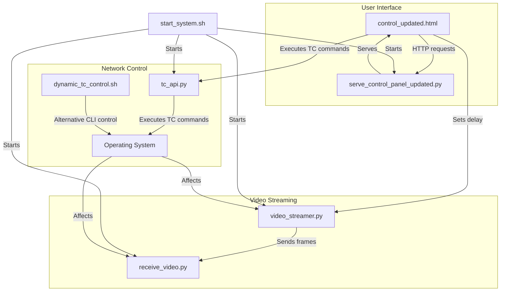
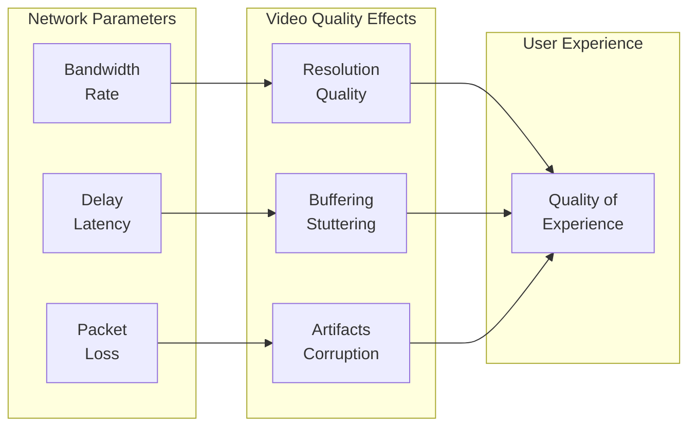
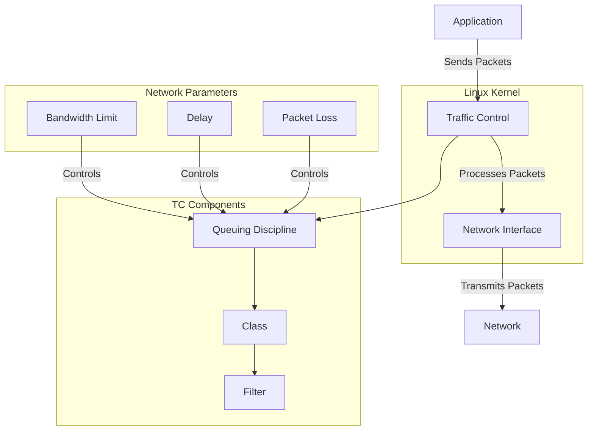
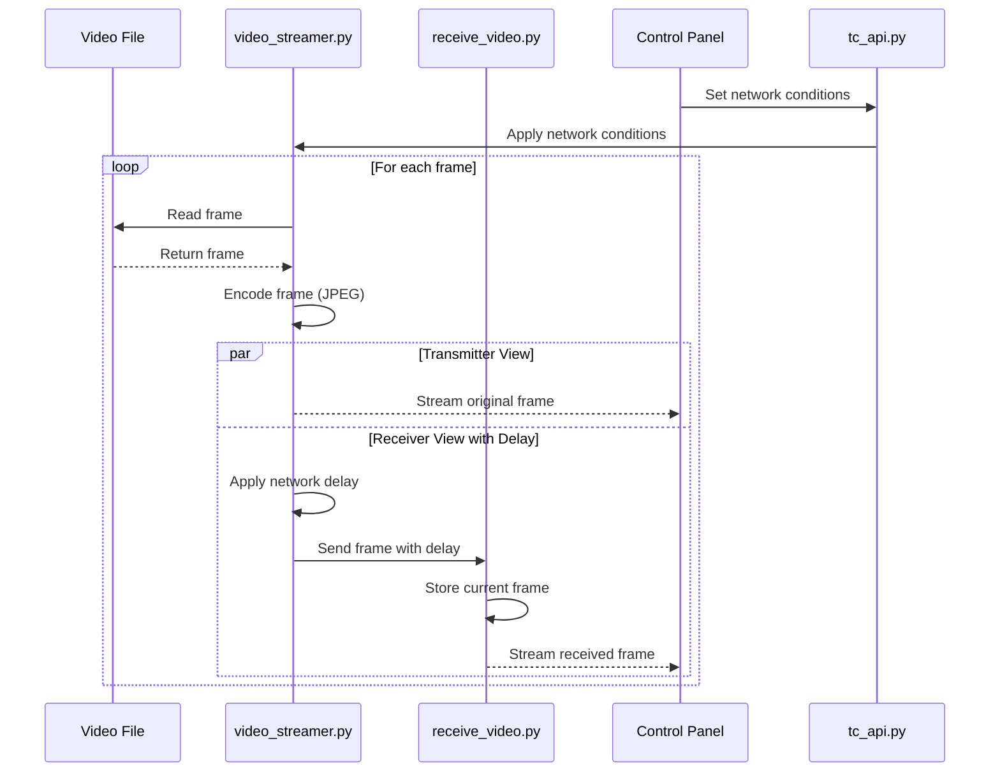

# Video Streaming with Network Condition Simulation - Documentation

## 1. Introduction and System Overview

### Purpose and Goals

This system provides a comprehensive platform for streaming video while simulating various network conditions using Linux Traffic Control (tc). The primary purpose is to demonstrate and test how video streaming performance is affected by different network parameters such as bandwidth limitations, latency, and packet loss.

### Key Features and Capabilities

- Real-time video streaming with side-by-side comparison of original and affected video
- Dynamic control of network conditions through a web interface
- Simulation of various network scenarios (perfect connection, mobile networks, satellite, etc.)
- Visual representation of quality degradation based on network parameters
- Real-time quality metrics and statistics

### High-level Architecture Overview

The system consists of several interconnected components:

1. **Video Streaming Components**: Capture, transmit, and display video frames
2. **Network Control Components**: Manipulate network conditions using Linux TC
3. **User Interface Components**: Provide web-based control and visualization
4. **System Management Components**: Handle startup, coordination, and monitoring
## 2. System Architecture

### Component Breakdown and Interactions



### Component Descriptions

1. **video_streamer.py**: Flask application that captures video frames from a file and streams them to the receiver. It also simulates network delay.

2. **receive_video.py**: Flask application that receives video frames from the streamer and displays them.

3. **tc_api.py**: Flask API server that executes Linux TC commands to control network conditions.

4. **dynamic_tc_control.sh**: Bash script providing a command-line interface for controlling network conditions.

5. **control_updated.html**: Web interface for controlling network conditions and viewing video streams.

6. **serve_control_panel_updated.py**: Simple HTTP server that serves the control panel.

7. **start_system.sh**: Bash script that starts all components in the correct order.

### Startup Sequence and Dependencies

1. The system starts with `start_system.sh`, which:
   - Checks and activates the virtual environment
   - Starts `receive_video.py` (port 5001)
   - Starts `video_streamer.py` (port 5000)
   - Starts `tc_api.py` (port 5002) with sudo privileges
   - Starts `serve_control_panel_updated.py` (port 8000)
   - Opens the control panel in the browser

2. Dependencies:
   - `receive_video.py` must be running before `video_streamer.py`
   - `tc_api.py` requires sudo privileges to execute TC commands
   - All components must be running for the control panel to function properly
## 3. Network Condition Simulation

### Concepts of Linux Traffic Control (tc)

Linux Traffic Control (tc) is a powerful tool for managing network traffic on Linux systems. It allows for controlling:

1. **Bandwidth (Rate)**: Limits the maximum data transfer speed
2. **Delay (Latency)**: Adds artificial delay to packets
3. **Packet Loss**: Randomly drops a percentage of packets
4. **Jitter**: Variation in packet delay

These parameters are controlled using queuing disciplines (qdiscs) that manage how packets are sent and received.

### Network Parameters and Their Effects



#### Bandwidth (Rate)

- **What it is**: Limits the maximum data transfer speed
- **Measurement**: Bits per second (kbit/s, Mbit/s, Gbit/s)
- **Effect on video**: Lower bandwidth forces lower resolution or more compression, resulting in visual quality degradation
- **Examples**:
  - 10 Mbit/s: Good broadband connection
  - 1 Mbit/s: Basic mobile data
  - 500 Kbit/s: Very slow connection

#### Delay (Latency)

- **What it is**: Time taken for packets to travel from source to destination
- **Measurement**: Milliseconds (ms)
- **Effect on video**: Higher delay causes longer startup times and slower response to interactions
- **Examples**:
  - 10ms: Excellent connection
  - 100ms: Average internet connection
  - 500ms: Satellite internet

#### Packet Loss

- **What it is**: Percentage of packets that never reach their destination
- **Measurement**: Percentage (%)
- **Effect on video**: Causes visual artifacts, frame freezing, and quality drops
- **Examples**:
  - 0%: Perfect connection
  - 1%: Slightly unstable connection
  - 5%: Very poor connection

### Implementation in the System

The system implements network condition simulation in two ways:

1. **Linux TC (Traffic Control)**: Modifies actual network behavior at the OS level
   - Implemented through `tc_api.py` and `dynamic_tc_control.sh`
   - Affects all traffic on the specified network interface
   - Provides realistic network simulation

2. **Application-level Delay**: Simulates network delay in the application
   - Implemented in `video_streamer.py` through the `send_frame_to_gcp` function
   - Only affects the video streaming application
   - Easier to observe the effects of delay

### Network Simulation Diagram



### How Network Conditions Affect Video Quality

The system allows users to observe in real-time how different network conditions affect video quality:

1. **Bandwidth Limitations**:
   - Reduced bandwidth forces the video to use lower quality or resolution
   - May cause buffering if the video bitrate exceeds available bandwidth
   - Visual quality degradation becomes apparent below 1 Mbit/s

2. **Delay (Latency)**:
   - Increased delay causes a noticeable lag between the original and received video
   - Interactive applications become less responsive
   - Delay above 200ms is very noticeable to users

3. **Packet Loss**:
   - Even small amounts of packet loss (1-2%) cause visible artifacts
   - Higher packet loss (5%+) causes frame freezing and severe quality degradation
   - Loss above 10% makes video nearly unwatchable

4. **Combined Effects**:
   - The system calculates a weighted quality score based on all parameters
   - Delay has the highest impact on perceived quality (50% weight)
   - Bandwidth has medium impact (30% weight)
   - Packet loss has significant but lower impact (20% weight)
## 4. Video Streaming Implementation

### Video Frame Capture and Transmission

The video streaming process begins in `video_streamer.py`, which:

1. Opens a video file using OpenCV
2. Captures frames one by one
3. Encodes frames in JPEG format
4. Sends frames to the receiver with optional network delay
5. Simultaneously streams frames to the browser for the transmitter view

### Data Flow Diagram



### Key Implementation Details

1. **Frame Capture**:
   ```python
   # Open video file
   cap = cv2.VideoCapture(video_path)
   if not cap.isOpened():
       print("Error: Could not open video file.")
       exit()
       
   # In the generate() function:
   ret, frame = cap.read()
   if not ret:
       print("Error: Failed to capture frame.")
       break
   ```

2. **Frame Encoding**:
   ```python
   # Encode the frame in JPEG format
   ret, jpeg = cv2.imencode('.jpg', frame)
   if not ret:
       print("Error: Failed to encode frame.")
       continue
   ```

3. **Network Delay Simulation**:
   ```python
   # Function to send frames to receiver asynchronously
   def send_frame_to_gcp(jpeg):
       # Simulate network delay before sending the frame
       # Ensure delay is never negative and cap it at a maximum value
       additional_delay = max(0, min(NETWORK_DELAY - TRANSMITTER_DELAY, 2.0))
       
       if additional_delay > 0:
           try:
               time.sleep(additional_delay)
           except Exception as e:
               print(f"Error during sleep: {e}")
       
       encoded_frame = base64.b64encode(jpeg.tobytes()).decode('utf-8')
       try:
           response = requests.post('http://127.0.0.1:5001/receive_video', 
                                   json={'frame': encoded_frame}, 
                                   timeout=10)
       except requests.exceptions.RequestException as e:
           print(f"Error sending frame to receiver: {e}")
   ```

4. **Frame Transmission**:
   ```python
   # Send frame to receiver asynchronously using threading
   threading.Thread(target=send_frame_to_gcp, args=(jpeg,)).start()
   
   # Yield the frame to stream to browser
   yield (b'--frame\r\n' b'Content-Type: image/jpeg\r\n\r\n' + 
          jpeg.tobytes() + b'\r\n\r\n')
   ```

5. **Frame Reception in receive_video.py**:
   ```python
   @app.route('/receive_video', methods=['POST'])
   def receive_video():
       global current_frame
   
       # Get the base64-encoded frame from the POST request
       data = request.json
       frame_data = data['frame']
   
       # Decode the frame from base64 format
       img_bytes = base64.b64decode(frame_data)
       nparr = np.frombuffer(img_bytes, np.uint8)
       frame = cv2.imdecode(nparr, cv2.IMREAD_COLOR)
   
       if frame is not None:
           # Set the current frame to be used in the MJPEG stream
           current_frame = frame
           return jsonify({'status': 'success'}), 200
       else:
           return jsonify({'status': 'error', 'message': 'Failed to decode frame'}), 400
   ```

6. **Streaming to Browser in receive_video.py**:
   ```python
   # Function to generate MJPEG stream from received frames
   def generate():
       global current_frame
       while True:
           if current_frame is not None:
               # Encode the frame as JPEG
               ret, jpeg = cv2.imencode('.jpg', current_frame)
               if not ret:
                   continue
               jpeg_bytes = jpeg.tobytes()
   
               # Yield the frame in MJPEG format
               yield (b'--frame\r\n'
                      b'Content-Type: image/jpeg\r\n\r\n' + jpeg_bytes + b'\r\n\r\n')
   
   @app.route('/rx_video_feed')
   def video_feed():
       # Return the MJPEG stream to the browser
       return Response(generate(), mimetype='multipart/x-mixed-replace; boundary=frame')
   ```

### Performance Considerations

1. **Threading**: The system uses threading to send frames asynchronously, preventing blocking operations
2. **Buffering**: The receiver maintains only the current frame to minimize memory usage
3. **Timeout Handling**: Network requests have timeouts to prevent hanging on network issues
4. **Delay Capping**: Network delay is capped at 10 seconds to prevent system unresponsiveness
## 5. User Interface and Control

### Web-based Control Panel

The control panel (`control_updated.html`) provides a comprehensive interface for:

1. Viewing both transmitter and receiver video streams side by side
2. Controlling network parameters (delay, bandwidth, packet loss)
3. Applying preset network conditions
4. Monitoring quality metrics
5. Adjusting video display size

### Network Condition Presets

The system provides several presets that simulate real-world network scenarios:

```javascript
// Function to set network preset
function setNetworkPreset(preset) {
    const statusElement = document.getElementById('status');
    let delay, rate, rateUnit, loss, presetName;
    
    switch(preset) {
        case 'perfect':
            presetName = "Perfect Connection";
            delay = 10;
            rate = 10;
            rateUnit = 'mbit';
            loss = 0;
            break;
        case 'good':
            presetName = "Good Broadband";
            delay = 30;
            rate = 5;
            rateUnit = 'mbit';
            loss = 0.1;
            break;
        case 'average':
            presetName = "Average Mobile";
            delay = 100;
            rate = 2;
            rateUnit = 'mbit';
            loss = 1;
            break;
        case 'poor':
            presetName = "Poor Mobile";
            delay = 200;
            rate = 500;
            rateUnit = 'kbit';
            loss = 5;
            break;
        case 'satellite':
            presetName = "Satellite Internet";
            delay = 500;
            rate = 1;
            rateUnit = 'mbit';
            loss = 2;
            break;
        case 'critical':
            presetName = "Critical Conditions";
            delay = 1000;
            rate = 100;
            rateUnit = 'kbit';
            loss = 10;
            break;
        default:
            statusElement.textContent = `Status: Error - Unknown preset: ${preset}`;
            return;
    }
    
    // Update UI elements and apply settings
    // ...
}
```

### Real-time Quality Metrics

The control panel calculates and displays several quality metrics:

```javascript
// Function to update QoS metrics based on all network parameters
function updateQoSMetrics() {
    // Get current parameters
    const delayMs = currentParams.delay;
    const delaySec = delayMs / 1000;
    const rate = currentParams.rate;
    const rateUnit = currentParams.rateUnit;
    const loss = currentParams.loss;
    
    // Update latency display
    const latencyValue = document.getElementById('latency-value');
    const latencyQuality = document.getElementById('latency-quality');
    latencyValue.textContent = delayMs + ' ms';
    
    // Update fps (based on delay)
    const fpsValue = document.getElementById('fps-value');
    const fpsQuality = document.getElementById('fps-quality');
    const fps = Math.round((1 / delaySec) * 100) / 100;
    fpsValue.textContent = fps.toFixed(2) + ' fps';
    
    // Calculate quality scores for each parameter
    let delayScore = 0;
    let rateScore = 0;
    let lossScore = 0;
    
    // Score delay (0-5)
    if (delayMs <= 10) delayScore = 5;
    else if (delayMs <= 30) delayScore = 4.5;
    else if (delayMs <= 100) delayScore = 4;
    // ... more conditions
    
    // Score rate (0-5)
    let rateInMbps = rate;
    if (rateUnit === 'kbit') rateInMbps = rate / 1000;
    else if (rateUnit === 'gbit') rateInMbps = rate * 1000;
    
    if (rateInMbps >= 10) rateScore = 5;
    else if (rateInMbps >= 5) rateScore = 4.5;
    // ... more conditions
    
    // Score loss (0-5)
    if (loss <= 0.1) lossScore = 5;
    else if (loss <= 0.5) lossScore = 4.5;
    // ... more conditions
    
    // Calculate weighted average (delay is most important for video)
    const overallScore = (delayScore * 0.5) + (rateScore * 0.3) + (lossScore * 0.2);
    
    // Determine quality level and update display
    // ...
}
```

### Video Display Controls

The control panel allows adjusting the video display size through the `adjustVideoSize.js` script:

```javascript
// Function to adjust video size
function adjustVideoSize(height) {
    console.log(`adjustVideoSize called with height: ${height}`);
    
    // Get video elements by ID
    const txVideo = document.getElementById('tx-video');
    const rxVideo = document.getElementById('rx-video');
    const currentHeightDisplay = document.getElementById('currentHeight');
    
    if (!txVideo || !rxVideo) {
        console.error('Video elements not found!');
        alert('Video elements not found! Check the console for details.');
        const statusElement = document.getElementById('status');
        if (statusElement) {
            statusElement.textContent = 'Status: Error - Video elements not found!';
        }
        return;
    }
    
    try {
        // Update iframe heights
        txVideo.height = height;
        rxVideo.height = height;
        
        // Update display
        if (currentHeightDisplay) {
            currentHeightDisplay.textContent = height;
        }
        
        // Add to debug log
        // ...
    } catch (error) {
        console.error('Error adjusting video size:', error);
        alert(`Error adjusting video size: ${error.message}`);
    }
}
```
## 6. Detailed Component Analysis

### video_streamer.py

**Purpose**: Captures video frames and streams them to the receiver with optional network delay.

**Key Functions**:

1. **Video Initialization**:
   ```python
   # Configuration
   video_path = './Video_test/BigBuckBunny.mp4'
   # Adjust this value to simulate different network conditions
   NETWORK_DELAY = 0.033  # Default: ~30 fps (1/30 ≈ 0.033)
   # Constant for normal playback speed on transmitter side
   TRANSMITTER_DELAY = 0.033  # Fixed at ~30 fps
   
   # Open video file
   cap = cv2.VideoCapture(video_path)
   if not cap.isOpened():
       print("Error: Could not open video file.")
       exit()
   ```

2. **Frame Generation and Streaming**:
   ```python
   def generate():
       while cap.isOpened():
           ret, frame = cap.read()
           if not ret:
               print("Error: Failed to capture frame.")
               break
           
           # Encode the frame in JPEG format
           ret, jpeg = cv2.imencode('.jpg', frame)
           if not ret:
               print("Error: Failed to encode frame.")
               continue
           
           # Send frame to receiver asynchronously
           threading.Thread(target=send_frame_to_gcp, args=(jpeg,)).start()
           
           # Yield the frame to stream to browser
           yield (b'--frame\r\n' b'Content-Type: image/jpeg\r\n\r\n' + 
                  jpeg.tobytes() + b'\r\n\r\n')
           
           # Use normal playback speed for transmitter side
           time.sleep(TRANSMITTER_DELAY)  # Fixed at ~30 fps
   ```

3. **Network Delay Control**:
   ```python
   @app.route('/set_delay/<path:delay_value>', methods=['GET'])
   def set_delay(delay_value):
       """
       Set the network delay to simulate different network conditions
       Examples:
       - /set_delay/0.033 (30 fps - normal)
       - /set_delay/0.1 (10 fps - slight delay)
       - /set_delay/0.5 (2 fps - significant delay)
       """
       global NETWORK_DELAY
       
       # Convert the delay_value to float, handling potential errors
       try:
           delay_value = float(delay_value)
       except ValueError:
           return f"Error: Invalid delay value '{delay_value}'. Please provide a valid number.", 400
       
       # Set minimum delay but allow higher values
       max_safe_delay = 5.0  # Warning threshold (0.2 fps)
       absolute_max_delay = 10.0  # Absolute maximum (0.1 fps)
       min_delay = 0.01  # 10ms minimum to prevent issues
       
       # Ensure delay is within acceptable range
       if delay_value > absolute_max_delay:
           NETWORK_DELAY = absolute_max_delay
           return f"Warning: Delay value {delay_value} capped at {absolute_max_delay} seconds..."
       elif delay_value > max_safe_delay:
           NETWORK_DELAY = delay_value
           return f"Caution: Delay value {delay_value} is very high and may cause system instability..."
       elif delay_value < min_delay:
           NETWORK_DELAY = min_delay
           return f"Warning: Delay value {delay_value} increased to minimum {min_delay} seconds..."
       else:
           NETWORK_DELAY = delay_value
           
           # Calculate quality level based on delay
           quality_level = ""
           if delay_value <= 0.033:
               quality_level = "Perfect"
           elif delay_value <= 0.066:
               quality_level = "Very Good"
           # ... more conditions
               
           return f"Network delay set to {delay_value:.3f} seconds..."
   ```

**Design Pattern**: Uses Flask for HTTP server and threading for asynchronous operations.

### receive_video.py

**Purpose**: Receives video frames from the streamer and displays them.

**Key Functions**:

1. **Frame Reception**:
   ```python
   # Initialize a variable to hold the current frame
   current_frame = None
   
   @app.route('/receive_video', methods=['POST'])
   def receive_video():
       global current_frame
   
       # Get the base64-encoded frame from the POST request
       data = request.json
       frame_data = data['frame']
   
       # Decode the frame from base64 format
       img_bytes = base64.b64decode(frame_data)
       nparr = np.frombuffer(img_bytes, np.uint8)
       frame = cv2.imdecode(nparr, cv2.IMREAD_COLOR)
   
       if frame is not None:
           # Set the current frame to be used in the MJPEG stream
           current_frame = frame
           return jsonify({'status': 'success'}), 200
       else:
           return jsonify({'status': 'error', 'message': 'Failed to decode frame'}), 400
   ```

2. **MJPEG Streaming**:
   ```python
   def generate():
       global current_frame
       while True:
           if current_frame is not None:
               # Encode the frame as JPEG
               ret, jpeg = cv2.imencode('.jpg', current_frame)
               if not ret:
                   continue
               jpeg_bytes = jpeg.tobytes()
   
               # Yield the frame in MJPEG format
               yield (b'--frame\r\n'
                      b'Content-Type: image/jpeg\r\n\r\n' + jpeg_bytes + b'\r\n\r\n')
   
   @app.route('/rx_video_feed')
   def video_feed():
       # Return the MJPEG stream to the browser
       return Response(generate(), mimetype='multipart/x-mixed-replace; boundary=frame')
   ```

**Design Pattern**: Uses Flask for HTTP server and maintains only the current frame in memory.

### tc_api.py

**Purpose**: Provides an API for executing Linux TC commands.

**Key Functions**:

1. **Network Interface Detection**:
   ```python
   def get_default_interface():
       try:
           # Try to get the default interface using ip route
           result = subprocess.run("ip route | grep default | awk '{print $5}' | head -n 1",
                                  shell=True, capture_output=True, text=True, check=True)
           interface = result.stdout.strip()
           if interface:
               logger.info(f"Auto-detected default interface: {interface}")
               return interface
       except Exception as e:
           logger.error(f"Error auto-detecting interface: {str(e)}")
       
       # Fallback interfaces to try
       fallbacks = ["eth0", "wlan0", "ens33", "enp0s3", "wlp0s20f3"]
       for interface in fallbacks:
           try:
               # Check if interface exists
               result = subprocess.run(f"ip link show {interface}",
                                     shell=True, capture_output=True, text=True)
               if result.returncode == 0:
                   logger.info(f"Using fallback interface: {interface}")
                   return interface
           except:
               pass
       
       # Last resort fallback
       logger.warning("Could not detect interface, using lo (loopback)")
       return "lo"
   ```

2. **TC Command Execution**:
   ```python
   @app.route('/execute_tc_command', methods=['POST'])
   def execute_tc_command():
       """Execute a tc command"""
       data = request.json
       
       if not data or 'command' not in data:
           return jsonify({'error': 'No command provided'}), 400
       
       command = data['command']
       
       # Validate the command to ensure it's a tc command
       if not command.startswith('tc '):
           return jsonify({'error': 'Only tc commands are allowed'}), 400
       
       # Extract parameters from the command
       delay_match = re.search(r'delay\s+(\d+)ms', command)
       rate_match = re.search(r'rate\s+(\d+\.?\d*)(\w+)', command)
       loss_match = re.search(r'loss\s+(\d+\.?\d*)%', command)
       
       delay = delay_match.group(1) if delay_match else "0"
       rate = rate_match.group(1) if rate_match else "10"
       rate_unit = rate_match.group(2) if rate_match else "mbit"
       loss = loss_match.group(1) if loss_match else "0"
       
       # Validate parameters
       try:
           # Convert values but don't enforce strict limits
           delay = int(delay) if delay else 0
           rate = float(rate) if rate else 10
           loss = float(loss) if loss else 0
           
           # Just ensure values are not negative
           if delay < 0:
               logger.warning(f"Negative delay value ({delay}) corrected to 0")
               delay = 0
           
           # ... more validation
       
       except ValueError as e:
           logger.error(f"Parameter validation error: {str(e)}")
           return jsonify({'error': f'Invalid parameter values: {str(e)}'}), 400
       
       # Check if the qdisc exists
       check_cmd = f"tc qdisc show dev {INTERFACE} | grep netem"
       
       try:
           result = subprocess.run(check_cmd, shell=True, capture_output=True, text=True)
           
           # If the qdisc doesn't exist, add it
           if result.returncode != 0:
               add_cmd = f"sudo tc qdisc add dev {INTERFACE} root netem delay {delay}ms rate {rate}{rate_unit} loss {loss}%"
               
               add_result = subprocess.run(add_cmd, shell=True, capture_output=True, text=True)
               if add_result.returncode != 0:
                   return jsonify({
                       'error': f'Add command failed: {add_result.stderr}',
                       'command': add_cmd
                   }), 500
               
               return jsonify({
                   'message': f'Added netem qdisc with delay={delay}ms, rate={rate}{rate_unit}, loss={loss}%',
                   'command': add_cmd,
                   'success': True
               })
           
           # If the qdisc exists, change it
           change_cmd = f"sudo tc qdisc change dev {INTERFACE} root netem delay {delay}ms rate {rate}{rate_unit} loss {loss}%"
           
           change_result = subprocess.run(change_cmd, shell=True, capture_output=True, text=True)
           if change_result.returncode != 0:
               return jsonify({
                   'error': f'Change command failed: {change_result.stderr}',
                   'command': change_cmd
               }), 500
           
           # Verify the change was applied
           verify_cmd = f"tc -s qdisc show dev {INTERFACE}"
           verify_result = subprocess.run(verify_cmd, shell=True, capture_output=True, text=True)
           
           return jsonify({
               'message': f'Changed netem qdisc to delay={delay}ms, rate={rate}{rate_unit}, loss={loss}%',
               'command': change_cmd,
               'verification': verify_result.stdout,
               'success': True
           })
       
       except subprocess.CalledProcessError as e:
           logger.error(f"Command failed: {str(e)}")
           return jsonify({
               'error': f'Command failed: {str(e)}',
               'details': str(e),
               'success': False
           }), 500
   ```

**Design Pattern**: Uses Flask for API server and subprocess for executing system commands.

### dynamic_tc_control.sh

**Purpose**: Provides a command-line interface for controlling network conditions.

**Key Functions**:

1. **Apply Network Conditions**:
   ```bash
   # Function to apply network conditions dynamically
   apply_conditions() {
       local rate="$1"     # Bandwidth rate (e.g., "1mbit")
       local delay="$2"    # Latency delay (e.g., "100ms")
       local loss="$3"     # Packet loss (e.g., "10%")
       
       # Check for empty inputs and provide defaults
       if [ -z "$rate" ]; then
           rate="1mbit"
       elif [[ "$rate" =~ ^[0-9]+$ ]]; then
           rate="${rate}mbit"
       fi
       
       # ... similar handling for delay and loss
   
       echo "Applying network conditions: Rate=$rate, Delay=$delay, Loss=$loss"
   
       # First, ensure the qdisc is added to the interface if it doesn't exist yet
       if ! tc qdisc show dev $INTERFACE | grep -q "netem"; then
           # Add the root qdisc for network emulation if not already added
           sudo tc qdisc add dev $INTERFACE root netem
       fi
   
       # Apply the new network conditions using tc
       sudo tc qdisc change dev $INTERFACE root netem rate $rate delay $delay loss $loss
   }
   ```

2. **Reset Network Conditions**:
   ```bash
   # Function to reset network conditions (remove tc configuration)
   reset_conditions() {
       echo "Resetting network conditions."
       sudo tc qdisc del dev $INTERFACE root
   }
   ```

**Design Pattern**: Uses bash scripting with a menu-driven interface.

### control_updated.html

**Purpose**: Provides a web interface for controlling network conditions and viewing video streams.

**Key Functions**:

1. **TC Command Execution**:
   ```javascript
   function executeTcCommand(command) {
       const statusElement = document.getElementById('status');
       statusElement.textContent = `Status: Executing command: ${command}...`;
       
       // Make an API call to execute the command
       fetch('http://localhost:5002/execute_tc_command', {
           method: 'POST',
           headers: { 'Content-Type': 'application/json' },
           body: JSON.stringify({ command })
       })
       .then(response => {
           if (!response.ok) {
               throw new Error(`Server returned ${response.status}: ${response.statusText}`);
           }
           return response.json();
       })
       .then(data => {
           if (data.error) {
               throw new Error(data.error);
           }
           
           // Update status
           statusElement.textContent = `Status: ${data.message}`;
           
           // Update debug information
           // ...
           
           updateQoSMetrics();
       })
       .catch(error => {
           statusElement.textContent = `Status: Error - ${error.message}`;
           console.error('Error:', error);
           
           // Update debug information with error
           // ...
       });
   }
   ```

**Design Pattern**: Uses HTML, CSS, and JavaScript with fetch API for HTTP requests.

### serve_control_panel_updated.py

**Purpose**: Serves the control panel web interface.

**Key Functions**:

1. **HTTP Server with Port Fallback**:
   ```python
   def main():
       # Change to the directory containing this script
       os.chdir(os.path.dirname(os.path.abspath(__file__)))
       
       # Try each port in the list
       for port in PORTS:
           try:
               # Create the server
               httpd = socketserver.TCPServer(("", port), MyHandler)
               print(f"Serving updated control panel at http://localhost:{port}/control_updated.html")
               
               # Open the control panel in the default browser
               webbrowser.open(f"http://localhost:{port}/control_updated.html")
               
               # Serve until interrupted
               try:
                   httpd.serve_forever()
               except KeyboardInterrupt:
                   print("\nServer stopped.")
                   httpd.server_close()
                   return
                   
               # If we get here, the server was started successfully
               break
               
           except OSError as e:
               if e.errno == 98:  # Address already in use
                   print(f"Port {port} is already in use, trying next port...")
               else:
                   print(f"Error starting server on port {port}: {e}")
                   sys.exit(1)
       else:
           # If we get here, all ports failed
           print("All ports are in use. Please close some applications and try again.")
           sys.exit(1)
   ```

**Design Pattern**: Uses Python's built-in HTTP server with port fallback mechanism.

### start_system.sh

**Purpose**: Starts all system components in the correct order.

**Key Functions**:

1. **Virtual Environment Management**:
   ```bash
   # Check if virtual environment exists
   if [ ! -d ".venv" ]; then
       print_warning "Virtual environment not found. Creating one..."
       python3 -m venv .venv
       source .venv/bin/activate
       pip install flask flask-cors opencv-python numpy requests
   else
       print_message "Virtual environment found."
   fi
   
   # Activate virtual environment
   source .venv/bin/activate
   print_message "Virtual environment activated."
   ```

2. **Port Availability Checking**:
   ```bash
   # Function to check if a port is in use
   is_port_in_use() {
       if lsof -Pi :$1 -sTCP:LISTEN -t >/dev/null ; then
           return 0
       else
           return 1
       fi
   }
   
   # Check if ports are already in use and kill processes if needed
   if is_port_in_use 5000; then
       print_warning "Port 5000 is already in use. Attempting to kill the process..."
       sudo kill $(lsof -t -i:5000) 2>/dev/null || print_warning "Failed to kill process on port 5000"
       sleep 1
   fi
   ```

3. **Component Startup**:
   ```bash
   # Start the receiver in a new terminal
   print_message "Starting video receiver on port 5001..."
   gnome-terminal --title="Video Receiver" -- bash -c "source .venv/bin/activate; python3 receive_video.py; exec bash"
   sleep 2
   
   # Start the streamer in a new terminal
   print_message "Starting video streamer on port 5000..."
   gnome-terminal --title="Video Streamer" -- bash -c "source .venv/bin/activate; python3 video_streamer.py; exec bash"
   sleep 2
   
   # Start the TC API server in a new terminal
   print_message "Starting TC API server on port 5002 (requires sudo)..."
   gnome-terminal --title="TC API Server" -- bash -c "./run_tc_api.sh; exec bash"
   sleep 2
   
   # Start the control panel in a new terminal
   print_message "Starting control panel server on port 8000..."
   gnome-terminal --title="Control Panel" -- bash -c "source .venv/bin/activate; python3 serve_control_panel_updated.py; exec bash"
   ```

**Design Pattern**: Uses bash scripting with colored output and error handling.
## 7. System Integration

### Communication Between Components

1. **HTTP/REST Communication**:
   - Control panel to TC API: HTTP POST requests
   - Control panel to video streamer: HTTP GET requests
   - Video streamer to receiver: HTTP POST requests with JSON payload

2. **System Command Execution**:
   - TC API to operating system: Subprocess calls to execute TC commands

3. **Browser Integration**:
   - Control panel serves iframes that display video streams
   - JavaScript in the control panel communicates with all backend components

### Error Handling and Recovery

1. **Network Interface Detection**:
   - Auto-detects the default network interface
   - Falls back to common interfaces if auto-detection fails

2. **Port Conflict Resolution**:
   - Checks if ports are in use before starting components
   - Attempts to kill conflicting processes
   - Control panel server tries multiple ports if the default is unavailable

3. **Command Execution Validation**:
   - Validates TC commands before execution
   - Ensures parameters are within safe ranges
   - Provides detailed error messages for troubleshooting

4. **Video Streaming Resilience**:
   - Handles frame capture failures gracefully
   - Uses timeouts for network requests to prevent hanging
   - Caps network delay to prevent system unresponsiveness

## 8. Challenges and Problems Faced

### Network Interface Configuration

**Challenge**: Different systems have different network interface names (eth0, wlan0, etc.).

**Solution**: Implemented auto-detection of the default interface with fallback options.

```python
def get_default_interface():
    try:
        # Try to get the default interface using ip route
        result = subprocess.run("ip route | grep default | awk '{print $5}' | head -n 1",
                               shell=True, capture_output=True, text=True, check=True)
        interface = result.stdout.strip()
        if interface:
            return interface
    except Exception:
        pass
    
    # Fallback interfaces to try
    fallbacks = ["eth0", "wlan0", "ens33", "enp0s3", "wlp0s20f3"]
    for interface in fallbacks:
        try:
            # Check if interface exists
            result = subprocess.run(f"ip link show {interface}",
                                  shell=True, capture_output=True, text=True)
            if result.returncode == 0:
                return interface
        except:
            pass
    
    # Last resort fallback
    return "lo"
```

### Sudo Privileges for TC Commands

**Challenge**: TC commands require sudo privileges, but running the entire application as root is not ideal.

**Solution**: Created a separate script (`run_tc_api.sh`) that runs only the TC API with sudo while preserving the virtual environment.

```bash
#!/bin/bash
# Get the path to the virtual environment's Python
VENV_PYTHON=$(which python3)
# Run the tc_api.py script with sudo using the virtual environment's Python
sudo $VENV_PYTHON tc_api.py
```

### Video Frame Synchronization

**Challenge**: Ensuring that the transmitter and receiver views stay synchronized despite network delay.

**Solution**: Implemented separate delays for transmission and display:
- Transmitter always displays at normal speed (30 fps)
- Receiver displays frames after the simulated network delay
- Used threading to prevent blocking the main application

### Browser Compatibility

**Challenge**: Ensuring the control panel works across different browsers and screen sizes.

**Solution**: 
- Used responsive design with flexbox layout
- Implemented iframe-based video display that works in most browsers
- Added video size controls to accommodate different screen sizes

### Performance Under Extreme Conditions

**Challenge**: System becoming unresponsive under extreme network conditions (very high delay or packet loss).

**Solution**:
- Implemented caps on network parameters
- Added warnings for potentially unstable settings
- Used timeouts for network requests
- Implemented graceful degradation of video quality

## 9. Conclusion

### System Capabilities

The Video Streaming with Network Condition Simulation system provides:

1. Real-time video streaming with network condition simulation
2. Comprehensive control over network parameters
3. Visual comparison of original and affected video
4. Quality metrics and statistics
5. Preset network conditions for common scenarios

### Limitations

1. Requires Linux with TC capabilities
2. Sudo privileges needed for network manipulation
3. Limited to local network simulation (not actual internet conditions)
4. Video quality metrics are estimates, not precise measurements

### Potential Improvements

1. Add support for live camera input instead of just video files
2. Implement more sophisticated quality metrics (PSNR, SSIM)
3. Add recording capabilities for comparison studies
4. Implement adaptive streaming that responds to network conditions
5. Add support for audio streaming and synchronization
6. Create a more detailed analytics dashboard for network performance

This system provides a valuable tool for understanding how network conditions affect video streaming quality, making it useful for education, testing, and development of video streaming applications.