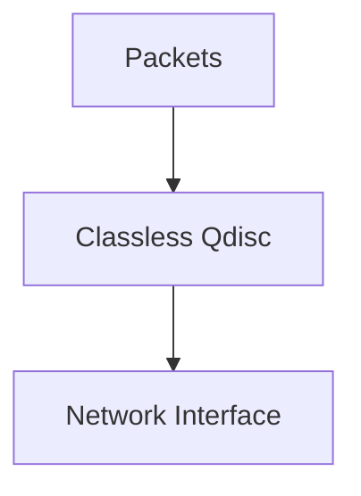
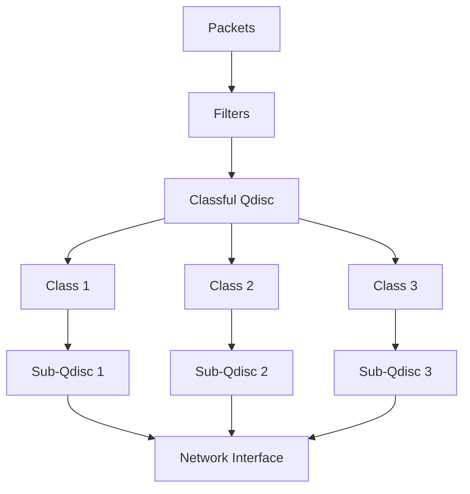
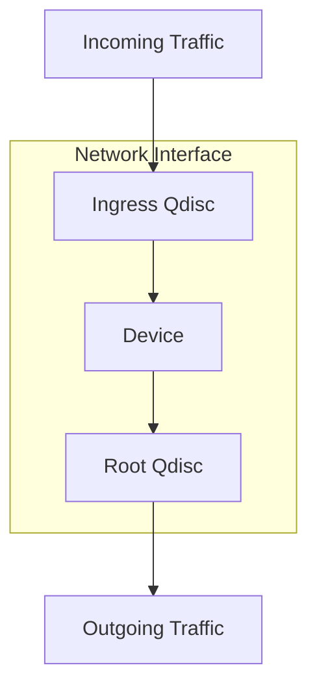
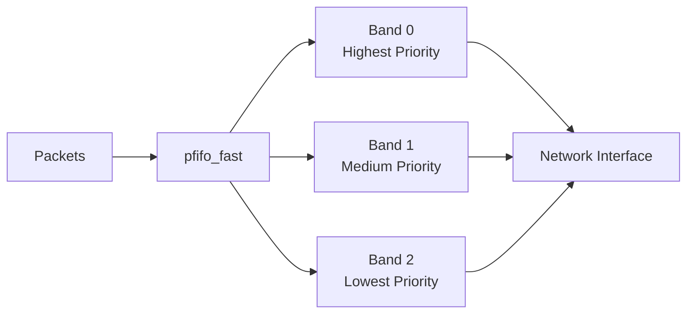
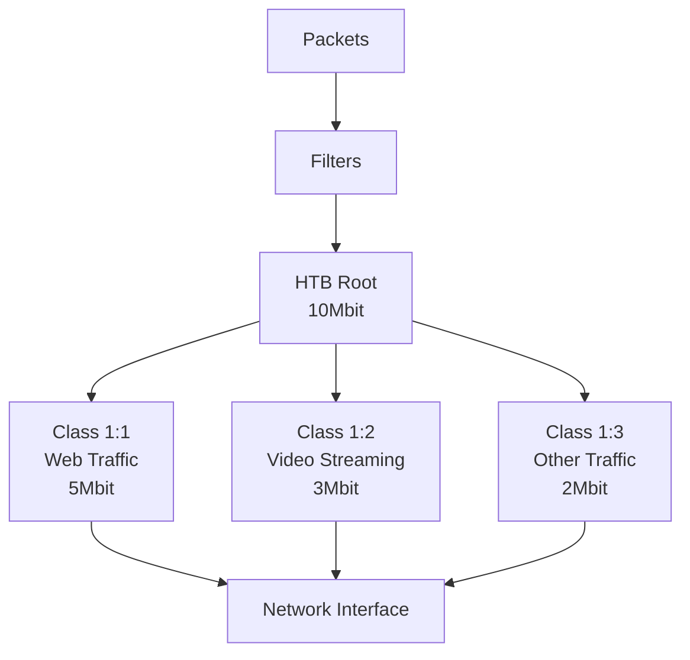
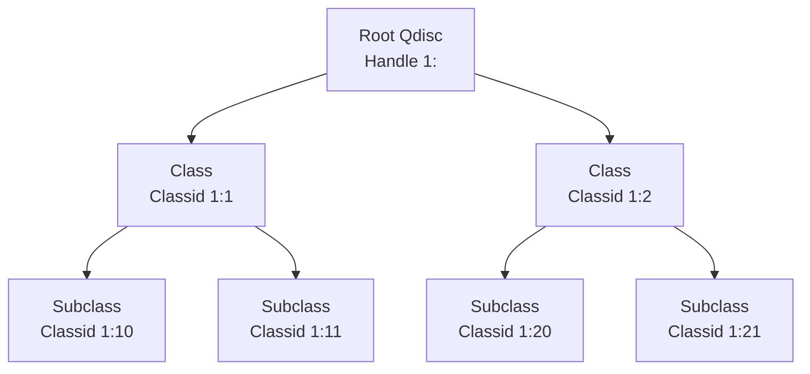

# Queuing Disciplines (qdiscs) Explained

## What is a Qdisc?

A **queuing discipline (qdisc)** is a fundamental component of Linux Traffic Control (TC) that determines **how packets are queued and dequeued** on a network interface. Think of a qdisc as an algorithm or a set of rules that controls:

1. **When** packets are sent
2. **In what order** packets are sent
3. **How fast** packets are sent
4. **Which packets** might be dropped or delayed

## Qdisc Visualization


When an application sends data over the network:
1. The data is broken into packets
2. Packets travel down through the network stack
3. **Packets enter the qdisc** (this is where traffic control happens)
4. The qdisc determines when and how packets leave
5. Packets are transmitted over the network interface

## Types of Qdiscs

There are two main types of qdiscs:

### 1. Classless Qdiscs

Classless qdiscs treat all traffic the same way - they don't distinguish between different types of traffic.



**Common classless qdiscs:**

- **pfifo_fast**: The default qdisc that uses three priority bands
- **tbf (Token Bucket Filter)**: Limits bandwidth while allowing short bursts
- **netem (Network Emulator)**: Simulates network conditions like delay, loss, and jitter
- **fq_codel (Fair Queuing Controlled Delay)**: Reduces bufferbloat and ensures fairness

### 2. Classful Qdiscs

Classful qdiscs can divide traffic into different classes, each with its own rules and parameters.



**Common classful qdiscs:**

- **htb (Hierarchical Token Bucket)**: Creates a hierarchy of classes with bandwidth sharing
- **prio**: Creates multiple bands with different priorities
- **cbq (Class Based Queueing)**: Older classful qdisc for bandwidth sharing

## Qdisc Attachment Points

Each network interface has:

1. **Root qdisc**: Controls outgoing traffic (egress)
2. **Ingress qdisc** (optional): Controls incoming traffic



## How Qdiscs Work in Practice

### Example 1: Default Qdisc (pfifo_fast)

By default, Linux uses the `pfifo_fast` qdisc, which:
- Has three priority bands (0, 1, 2)
- Processes all packets from band 0 before band 1, and all from band 1 before band 2
- Assigns packets to bands based on their Type of Service (ToS) field



### Example 2: Network Emulation with NETEM

The `netem` qdisc is used to simulate network conditions:


When you run a command like:
```bash
tc qdisc add dev eth0 root netem delay 100ms loss 2% rate 1mbit
```

You're telling the system to:
1. Add a new qdisc to the root of device eth0
2. Use the netem qdisc type
3. Apply 100ms delay to all packets
4. Randomly drop 2% of packets
5. Limit the bandwidth to 1 Mbit/s

### Example 3: Traffic Classification with HTB

The `htb` qdisc allows you to create a hierarchy of traffic classes:



When you run commands like:
```bash
tc qdisc add dev eth0 root handle 1: htb default 13
tc class add dev eth0 parent 1: classid 1:1 htb rate 10mbit
tc class add dev eth0 parent 1:1 classid 1:11 htb rate 5mbit
tc class add dev eth0 parent 1:1 classid 1:12 htb rate 3mbit
tc class add dev eth0 parent 1:1 classid 1:13 htb rate 2mbit
tc filter add dev eth0 protocol ip parent 1:0 prio 1 u32 match ip dport 80 0xffff flowid 1:11
tc filter add dev eth0 protocol ip parent 1:0 prio 1 u32 match ip dport 443 0xffff flowid 1:11
tc filter add dev eth0 protocol ip parent 1:0 prio 2 u32 match ip sport 5000 0xffff flowid 1:12
```

You're:
1. Creating an HTB qdisc at the root
2. Creating a parent class with 10Mbit total bandwidth
3. Creating three child classes with different bandwidth allocations
4. Adding filters to direct web traffic (ports 80, 443) to class 1:11
5. Adding a filter to direct video streaming traffic (port 5000) to class 1:12
6. All other traffic goes to class 1:13 (the default)

## Qdisc Handles and IDs

Qdiscs and classes use a numbering system for identification:

- **Handle**: Identifies a qdisc, in the format `major:0`
- **Classid**: Identifies a class, in the format `major:minor`

For example:
- A qdisc with handle `1:` is identified as `1:0`
- Classes under this qdisc might be `1:1`, `1:2`, etc.



## Common Qdiscs in Detail

### NETEM (Network Emulator)

The `netem` qdisc is used to simulate various network conditions:

```bash
# Add 100ms delay
tc qdisc add dev eth0 root netem delay 100ms

# Add variable delay (jitter)
tc qdisc add dev eth0 root netem delay 100ms 20ms

# Add correlated delay (more realistic)
tc qdisc add dev eth0 root netem delay 100ms 20ms 25%

# Add packet loss
tc qdisc add dev eth0 root netem loss 5%

# Add packet corruption
tc qdisc add dev eth0 root netem corrupt 2%

# Add packet duplication
tc qdisc add dev eth0 root netem duplicate 1%

# Add packet reordering
tc qdisc add dev eth0 root netem delay 100ms reorder 25% 50%

# Combine multiple parameters
tc qdisc add dev eth0 root netem delay 100ms 10ms loss 5% corrupt 2% rate 1mbit
```

### HTB (Hierarchical Token Bucket)

The `htb` qdisc is used for bandwidth control and traffic classification:

```bash
# Create HTB root qdisc
tc qdisc add dev eth0 root handle 1: htb default 10

# Create parent class with total bandwidth
tc class add dev eth0 parent 1: classid 1:1 htb rate 100mbit

# Create child classes with different rates
tc class add dev eth0 parent 1:1 classid 1:10 htb rate 10mbit ceil 100mbit
tc class add dev eth0 parent 1:1 classid 1:20 htb rate 50mbit ceil 100mbit
tc class add dev eth0 parent 1:1 classid 1:30 htb rate 30mbit ceil 100mbit

# Add leaf qdiscs to the classes
tc qdisc add dev eth0 parent 1:10 handle 10: netem delay 10ms
tc qdisc add dev eth0 parent 1:20 handle 20: netem delay 20ms
tc qdisc add dev eth0 parent 1:30 handle 30: netem delay 30ms

# Add filters to classify traffic
tc filter add dev eth0 protocol ip parent 1: prio 1 u32 match ip dport 80 0xffff flowid 1:10
tc filter add dev eth0 protocol ip parent 1: prio 1 u32 match ip dport 22 0xffff flowid 1:20
tc filter add dev eth0 protocol ip parent 1: prio 1 u32 match ip dport 53 0xffff flowid 1:30
```

Key HTB parameters:
- **rate**: Guaranteed bandwidth
- **ceil**: Maximum bandwidth (can borrow up to this amount)
- **burst**: Allowed burst size
- **prio**: Priority (lower values = higher priority)

### TBF (Token Bucket Filter)

The `tbf` qdisc is a simple qdisc for bandwidth limiting:

```bash
# Limit bandwidth to 1Mbit with 10KB burst size
tc qdisc add dev eth0 root tbf rate 1mbit burst 10kb latency 70ms
```

Key TBF parameters:
- **rate**: The maximum rate
- **burst**: How many bytes can be sent at once
- **latency**: Maximum time a packet can be delayed

## Qdisc in Your Project

In your video streaming project, the `netem` qdisc is used to simulate different network conditions:

```bash
# Perfect connection
tc qdisc change dev wlp0s20f3 root netem delay 10ms rate 10mbit loss 0%

# Good broadband
tc qdisc change dev wlp0s20f3 root netem delay 30ms rate 5mbit loss 0.1%

# Average mobile
tc qdisc change dev wlp0s20f3 root netem delay 100ms rate 2mbit loss 1%

# Poor mobile
tc qdisc change dev wlp0s20f3 root netem delay 200ms rate 500kbit loss 5%

# Satellite internet
tc qdisc change dev wlp0s20f3 root netem delay 500ms rate 1mbit loss 2%

# Critical conditions
tc qdisc change dev wlp0s20f3 root netem delay 1000ms rate 100kbit loss 10%
```

The web interface and API server in your project execute these TC commands to control the network conditions, allowing you to observe how different conditions affect video streaming quality.

## Practical Examples

### Example 1: Simulating a Slow Connection

```bash
# Add a TBF qdisc to limit bandwidth to 1Mbit
sudo tc qdisc add dev eth0 root tbf rate 1mbit burst 32kbit latency 400ms

# Check the qdisc
tc -s qdisc show dev eth0

# Test with a download
wget http://speedtest.tele2.net/1MB.zip

# Remove the qdisc
sudo tc qdisc del dev eth0 root
```

### Example 2: Prioritizing SSH Traffic

```bash
# Add HTB qdisc
sudo tc qdisc add dev eth0 root handle 1: htb default 20

# Add main class
sudo tc class add dev eth0 parent 1: classid 1:1 htb rate 100mbit

# Add high-priority class for SSH
sudo tc class add dev eth0 parent 1:1 classid 1:10 htb rate 20mbit prio 1

# Add default class for other traffic
sudo tc class add dev eth0 parent 1:1 classid 1:20 htb rate 80mbit prio 2

# Add filter for SSH traffic
sudo tc filter add dev eth0 protocol ip parent 1: prio 1 u32 match ip dport 22 0xffff flowid 1:10
sudo tc filter add dev eth0 protocol ip parent 1: prio 1 u32 match ip sport 22 0xffff flowid 1:10
```

### Example 3: Simulating Different Network Conditions

```bash
# Good 4G connection
sudo tc qdisc add dev eth0 root netem delay 50ms 10ms loss 0.5% rate 10mbit

# Poor 3G connection
sudo tc qdisc add dev eth0 root netem delay 150ms 40ms loss 3% rate 1mbit

# Satellite connection
sudo tc qdisc add dev eth0 root netem delay 500ms 50ms loss 1% rate 2mbit
```

## Troubleshooting Qdiscs

### Viewing Current Qdiscs

```bash
# Show all qdiscs
tc qdisc show

# Show qdiscs for a specific interface
tc qdisc show dev eth0

# Show detailed statistics
tc -s qdisc show dev eth0

# Show classes
tc class show dev eth0

# Show filters
tc filter show dev eth0
```

### Common Issues

1. **Permission Denied**: TC commands require root privileges
   ```bash
   sudo tc qdisc add dev eth0 root netem delay 100ms
   ```

2. **Invalid Argument**: Check syntax and parameter values
   ```bash
   # Incorrect
   tc qdisc add dev eth0 root netem delay 100
   
   # Correct
   tc qdisc add dev eth0 root netem delay 100ms
   ```

3. **File Exists**: A qdisc already exists at the specified location
   ```bash
   # First delete the existing qdisc
   sudo tc qdisc del dev eth0 root
   
   # Then add the new one
   sudo tc qdisc add dev eth0 root netem delay 100ms
   ```

4. **No Such Device**: The specified network interface doesn't exist
   ```bash
   # List available interfaces
   ip link show
   
   # Use the correct interface name
   sudo tc qdisc add dev wlan0 root netem delay 100ms
   ```

## Summary

- A **qdisc (queuing discipline)** is an algorithm that controls how packets are queued and sent
- Each network interface has a **root qdisc** for outgoing traffic
- Qdiscs can be **classless** (treat all traffic the same) or **classful** (divide traffic into classes)
- Common qdiscs include **netem** (network emulation), **htb** (hierarchical bandwidth control), and **tbf** (simple bandwidth limiting)
- Qdiscs are configured using the **tc** command
- In your project, the **netem** qdisc is used to simulate different network conditions for video streaming