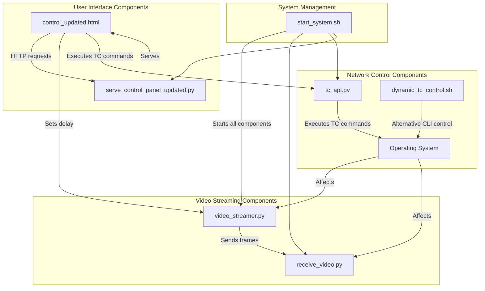
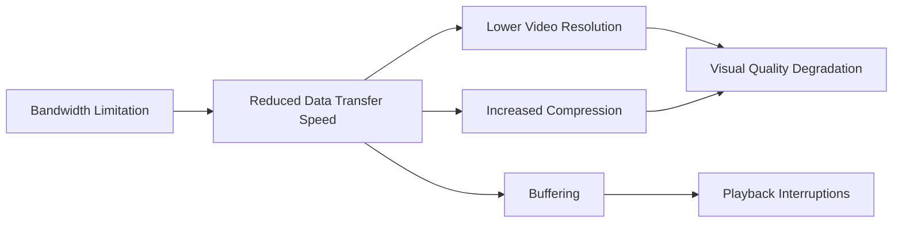
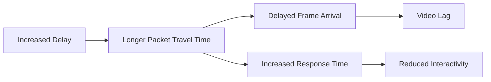
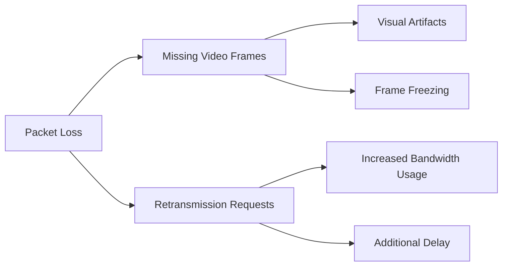
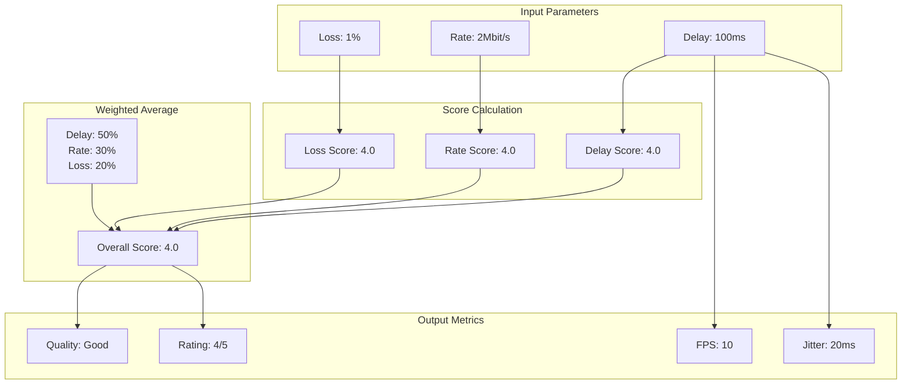

# Traffic Control (TC) Implementation in Video Streaming Project

## Table of Contents
- [Overview](#overview)
- [System Architecture](#system-architecture)
- [TC Implementation Components](#tc-implementation-components)
  - [TC API Server (tc_api.py)](#tc-api-server-tc_apipy)
  - [Dynamic TC Control Script (dynamic_tc_control.sh)](#dynamic-tc-control-script-dynamic_tc_controlsh)
  - [Web Interface (control_updated.html)](#web-interface-control_updatedhtml)
- [Network Parameters and Their Effects](#network-parameters-and-their-effects)
- [Quality Metrics Implementation](#quality-metrics-implementation)
- [Running the System](#running-the-system)
- [Extending the System](#extending-the-system)

## Overview

This project demonstrates how different network conditions affect video streaming quality by using Linux Traffic Control (TC) to simulate various network scenarios. The system allows you to:

1. Stream video with controlled network conditions
2. Observe the effects of bandwidth limitations, delay, and packet loss
3. Compare original and affected video streams side by side
4. Measure and visualize quality metrics

## System Architecture

The system consists of several interconnected components:



### Component Roles

1. **Video Streaming Components**:
   - `video_streamer.py`: Flask application that captures video frames from a file and streams them
   - `receive_video.py`: Flask application that receives video frames and displays them

2. **Network Control Components**:
   - `tc_api.py`: Flask API server that executes TC commands to control network conditions
   - `dynamic_tc_control.sh`: Bash script for command-line control of network conditions

3. **User Interface Components**:
   - `control_updated.html`: Web interface for controlling network conditions and viewing video
   - `serve_control_panel_updated.py`: Simple HTTP server that serves the control panel

4. **System Management**:
   - `start_system.sh`: Script that starts all components in the correct order

## TC Implementation Components

### TC API Server (tc_api.py)

The `tc_api.py` file implements a Flask API server that executes TC commands. It provides three main endpoints:

1. `/execute_tc_command`: Executes a TC command
2. `/reset_tc`: Resets TC configuration
3. `/get_tc_status`: Gets current TC status

#### Key Implementation Details

1. **Network Interface Detection**:
```python
def get_default_interface():
    try:
        # Try to get the default interface using ip route
        result = subprocess.run("ip route | grep default | awk '{print $5}' | head -n 1",
                              shell=True, capture_output=True, text=True, check=True)
        interface = result.stdout.strip()
        if interface:
            logger.info(f"Auto-detected default interface: {interface}")
            return interface
    except Exception as e:
        logger.error(f"Error auto-detecting interface: {str(e)}")
    
    # Fallback interfaces to try
    fallbacks = ["eth0", "wlan0", "ens33", "enp0s3", "wlp0s20f3"]
    for interface in fallbacks:
        try:
            # Check if interface exists
            result = subprocess.run(f"ip link show {interface}",
                                  shell=True, capture_output=True, text=True)
            if result.returncode == 0:
                logger.info(f"Using fallback interface: {interface}")
                return interface
        except:
            pass
    
    # Last resort fallback
    logger.warning("Could not detect interface, using lo (loopback)")
    return "lo"
```

2. **Command Execution**:
```python
@app.route('/execute_tc_command', methods=['POST'])
def execute_tc_command():
    data = request.json
    command = data['command']
    
    # Validate the command to ensure it's a tc command
    if not command.startswith('tc '):
        return jsonify({'error': 'Only tc commands are allowed'}), 400
    
    # Extract parameters from the command
    delay_match = re.search(r'delay\s+(\d+)ms', command)
    rate_match = re.search(r'rate\s+(\d+\.?\d*)(\w+)', command)
    loss_match = re.search(r'loss\s+(\d+\.?\d*)%', command)
    
    # Check if the qdisc exists
    check_cmd = f"tc qdisc show dev {INTERFACE} | grep netem"
    result = subprocess.run(check_cmd, shell=True, capture_output=True, text=True)
    
    if result.returncode != 0:
        # If the qdisc doesn't exist, add it
        add_cmd = f"sudo tc qdisc add dev {INTERFACE} root netem delay {delay}ms rate {rate}{rate_unit} loss {loss}%"
        add_result = subprocess.run(add_cmd, shell=True, capture_output=True, text=True)
        # ...
    else:
        # If the qdisc exists, change it
        change_cmd = f"sudo tc qdisc change dev {INTERFACE} root netem delay {delay}ms rate {rate}{rate_unit} loss {loss}%"
        change_result = subprocess.run(change_cmd, shell=True, capture_output=True, text=True)
        # ...
```

3. **Reset Functionality**:
```python
@app.route('/reset_tc', methods=['POST'])
def reset_tc():
    reset_cmd = f"sudo tc qdisc del dev {INTERFACE} root"
    reset_result = subprocess.run(reset_cmd, shell=True, capture_output=True, text=True)
    # ...
```

4. **Status Retrieval**:
```python
@app.route('/get_tc_status', methods=['GET'])
def get_tc_status():
    status_cmd = f"tc -s qdisc show dev {INTERFACE}"
    status_result = subprocess.run(status_cmd, shell=True, capture_output=True, text=True)
    # ...
```

### Dynamic TC Control Script (dynamic_tc_control.sh)

The `dynamic_tc_control.sh` script provides a command-line interface for controlling network conditions. It's an alternative to the web interface.

#### Key Implementation Details

1. **Network Interface Configuration**:
```bash
# Set the network interface
INTERFACE="wlp0s20f3"  # network interface (e.g., eth0, wlan0, etc.)
```

2. **Applying Network Conditions**:
```bash
# Function to apply network conditions dynamically
apply_conditions() {
    local rate="$1"     # Bandwidth rate (e.g., "1mbit")
    local delay="$2"    # Latency delay (e.g., "100ms")
    local loss="$3"     # Packet loss (e.g., "10%")
    
    # Check for empty inputs and provide defaults
    if [ -z "$rate" ]; then
        rate="1mbit"
    elif [[ "$rate" =~ ^[0-9]+$ ]]; then
        rate="${rate}mbit"
    fi
    
    if [ -z "$delay" ]; then
        delay="100ms"
    elif [[ "$delay" =~ ^[0-9]+$ ]]; then
        delay="${delay}ms"
    fi
    
    if [ -z "$loss" ]; then
        loss="0%"
    elif [[ "$loss" =~ ^[0-9]+$ ]]; then
        loss="${loss}%"
    fi

    echo "Applying network conditions: Rate=$rate, Delay=$delay, Loss=$loss"

    # First, ensure the qdisc is added to the interface if it doesn't exist yet
    if ! tc qdisc show dev $INTERFACE | grep -q "netem"; then
        # Add the root qdisc for network emulation if not already added
        sudo tc qdisc add dev $INTERFACE root netem
    fi

    # Apply the new network conditions using tc
    sudo tc qdisc change dev $INTERFACE root netem rate $rate delay $delay loss $loss
}
```

3. **Resetting Network Conditions**:
```bash
# Function to reset network conditions (remove tc configuration)
reset_conditions() {
    echo "Resetting network conditions."
    sudo tc qdisc del dev $INTERFACE root
}
```

4. **Interactive Menu**:
```bash
# Interactive menu for dynamic control
menu() {
    echo "----------------------------"
    echo "Dynamic Network Control (TC)"
    echo "----------------------------"
    echo "1. Set network conditions (Rate, Delay, Loss)"
    echo "2. Show current stats"
    echo "3. Reset network conditions"
    echo "4. Exit"
    echo "----------------------------"
    read -p "Select an option (1-4): " option

    case $option in
        1)
            # Set network conditions
            read -p "Enter the rate (e.g., '1mbit'): " rate
            read -p "Enter the delay (e.g., '100ms'): " delay
            read -p "Enter the loss (e.g., '10%'): " loss
            apply_conditions "$rate" "$delay" "$loss"
            ;;
        2)
            # Show current stats
            show_stats
            ;;
        3)
            # Reset network conditions
            reset_conditions
            ;;
        4)
            echo "Exiting the script."
            exit 0
            ;;
        *)
            echo "Invalid option. Please select again."
            ;;
    esac
}
```

### Web Interface (control_updated.html)

The `control_updated.html` file provides a web interface for controlling network conditions and viewing video streams.

#### Key Implementation Details

1. **Network Parameter Controls**:
```html
<div class="custom-delay">
    <h4>Delay (Latency)</h4>
    <p>Set the network delay in milliseconds:</p>
    <input type="number" id="customDelay" min="0" step="10" value="100">
    <span>ms</span>
    <button onclick="setCustomDelay()">Apply Delay</button>
</div>

<div class="custom-delay">
    <h4>Bandwidth (Rate)</h4>
    <p>Set the bandwidth limit:</p>
    <input type="number" id="customRate" min="0.1" step="0.1" value="10">
    <select id="rateUnit">
        <option value="kbit">Kbit/s</option>
        <option value="mbit" selected>Mbit/s</option>
        <option value="gbit">Gbit/s</option>
    </select>
    <button onclick="setCustomRate()">Apply Bandwidth</button>
</div>

<div class="custom-delay">
    <h4>Packet Loss</h4>
    <p>Set the packet loss percentage:</p>
    <input type="number" id="customLoss" min="0" step="0.1" value="0">
    <span>%</span>
    <button onclick="setCustomLoss()">Apply Loss</button>
</div>
```

2. **Network Presets**:
```javascript
function setNetworkPreset(preset) {
    switch(preset) {
        case 'perfect':
            presetName = "Perfect Connection";
            delay = 10;
            rate = 10;
            rateUnit = 'mbit';
            loss = 0;
            break;
        case 'good':
            presetName = "Good Broadband";
            delay = 30;
            rate = 5;
            rateUnit = 'mbit';
            loss = 0.1;
            break;
        case 'average':
            presetName = "Average Mobile";
            delay = 100;
            rate = 2;
            rateUnit = 'mbit';
            loss = 1;
            break;
        case 'poor':
            presetName = "Poor Mobile";
            delay = 200;
            rate = 500;
            rateUnit = 'kbit';
            loss = 5;
            break;
        case 'satellite':
            presetName = "Satellite Internet";
            delay = 500;
            rate = 1;
            rateUnit = 'mbit';
            loss = 2;
            break;
        case 'critical':
            presetName = "Critical Conditions";
            delay = 1000;
            rate = 100;
            rateUnit = 'kbit';
            loss = 10;
            break;
        // ...
    }
    
    // Apply to video streamer
    applyDelayToVideoStreamer(delay / 1000);
    
    // Apply to tc
    const command = `tc qdisc change dev ${currentParams.interface} root netem delay ${delay}ms rate ${rate}${rateUnit} loss ${loss}%`;
    executeTcCommand(command);
}
```

3. **TC Command Execution**:
```javascript
function executeTcCommand(command) {
    const statusElement = document.getElementById('status');
    statusElement.textContent = `Status: Executing command: ${command}...`;
    
    // Make an API call to execute the command
    fetch('http://localhost:5002/execute_tc_command', {
        method: 'POST',
        headers: { 'Content-Type': 'application/json' },
        body: JSON.stringify({ command })
    })
    .then(response => {
        if (!response.ok) {
            throw new Error(`Server returned ${response.status}: ${response.statusText}`);
        }
        return response.json();
    })
    .then(data => {
        if (data.error) {
            throw new Error(data.error);
        }
        
        // Update status
        statusElement.textContent = `Status: ${data.message}`;
        
        // Update QoS metrics
        updateQoSMetrics();
    })
    .catch(error => {
        statusElement.textContent = `Status: Error - ${error.message}`;
        console.error('Error:', error);
    });
}
```

4. **Video Display**:
```html
<div class="container">
    <div class="video-container">
        <h2>Transmitter Side (Original)</h2>
        <iframe id="tx-video" src="http://localhost:5000/tx_video_feed" width="100%" height="450" frameborder="0"></iframe>
    </div>
    <div class="video-container">
        <h2>Receiver Side (Delayed)</h2>
        <iframe id="rx-video" src="http://localhost:5001/rx_video_feed" width="100%" height="450" frameborder="0"></iframe>
    </div>
</div>
```

## Network Parameters and Their Effects

The project allows you to manipulate three key network parameters:

### 1. Bandwidth (Rate)



- **Implementation**: `rate` parameter in TC commands
- **Units**: kbit/s, Mbit/s, Gbit/s
- **Effect on Video**: Lower bandwidth forces the video to use lower quality or resolution
- **Observable Impact**:
  - Visual quality degradation
  - Longer initial buffering
  - Potential playback interruptions
- **Typical Values**:
  - 10 Mbit/s: Good broadband connection
  - 2 Mbit/s: Average mobile connection
  - 500 Kbit/s: Poor mobile connection

### 2. Delay (Latency)



- **Implementation**: `delay` parameter in TC commands
- **Units**: milliseconds (ms)
- **Effect on Video**: Increased delay causes a noticeable lag between the original and received video
- **Observable Impact**:
  - Delayed video playback
  - Slower response to interactions
  - Increased time to start playback
- **Typical Values**:
  - 10ms: Excellent connection
  - 100ms: Average internet connection
  - 500ms: Satellite internet

### 3. Packet Loss



- **Implementation**: `loss` parameter in TC commands
- **Units**: percentage (%)
- **Effect on Video**: Causes visual artifacts, frame freezing, and quality drops
- **Observable Impact**:
  - Visual glitches and artifacts
  - Frame freezing
  - Choppy playback
- **Typical Values**:
  - 0%: Perfect connection
  - 1%: Slightly unstable connection
  - 5%: Very poor connection

## Quality Metrics Implementation

The system calculates and displays several quality metrics based on the network parameters:



### Implementation in JavaScript

```javascript
function updateQoSMetrics() {
    // Get current parameters
    const delayMs = currentParams.delay;
    const delaySec = delayMs / 1000;
    const rate = currentParams.rate;
    const rateUnit = currentParams.rateUnit;
    const loss = currentParams.loss;
    
    // Update latency display
    const latencyValue = document.getElementById('latency-value');
    const latencyQuality = document.getElementById('latency-quality');
    latencyValue.textContent = delayMs + ' ms';
    
    // Update fps (based on delay)
    const fpsValue = document.getElementById('fps-value');
    const fpsQuality = document.getElementById('fps-quality');
    const fps = Math.round((1 / delaySec) * 100) / 100;
    fpsValue.textContent = fps.toFixed(2) + ' fps';
    
    // Calculate quality scores for each parameter
    let delayScore = 0;
    let rateScore = 0;
    let lossScore = 0;
    
    // Score delay (0-5)
    if (delayMs <= 10) delayScore = 5;
    else if (delayMs <= 30) delayScore = 4.5;
    else if (delayMs <= 100) delayScore = 4;
    else if (delayMs <= 200) delayScore = 3;
    else if (delayMs <= 300) delayScore = 2;
    else if (delayMs <= 500) delayScore = 1;
    else delayScore = 0;
    
    // Score rate (0-5)
    let rateInMbps = rate;
    if (rateUnit === 'kbit') rateInMbps = rate / 1000;
    else if (rateUnit === 'gbit') rateInMbps = rate * 1000;
    
    if (rateInMbps >= 10) rateScore = 5;
    else if (rateInMbps >= 5) rateScore = 4.5;
    else if (rateInMbps >= 2) rateScore = 4;
    else if (rateInMbps >= 1) rateScore = 3;
    else if (rateInMbps >= 0.5) rateScore = 2;
    else if (rateInMbps >= 0.2) rateScore = 1;
    else rateScore = 0;
    
    // Score loss (0-5)
    if (loss <= 0.1) lossScore = 5;
    else if (loss <= 0.5) lossScore = 4.5;
    else if (loss <= 1) lossScore = 4;
    else if (loss <= 2) lossScore = 3;
    else if (loss <= 5) lossScore = 2;
    else if (loss <= 10) lossScore = 1;
    else lossScore = 0;
    
    // Calculate weighted average (delay is most important for video)
    const overallScore = (delayScore * 0.5) + (rateScore * 0.3) + (lossScore * 0.2);
    
    // Determine quality level based on overall score
    let quality = '';
    let rating = '';
    let jitter = '';
    
    if (overallScore >= 4.5) {
        quality = 'Perfect';
        rating = '5/5';
        jitter = Math.round(delayMs * 0.1) + ' ms';
    } else if (overallScore >= 4.0) {
        quality = 'Very Good';
        rating = '4.5/5';
        jitter = Math.round(delayMs * 0.15) + ' ms';
    }
    // ... more conditions ...
    
    // Update the UI
    latencyQuality.textContent = quality;
    fpsQuality.textContent = quality;
    qualityRating.textContent = rating;
    document.getElementById('jitter-value').textContent = jitter;
    document.getElementById('jitter-quality').textContent = quality;
}
```

## Running the System

The system is started using the `start_system.sh` script, which:

1. Checks and activates the virtual environment
2. Starts all components in separate terminal windows
3. Opens the control panel in the browser

```bash
#!/bin/bash

# Activate virtual environment
source .venv/bin/activate

# Start the receiver
gnome-terminal --title="Video Receiver" -- bash -c "source .venv/bin/activate; python3 receive_video.py; exec bash"
sleep 2

# Start the streamer
gnome-terminal --title="Video Streamer" -- bash -c "source .venv/bin/activate; python3 video_streamer.py; exec bash"
sleep 2

# Start the TC API server
gnome-terminal --title="TC API Server" -- bash -c "./run_tc_api.sh; exec bash"
sleep 2

# Start the control panel
gnome-terminal --title="Control Panel" -- bash -c "source .venv/bin/activate; python3 serve_control_panel_updated.py; exec bash"
```

The components must be started in the correct order:
1. `receive_video.py` (port 5001)
2. `video_streamer.py` (port 5000)
3. `tc_api.py` (port 5002)
4. `serve_control_panel_updated.py` (port 8000)

## Extending the System

### Adding New Network Parameters

To add a new network parameter (e.g., packet corruption):

1. **Update the TC API**:
```python
# In tc_api.py
corruption_match = re.search(r'corrupt\s+(\d+\.?\d*)%', command)
corruption = corruption_match.group(1) if corruption_match else "0"

# Include in the TC command
command = f"sudo tc qdisc change dev {INTERFACE} root netem delay {delay}ms rate {rate}{rate_unit} loss {loss}% corrupt {corruption}%"
```

2. **Update the Web Interface**:
```html
<!-- In control_updated.html -->
<div class="custom-delay">
    <h4>Packet Corruption</h4>
    <p>Set the packet corruption percentage:</p>
    <input type="number" id="customCorruption" min="0" step="0.1" value="0">
    <span>%</span>
    <button onclick="setCustomCorruption()">Apply Corruption</button>
</div>
```

3. **Add JavaScript Function**:
```javascript
// In control_updated.html
function setCustomCorruption() {
    const corruption = parseFloat(document.getElementById('customCorruption').value);
    
    // Update current parameters
    currentParams.corruption = corruption;
    
    // Apply to tc
    const command = `tc qdisc change dev ${currentParams.interface} root netem delay ${currentParams.delay}ms rate ${currentParams.rate}${currentParams.rateUnit} loss ${currentParams.loss}% corrupt ${corruption}%`;
    executeTcCommand(command);
}
```

### Adding New Network Scenarios

To add a new network scenario (e.g., "Rural 3G"):

```javascript
// In control_updated.html
function setNetworkPreset(preset) {
    switch(preset) {
        // ... existing presets ...
        case 'rural3g':
            presetName = "Rural 3G";
            delay = 150;
            rate = 750;
            rateUnit = 'kbit';
            loss = 3;
            break;
    }
    
    // ... rest of the function ...
}
```

Then add a button to the HTML:

```html
<button onclick="setNetworkPreset('rural3g')">Rural 3G</button>
```

### Implementing Advanced TC Features

To implement more advanced TC features (e.g., packet reordering):

1. **Update the TC API**:
```python
# In tc_api.py
reorder_match = re.search(r'reorder\s+(\d+\.?\d*)%', command)
reorder = reorder_match.group(1) if reorder_match else "0"

# Include in the TC command
command = f"sudo tc qdisc change dev {INTERFACE} root netem delay {delay}ms rate {rate}{rate_unit} loss {loss}% reorder {reorder}%"
```

2. **Update the Web Interface** with controls for the new parameter.

3. **Add to Network Presets** to include the new parameter in predefined scenarios.