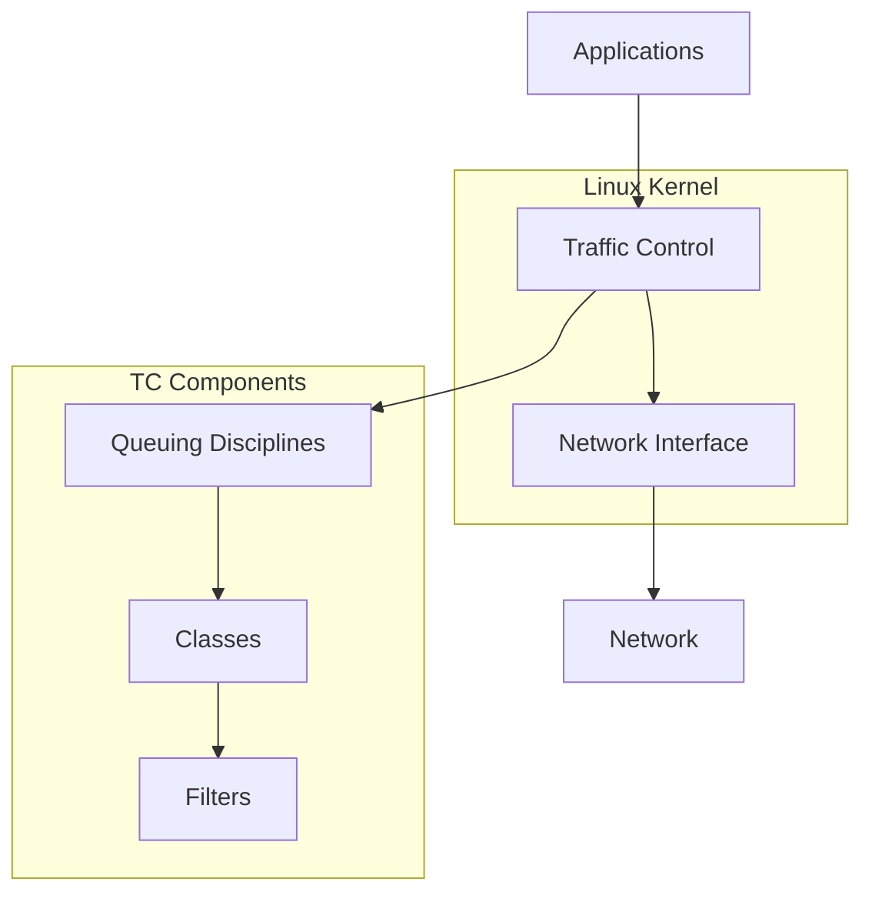
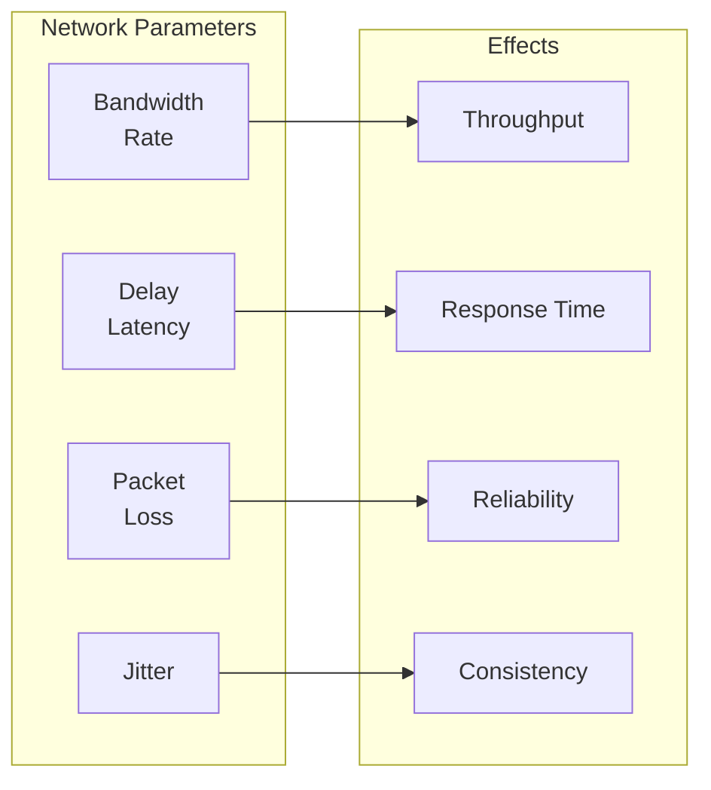
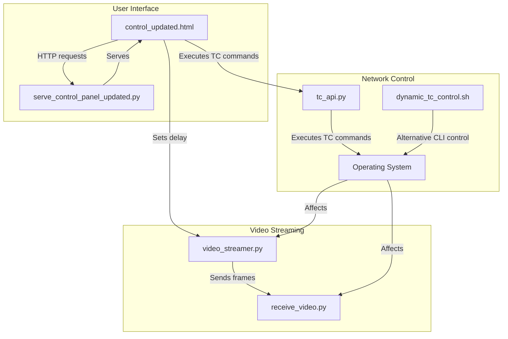
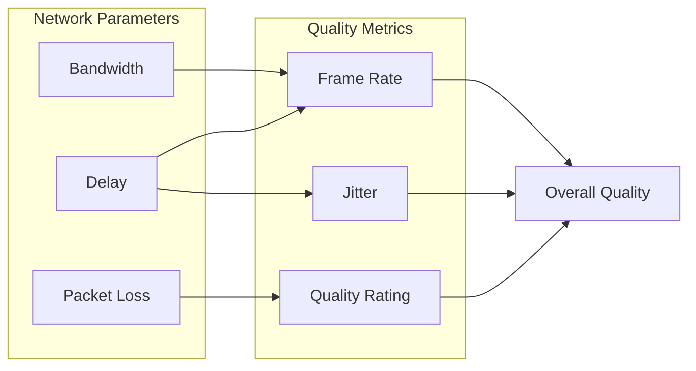

# Linux Traffic Control (TC) Tutorial

## Table of Contents
- [Part 1: Linux Traffic Control Fundamentals](#part-1-linux-traffic-control-fundamentals)
  - [Introduction to TC](#introduction-to-tc)
  - [TC Architecture and Components](#tc-architecture-and-components)
  - [Key Concepts](#key-concepts)
  - [Network Parameters](#network-parameters)
- [Part 2: TC Command-Line Usage](#part-2-tc-command-line-usage)
  - [Basic TC Commands](#basic-tc-commands)
  - [Common Queuing Disciplines](#common-queuing-disciplines)
  - [Network Simulation Examples](#network-simulation-examples)
- [Part 3: TC in Your Project](#part-3-tc-in-your-project)
  - [System Architecture](#system-architecture)
  - [Implementation Details](#implementation-details)
  - [Network Simulation Scenarios](#network-simulation-scenarios)
  - [Quality Metrics and Visualization](#quality-metrics-and-visualization)
- [Part 4: Practical Exercises](#part-4-practical-exercises)
  - [Setting Up Your Environment](#setting-up-your-environment)
  - [Basic TC Commands Practice](#basic-tc-commands-practice)
  - [Using the Web Interface](#using-the-web-interface)
  - [Extending the System](#extending-the-system)

## Part 1: Linux Traffic Control Fundamentals

### Introduction to TC

#### What is Traffic Control?

Linux Traffic Control (TC) is a powerful set of tools built into the Linux kernel that allows you to control how data packets are sent and received over network interfaces. It provides mechanisms to:

- Control bandwidth usage
- Prioritize certain types of traffic
- Delay packet transmission
- Drop packets selectively
- Simulate various network conditions

TC operates at the kernel level, which means it can affect all network traffic passing through a specific network interface, regardless of the application generating that traffic.

#### Why use Traffic Control?

There are several reasons to use Traffic Control:

1. **Network Emulation**: Test how applications perform under different network conditions
2. **Quality of Service (QoS)**: Prioritize important traffic over less critical traffic
3. **Bandwidth Management**: Prevent a single application or user from consuming all available bandwidth
4. **Traffic Shaping**: Smooth out traffic bursts to prevent congestion
5. **Network Debugging**: Diagnose network-related issues by simulating problematic conditions

#### Use Cases and Applications

- **Development and Testing**: Test how applications behave under poor network conditions
- **Network Administration**: Manage bandwidth allocation in multi-user environments
- **Gaming and Streaming**: Prioritize real-time traffic over background downloads
- **Education**: Demonstrate network concepts and behaviors
- **VoIP and Video Conferencing**: Ensure consistent quality for real-time communication

### TC Architecture and Components

TC operates within the Linux networking stack, sitting between the IP layer and the network device drivers. When packets are sent from applications, they pass through the TC subsystem before being transmitted over the network interface.



The TC architecture consists of three main components:

1. **Queuing Disciplines (qdiscs)**: Algorithms that control how packets are queued and dequeued
2. **Classes**: Subdivisions within qdiscs that can have their own parameters
3. **Filters**: Rules that determine which packets go to which classes

### Key Concepts

#### Queuing Disciplines (qdiscs)

A qdisc is an algorithm that controls how packets are queued (stored) and dequeued (sent) on a network interface. There are two types of qdiscs:

1. **Classless qdiscs**: Simple algorithms that treat all traffic the same way
   - Examples: pfifo, tbf, netem

2. **Classful qdiscs**: More complex algorithms that can divide traffic into classes
   - Examples: htb, prio, cbq

Each network interface has:
- A **root qdisc** attached to it (default is pfifo_fast)
- Optionally, **ingress qdisc** for incoming traffic

#### Classes

Classes are subdivisions within classful qdiscs. Each class:
- Has its own parameters (bandwidth, priority, etc.)
- Can contain other classes (creating a hierarchy)
- Can have its own qdisc

Classes allow for more granular control over different types of traffic.

#### Filters

Filters are rules that classify packets and direct them to specific classes. They can match on various criteria:
- Source/destination IP addresses
- Port numbers
- Protocol (TCP, UDP, etc.)
- TOS/DSCP values
- Packet size
- Application-specific markers

#### Tokens and Buckets

Many TC algorithms use the concept of "token buckets" to control traffic:

- **Tokens** represent permission to send data
- **Buckets** store tokens up to a maximum capacity
- Tokens are added to the bucket at a fixed rate
- Packets consume tokens proportional to their size
- If there are not enough tokens, packets are delayed or dropped

This mechanism allows for:
- Controlling average bandwidth while allowing short bursts
- Smoothing out traffic to prevent congestion

### Network Parameters

TC allows you to manipulate several network parameters to simulate different conditions:



#### Bandwidth (Rate)

- **What it is**: The maximum data transfer speed
- **Measurement**: Bits per second (bps, kbps, Mbps, Gbps)
- **Effect**: Limits how much data can be sent in a given time period
- **Real-world examples**:
  - Fiber: 100 Mbps - 10 Gbps
  - Cable: 10-500 Mbps
  - DSL: 1-100 Mbps
  - 4G Mobile: 5-50 Mbps
  - Satellite: 5-25 Mbps

#### Delay (Latency)

- **What it is**: The time it takes for a packet to travel from source to destination
- **Measurement**: Milliseconds (ms)
- **Effect**: Increases response time and reduces interactivity
- **Real-world examples**:
  - Local network: 1-5 ms
  - Same city: 5-20 ms
  - Same country: 20-100 ms
  - International: 100-400 ms
  - Satellite: 500-700 ms

#### Packet Loss

- **What it is**: The percentage of packets that never reach their destination
- **Measurement**: Percentage (%)
- **Effect**: Causes retransmissions, reduces throughput, and degrades quality
- **Real-world examples**:
  - Good connection: 0-0.1%
  - Average connection: 0.1-1%
  - Poor connection: 1-5%
  - Very poor connection: 5-20%

#### Jitter

- **What it is**: Variation in packet delay
- **Measurement**: Milliseconds (ms)
- **Effect**: Causes inconsistent timing, affecting real-time applications
- **Real-world examples**:
  - Good connection: 0-5 ms
  - Average connection: 5-20 ms
  - Poor connection: 20-100 ms

## Part 2: TC Command-Line Usage

### Basic TC Commands

TC commands follow this general structure:
```
tc [OPTIONS] OBJECT {add|change|replace|delete} dev DEVICE [PARAMETERS]
```

Where:
- `OBJECT` is one of: qdisc, class, filter
- `DEVICE` is the network interface (e.g., eth0, wlan0)

#### Viewing Current Configuration

To view the current qdiscs:
```bash
tc qdisc show dev eth0
```

To view classes:
```bash
tc class show dev eth0
```

To view filters:
```bash
tc filter show dev eth0
```

To view detailed statistics:
```bash
tc -s qdisc show dev eth0
```

#### Adding and Removing Qdiscs

To add a new root qdisc:
```bash
tc qdisc add dev eth0 root QDISC [PARAMETERS]
```

To change an existing qdisc:
```bash
tc qdisc change dev eth0 root QDISC [PARAMETERS]
```

To delete a qdisc:
```bash
tc qdisc del dev eth0 root
```

#### Working with Classes

To add a class:
```bash
tc class add dev eth0 parent 1: classid 1:1 QDISC [PARAMETERS]
```

To change a class:
```bash
tc class change dev eth0 parent 1: classid 1:1 QDISC [PARAMETERS]
```

#### Working with Filters

To add a filter:
```bash
tc filter add dev eth0 parent 1: protocol ip prio 1 u32 match ip dst 192.168.1.0/24 flowid 1:1
```

### Common Queuing Disciplines

#### NETEM (Network Emulation)

NETEM is the most commonly used qdisc for network simulation. It can simulate:
- Delay
- Packet loss
- Packet corruption
- Packet reordering
- Packet duplication
- Jitter

Basic syntax:
```bash
tc qdisc add dev eth0 root netem [PARAMETERS]
```

Examples:
```bash
# Add 100ms delay
tc qdisc add dev eth0 root netem delay 100ms

# Add 100ms delay with 10ms jitter
tc qdisc add dev eth0 root netem delay 100ms 10ms

# Add 5% packet loss
tc qdisc add dev eth0 root netem loss 5%

# Combine parameters
tc qdisc add dev eth0 root netem delay 100ms 10ms loss 5% corrupt 2%
```

#### HTB (Hierarchical Token Bucket)

HTB is used for bandwidth control and traffic classification. It allows you to:
- Set maximum bandwidth for different traffic classes
- Share unused bandwidth between classes
- Prioritize certain classes over others

Basic syntax:
```bash
tc qdisc add dev eth0 root handle 1: htb default 10
tc class add dev eth0 parent 1: classid 1:1 htb rate 100mbit
tc class add dev eth0 parent 1:1 classid 1:10 htb rate 10mbit ceil 100mbit
tc class add dev eth0 parent 1:1 classid 1:20 htb rate 50mbit ceil 100mbit
```

#### TBF (Token Bucket Filter)

TBF is a simple qdisc for bandwidth limiting:

```bash
# Limit bandwidth to 1Mbit with 10KB burst size
tc qdisc add dev eth0 root tbf rate 1mbit burst 10kb latency 70ms
```

#### PRIO (Priority Scheduler)

PRIO creates multiple bands with different priorities:

```bash
tc qdisc add dev eth0 root handle 1: prio bands 3
tc qdisc add dev eth0 parent 1:1 handle 10: netem delay 10ms
tc qdisc add dev eth0 parent 1:2 handle 20: netem delay 50ms
tc qdisc add dev eth0 parent 1:3 handle 30: netem delay 200ms
```

### Network Simulation Examples

#### Bandwidth Limitation

To limit bandwidth to 1 Mbps:
```bash
tc qdisc add dev eth0 root tbf rate 1mbit burst 32kbit latency 400ms
```

Or using HTB:
```bash
tc qdisc add dev eth0 root handle 1: htb default 10
tc class add dev eth0 parent 1: classid 1:1 htb rate 1mbit
```

#### Adding Delay/Latency

To add a fixed 100ms delay:
```bash
tc qdisc add dev eth0 root netem delay 100ms
```

To add a variable delay (jitter):
```bash
tc qdisc add dev eth0 root netem delay 100ms 20ms
```

To add a variable delay with correlation (more realistic):
```bash
tc qdisc add dev eth0 root netem delay 100ms 20ms 25%
```

#### Simulating Packet Loss

To add 5% packet loss:
```bash
tc qdisc add dev eth0 root netem loss 5%
```

To add correlated packet loss (more realistic):
```bash
tc qdisc add dev eth0 root netem loss 5% 25%
```

#### Creating Jitter

To add jitter without changing the average delay:
```bash
tc qdisc add dev eth0 root netem delay 100ms 30ms
```

#### Combined Effects

To simulate a poor mobile connection:
```bash
tc qdisc add dev eth0 root netem delay 200ms 40ms 25% loss 3% 25% rate 500kbit
```

To simulate a satellite connection:
```bash
tc qdisc add dev eth0 root netem delay 500ms 50ms loss 1% rate 1mbit
```

## Part 3: TC in Your Project

### System Architecture

Your project uses TC to simulate different network conditions for video streaming. The system architecture consists of several components that work together:



The main components are:

1. **Video Streaming Components**:
   - `video_streamer.py`: Captures video frames and streams them
   - `receive_video.py`: Receives and displays video frames

2. **Network Control Components**:
   - `tc_api.py`: Flask API server that executes TC commands
   - `dynamic_tc_control.sh`: Bash script for command-line TC control

3. **User Interface Components**:
   - `control_updated.html`: Web interface for controlling network conditions
   - `serve_control_panel_updated.py`: HTTP server for the control panel

4. **System Management**:
   - `start_system.sh`: Script to start all components

### Implementation Details

#### TC API Implementation

The `tc_api.py` file provides a REST API for executing TC commands:

```python
@app.route('/execute_tc_command', methods=['POST'])
def execute_tc_command():
    data = request.json
    command = data['command']
    
    # Validate the command to ensure it's a tc command
    if not command.startswith('tc '):
        return jsonify({'error': 'Only tc commands are allowed'}), 400
    
    # Extract parameters from the command
    delay_match = re.search(r'delay\s+(\d+)ms', command)
    rate_match = re.search(r'rate\s+(\d+\.?\d*)(\w+)', command)
    loss_match = re.search(r'loss\s+(\d+\.?\d*)%', command)
    
    # Execute the command
    result = subprocess.run(command, shell=True, capture_output=True, text=True)
    
    # Return the result
    return jsonify({
        'message': 'Command executed successfully',
        'command': command,
        'output': result.stdout,
        'error': result.stderr,
        'success': result.returncode == 0
    })
```

The API also provides endpoints for:
- Resetting TC configuration (`/reset_tc`)
- Getting current TC status (`/get_tc_status`)

#### Web Interface Controls

The web interface (`control_updated.html`) provides controls for:

1. **Delay (Latency)**:
   - Set the network delay in milliseconds
   - Affects how long it takes for packets to reach their destination

2. **Bandwidth (Rate)**:
   - Set the maximum bandwidth in kbit/s, Mbit/s, or Gbit/s
   - Limits how much data can be sent per second

3. **Packet Loss**:
   - Set the percentage of packets that will be dropped
   - Simulates unreliable network connections

4. **Preset Network Conditions**:
   - Perfect Connection
   - Good Broadband
   - Average Mobile
   - Poor Mobile
   - Satellite Internet
   - Critical Conditions

The interface also displays quality metrics that update based on the current network parameters.

#### Command-Line Interface

The `dynamic_tc_control.sh` script provides a command-line interface for controlling network conditions:

```bash
#!/bin/bash

# Set the network interface
INTERFACE="eth0"  # Change this to your network interface

# Function to apply network conditions
apply_conditions() {
    local rate="$1"     # Bandwidth rate (e.g., "1mbit")
    local delay="$2"    # Latency delay (e.g., "100ms")
    local loss="$3"     # Packet loss (e.g., "10%")
    
    # Apply the network conditions using tc
    sudo tc qdisc change dev $INTERFACE root netem rate $rate delay $delay loss $loss
}

# Interactive menu
while true; do
    echo "1. Set network conditions"
    echo "2. Show current stats"
    echo "3. Reset network conditions"
    echo "4. Exit"
    read -p "Select an option: " option
    
    case $option in
        1)
            read -p "Enter rate (e.g., 1mbit): " rate
            read -p "Enter delay (e.g., 100ms): " delay
            read -p "Enter loss (e.g., 5%): " loss
            apply_conditions "$rate" "$delay" "$loss"
            ;;
        2)
            tc -s qdisc show dev $INTERFACE
            ;;
        3)
            sudo tc qdisc del dev $INTERFACE root
            ;;
        4)
            exit 0
            ;;
    esac
done
```

### Network Simulation Scenarios

Your project includes several preset network scenarios that simulate real-world conditions:

#### Perfect Connection
- Delay: 10ms
- Rate: 10Mbit/s
- Loss: 0%
- Description: Represents an ideal network connection with no limitations

#### Good Broadband
- Delay: 30ms
- Rate: 5Mbit/s
- Loss: 0.1%
- Description: Typical home broadband connection

#### Average Mobile
- Delay: 100ms
- Rate: 2Mbit/s
- Loss: 1%
- Description: 4G mobile connection with moderate signal strength

#### Poor Mobile
- Delay: 200ms
- Rate: 500Kbit/s
- Loss: 5%
- Description: Mobile connection with weak signal or congestion

#### Satellite Internet
- Delay: 500ms
- Rate: 1Mbit/s
- Loss: 2%
- Description: Satellite internet connection with high latency

#### Critical Conditions
- Delay: 1000ms
- Rate: 100Kbit/s
- Loss: 10%
- Description: Extremely poor connection, barely usable

### Quality Metrics and Visualization

The system calculates and displays several quality metrics based on the network parameters:



The quality metrics include:

1. **Latency**: The current delay in milliseconds
2. **Frame Rate**: Calculated as 1/delay in seconds
3. **Jitter**: Estimated variation in delay
4. **Quality Rating**: Overall score from 0.5/5 to 5/5

The quality rating is calculated using a weighted formula:
- 50% based on delay
- 30% based on bandwidth
- 20% based on packet loss

This provides a comprehensive view of how the network conditions affect the perceived quality of the video stream.

## Part 4: Practical Exercises

### Setting Up Your Environment

#### Required Packages

To use TC, you need the `iproute2` package, which includes the TC tools:

```bash
# For Debian/Ubuntu
sudo apt-get update
sudo apt-get install iproute2

# For Red Hat/CentOS
sudo yum install iproute-tc
```

For the full project, you'll also need:
- Python 3 with Flask, OpenCV, NumPy, and Requests
- A web browser
- Sudo privileges (for TC commands)

#### Network Interface Configuration

1. Identify your network interface:
```bash
ip a
```

2. Update the interface name in the scripts:
- In `dynamic_tc_control.sh`: Update the `INTERFACE` variable
- In `tc_api.py`: The interface is auto-detected, but you can modify it if needed

### Basic TC Commands Practice

Try these exercises to get familiar with TC:

#### Exercise 1: View Current Configuration
```bash
# View current qdiscs
tc qdisc show

# View detailed statistics
tc -s qdisc show
```

#### Exercise 2: Add and Remove a Simple Delay
```bash
# Add a 100ms delay
sudo tc qdisc add dev eth0 root netem delay 100ms

# Verify it was added
tc qdisc show

# Test the delay
ping google.com

# Remove the delay
sudo tc qdisc del dev eth0 root

# Verify it was removed
tc qdisc show

# Test again
ping google.com
```

#### Exercise 3: Combine Multiple Parameters
```bash
# Add delay, packet loss, and bandwidth limitation
sudo tc qdisc add dev eth0 root netem delay 100ms loss 5% rate 1mbit

# Test with a download
wget http://speedtest.tele2.net/1MB.zip

# Remove the limitations
sudo tc qdisc del dev eth0 root

# Test again
wget http://speedtest.tele2.net/1MB.zip
```

### Using the Web Interface

1. Start the system using the provided script:
```bash
./start_system.sh
```

2. Open the control panel in your browser:
```
http://localhost:8000/control_updated.html
```

3. Try different network presets:
   - Click on "Perfect Connection" and observe the video quality
   - Click on "Average Mobile" and notice the delay and quality change
   - Click on "Poor Mobile" and observe the significant degradation

4. Try custom settings:
   - Set a custom delay of 200ms
   - Set a bandwidth limit of 500 Kbit/s
   - Set a packet loss of 2%
   - Observe how each parameter affects the video quality

5. Monitor the quality metrics:
   - Watch how the frame rate changes with delay
   - Observe how the quality rating changes with different parameters
   - Notice how jitter increases with higher delay values

### Extending the System

#### Adding New Network Scenarios

You can add new network scenarios to the web interface by modifying the `setNetworkPreset` function in `control_updated.html`:

```javascript
function setNetworkPreset(preset) {
    switch(preset) {
        case 'new_scenario':
            presetName = "My New Scenario";
            delay = 150;
            rate = 3;
            rateUnit = 'mbit';
            loss = 2;
            break;
        // ... existing scenarios ...
    }
    
    // Rest of the function remains the same
}
```

Then add a new button to the HTML:

```html
<button onclick="setNetworkPreset('new_scenario')">My New Scenario</button>
```

#### Customizing Parameters

You can modify the TC commands in `tc_api.py` to include additional parameters:

```python
# Add jitter parameter
jitter_match = re.search(r'jitter\s+(\d+)ms', command)
jitter = jitter_match.group(1) if jitter_match else "0"

# Modify the command to include jitter
command = f"sudo tc qdisc change dev {INTERFACE} root netem delay {delay}ms {jitter}ms rate {rate}{rate_unit} loss {loss}%"
```

Then update the web interface to include controls for the new parameters.

#### Adding New Quality Metrics

You can add new quality metrics to the web interface by modifying the `updateQoSMetrics` function in `control_updated.html`:

```javascript
function updateQoSMetrics() {
    // ... existing code ...
    
    // Add a new metric for packet corruption
    const corruptionValue = document.getElementById('corruption-value');
    const corruptionQuality = document.getElementById('corruption-quality');
    corruptionValue.textContent = currentParams.corruption + '%';
    
    // Calculate corruption score
    let corruptionScore = 0;
    if (currentParams.corruption <= 0.1) corruptionScore = 5;
    else if (currentParams.corruption <= 0.5) corruptionScore = 4;
    // ... more conditions ...
    
    // Update overall score calculation
    const overallScore = (delayScore * 0.4) + (rateScore * 0.25) + 
                         (lossScore * 0.15) + (corruptionScore * 0.2);
    
    // ... rest of the function ...
}
```

Then add the new metric to the HTML:

```html
<div class="metric">
    <h4>Corruption</h4>
    <div id="corruption-value">0%</div>
    <div id="corruption-quality">Perfect</div>
</div>