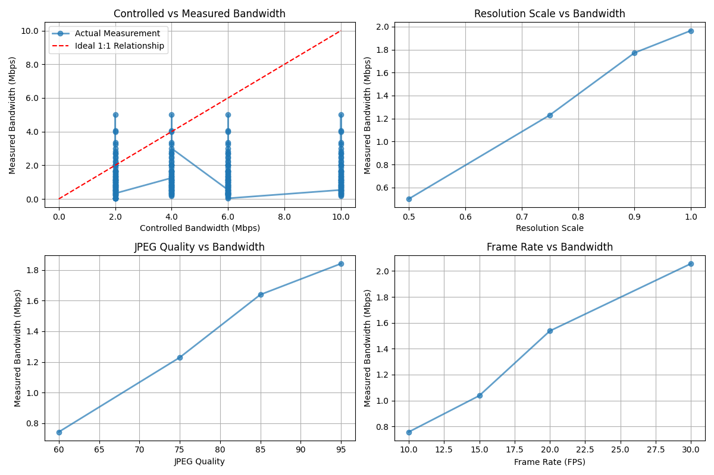
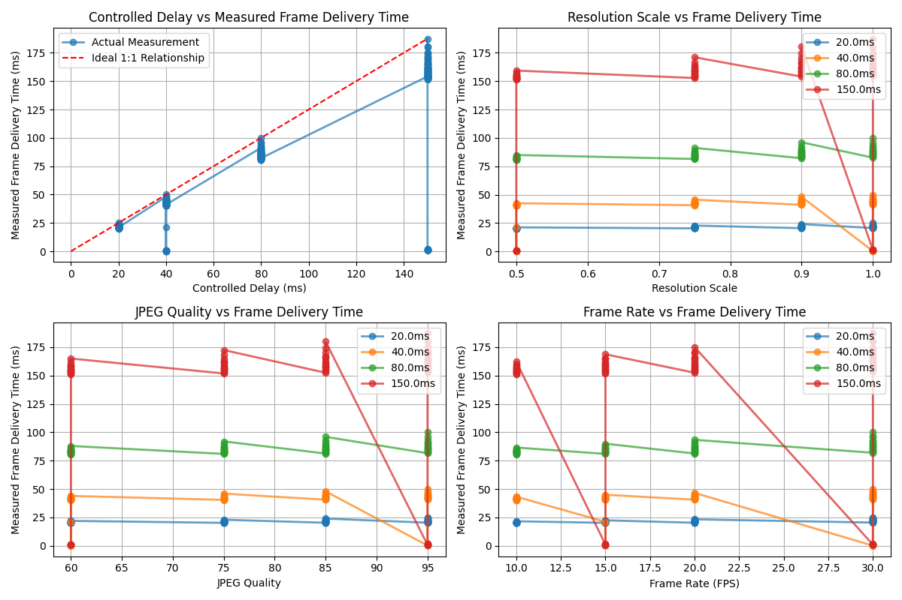
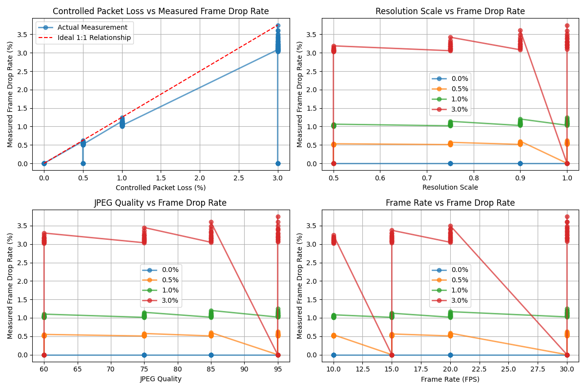
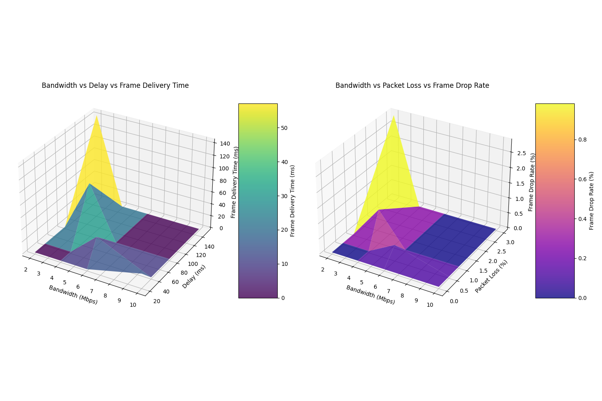
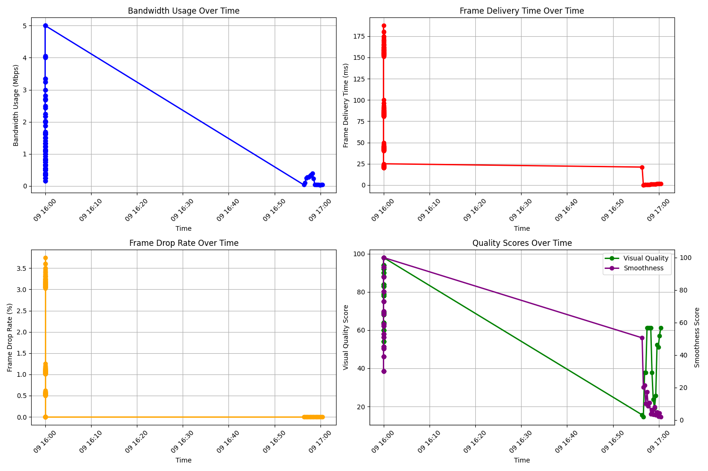
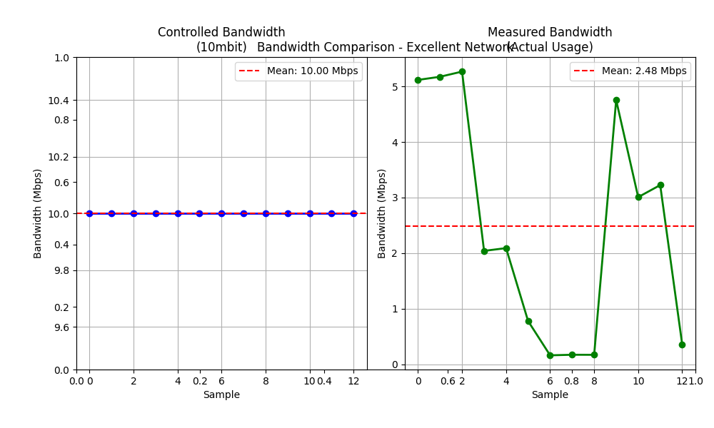
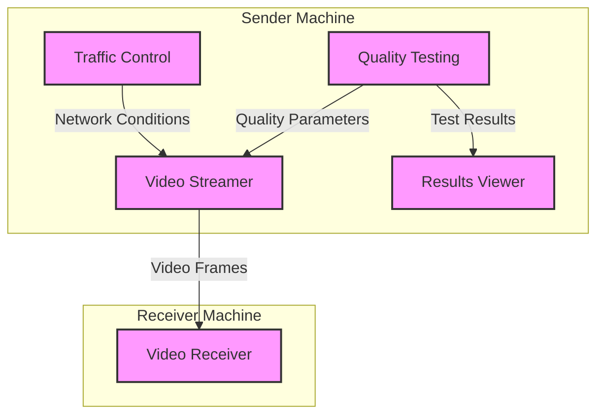
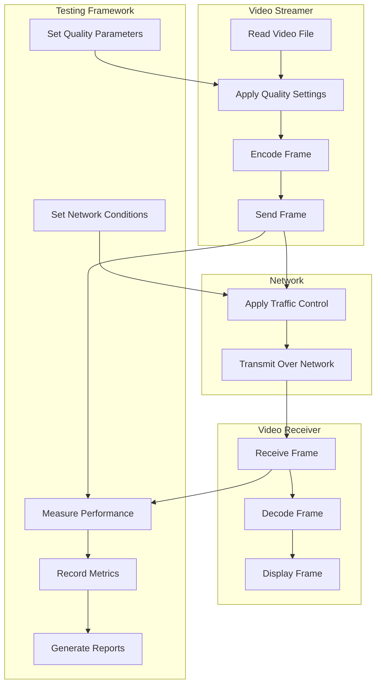
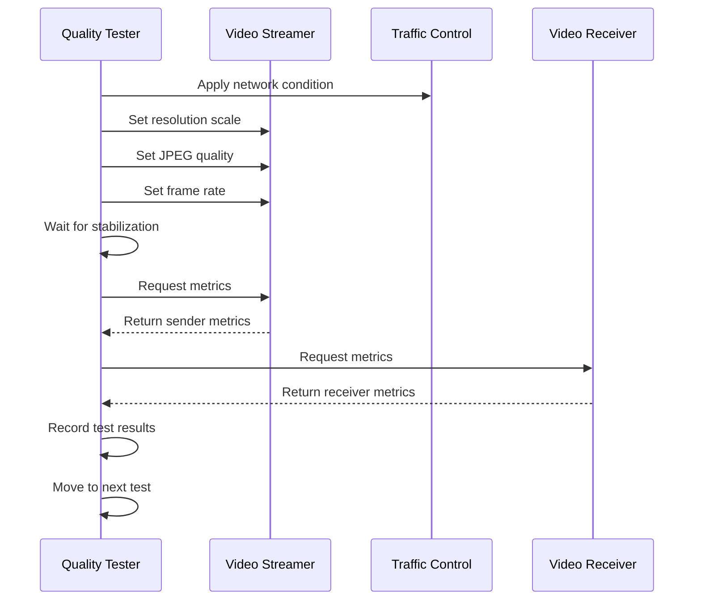
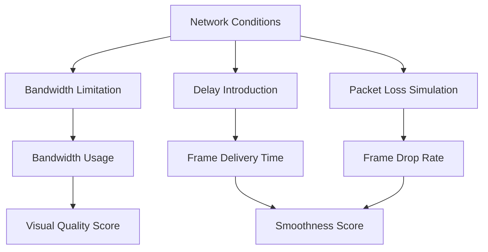

# Dynamic Traffic Shaping System: Detailed Code Documentation

This document provides a comprehensive explanation of all code files in the dynamic traffic shaping system, including how to start, visualize, and control network traffic. It covers the implementation details, data flow, and various types of graphs used for analysis.

## Table of Contents

1. [Introduction](#introduction)
2. [System Architecture](#system-architecture)
3. [Core Components](#core-components)
   - [Video Streamer](#video-streamer)
   - [Video Receiver](#video-receiver)
   - [Traffic Control](#traffic-control)
4. [Testing Framework](#testing-framework)
   - [Quality Testing](#quality-testing)
   - [Quick Testing](#quick-testing)
5. [Visualization and Analysis](#visualization-and-analysis)
   - [Results Viewer](#results-viewer)
   - [Graph Generation](#graph-generation)
   - [Controlled vs. Measured Comparison](#controlled-vs-measured-comparison)
   - [Live Monitoring](#live-monitoring)
6. [Setup and Configuration](#setup-and-configuration)
   - [Setup Scripts](#setup-scripts)
7. [Data Management](#data-management)
   - [Live Data Generation](#live-data-generation)
   - [Data Updates](#data-updates)
8. [Step-by-Step Usage Guide](#step-by-step-usage-guide)
9. [Understanding the Graphs](#understanding-the-graphs)
   - [Bandwidth Graphs](#bandwidth-graphs)
   - [Delay Graphs](#delay-graphs)
   - [Loss Graphs](#loss-graphs)
   - [Combined Graphs](#combined-graphs)
   - [Time Series Graphs](#time-series-graphs)
10. [Advanced Usage and Customization](#advanced-usage-and-customization)

## Introduction

The Dynamic Traffic Shaping System is designed to test and analyze video streaming performance under various network conditions. It allows you to:

1. Stream video between two computers
2. Apply controlled network conditions (bandwidth, delay, packet loss)
3. Measure performance metrics
4. Visualize the relationship between controlled parameters and measured metrics
5. Identify optimal quality settings for different network conditions

This system is particularly useful for:
- Testing video streaming applications
- Developing adaptive streaming algorithms
- Educational purposes to understand network effects on video quality
- Benchmarking video codecs and streaming protocols
## System Architecture

The system consists of several interconnected components:

```
+------------------------+                  +------------------------+
|    Sender Machine      |                  |    Receiver Machine    |
|                        |                  |                        |
|  +----------------+    |                  |  +----------------+    |
|  | Video Streamer |----+--Video Frames--->+--| Video Receiver |    |
|  +----------------+    |                  |  +----------------+    |
|         ^              |                  |         ^              |
|         |              |                  |         |              |
|  +----------------+    |                  |  +----------------+    |
|  | Traffic Control|    |                  |  | Traffic Control|    |
|  | (Sender-side)  |    |                  |  | (Receiver-side)|    |
|  +----------------+    |                  |  +----------------+    |
|         ^              |                  |                        |
|         |              |                  |                        |
|  +----------------+    |                  |                        |
|  | Quality Testing|    |                  |                        |
|  +----------------+    |                  |                        |
|         |              |                  |                        |
|         v              |                  |                        |
|  +----------------+    |                  |                        |
|  | Results Viewer |    |                  |                        |
|  +----------------+    |                  |                        |
+------------------------+                  +------------------------+
```

The system follows a client-server architecture where:

1. **Sender Machine** hosts:
   - Video Streamer: Reads video frames and sends them to the receiver
   - Traffic Control: Applies network conditions to outgoing traffic
   - Quality Testing: Tests different quality settings and network conditions
   - Results Viewer: Displays test results and graphs

2. **Receiver Machine** hosts:
   - Video Receiver: Receives video frames and displays them
   - Traffic Control: Can optionally apply network conditions to incoming traffic

The data flow between components is as follows:

1. The Quality Testing component controls both the Video Streamer and Traffic Control
2. The Video Streamer sends frames to the Video Receiver
3. Traffic Control affects the network conditions between the sender and receiver
4. Both the Video Streamer and Video Receiver provide metrics to the Quality Testing component
5. The Results Viewer displays the test results and graphs

This architecture allows for comprehensive testing of video streaming performance under various network conditions, with the ability to visualize and analyze the results.
## Core Components

### Video Streamer

**File: `video_streamer.py`**

This is the core component responsible for reading video frames from a file, applying quality settings, and streaming them to the receiver.

#### Key Functions:

```python
def generate():
    """Generate video frames and stream them."""
    # Create a new capture object each time to avoid thread safety issues
    local_cap = cv2.VideoCapture(video_path)
    
    try:
        frame_count = 0
        while local_cap.isOpened():
            ret, frame = local_cap.read()
            if not ret:
                # Try to loop the video by reopening it
                local_cap.release()
                local_cap = cv2.VideoCapture(video_path)
                continue
            
            # Apply resolution scaling
            if resolution_scale < 1.0:
                h, w = frame.shape[:2]
                new_h, new_w = int(h * resolution_scale), int(w * resolution_scale)
                frame = cv2.resize(frame, (new_w, new_h))
            
            # Encode the frame in JPEG format with the specified quality
            encode_param = [int(cv2.IMWRITE_JPEG_QUALITY), jpeg_quality]
            ret, jpeg = cv2.imencode('.jpg', frame, encode_param)
            jpeg_bytes = jpeg.tobytes()
            
            # Send frame to receiver
            send_frame_to_receiver(jpeg_bytes)
            
            # Yield the frame to stream to browser
            yield (b'--frame\r\n' b'Content-Type: image/jpeg\r\n\r\n' + jpeg_bytes + b'\r\n\r\n')
            
            # Add a delay to control frame rate
            time.sleep(1 / target_fps)
    
    finally:
        # Always release the capture object
        local_cap.release()
```

```python
def send_frame_to_receiver(jpeg_bytes):
    """Send a frame to the receiver."""
    global frame_count, last_frame_time, dropped_frames
    
    try:
        # Encode the frame as base64 for JSON transmission
        encoded_frame = base64.b64encode(jpeg_bytes).decode('utf-8')
        
        # Send the frame to the receiver
        response = requests.post(
            f"http://{receiver_ip}:8081/receive_video",
            json={"frame": encoded_frame},
            timeout=1.0  # 1 second timeout
        )
        
        # Update metrics
        frame_count += 1
        current_time = time.time()
        
        # Calculate bandwidth usage
        frame_size = len(jpeg_bytes)
        if last_frame_time > 0:
            time_diff = current_time - last_frame_time
            if time_diff > 0:
                bandwidth = frame_size / time_diff  # bytes per second
                bandwidth_history.append(bandwidth)
                # Keep only the last 30 bandwidth measurements
                if len(bandwidth_history) > 30:
                    bandwidth_history.pop(0)
        
        last_frame_time = current_time
        
        return response.status_code == 200
    except Exception as e:
        dropped_frames += 1
        return False
```

#### API Endpoints:

1. `/tx_video_feed` - Streams video to the local browser
2. `/set_resolution` - Sets the resolution scaling factor (0.5, 0.75, 0.9, 1.0)
3. `/set_quality` - Sets the JPEG quality (60, 75, 85, 95)
4. `/set_fps` - Sets the target frame rate (10, 15, 20, 30)
5. `/get_metrics` - Returns performance metrics (bandwidth usage, visual quality score)

#### How It Works:

1. The streamer reads frames from a video file using OpenCV
2. It applies resolution scaling by resizing the frame
3. It encodes the frame as a JPEG with the specified quality
### Video Receiver

**File: `receive_video.py`**

This component receives video frames from the streamer, decodes them, and displays them in a web browser.

#### Key Functions:

```python
@app.route('/receive_video', methods=['POST'])
def receive_video():
    """Receive a video frame from the streamer."""
    global current_frame, frame_count, last_frame_time, dropped_frames
    
    try:
        # Get the frame data from the POST request
        data = request.json
        frame_data = data['frame']
        
        # Decode the frame from base64 format
        img_bytes = base64.b64decode(frame_data)
        nparr = np.frombuffer(img_bytes, np.uint8)
        frame = cv2.imdecode(nparr, cv2.IMREAD_COLOR)
        
        if frame is not None:
            # Calculate frame delivery time
            current_time = time.time()
            if last_frame_time > 0:
                frame_delivery_time = (current_time - last_frame_time) * 1000  # in ms
                frame_delivery_times.append(frame_delivery_time)
                # Keep only the last 30 frame delivery times
                if len(frame_delivery_times) > 30:
                    frame_delivery_times.pop(0)
            
            last_frame_time = current_time
            
            # Set the current frame to be used in the MJPEG stream
            current_frame = frame
            frame_count += 1
            
            return jsonify({'status': 'success'}), 200
        else:
            dropped_frames += 1
            return jsonify({'status': 'error', 'message': 'Failed to decode frame'}), 400
    except Exception as e:
        dropped_frames += 1
        return jsonify({'status': 'error', 'message': str(e)}), 400
```

```python
def generate():
    """Generate frames for the MJPEG stream."""
    global current_frame
    
    while True:
        if current_frame is not None:
            # Encode the frame as JPEG
            ret, jpeg = cv2.imencode('.jpg', current_frame)
            
            # Yield the frame for the MJPEG stream
            yield (b'--frame\r\n'
                   b'Content-Type: image/jpeg\r\n\r\n' + jpeg.tobytes() + b'\r\n\r\n')
        else:
            # If no frame is available, yield a blank frame
            blank_frame = np.zeros((480, 640, 3), np.uint8)
            ret, jpeg = cv2.imencode('.jpg', blank_frame)
            yield (b'--frame\r\n'
                   b'Content-Type: image/jpeg\r\n\r\n' + jpeg.tobytes() + b'\r\n\r\n')
        
        # Add a small delay to control the frame rate
        time.sleep(0.01)
```

#### API Endpoints:

1. `/rx_video_feed` - Displays the received video in a browser
2. `/get_metrics` - Returns performance metrics (frame delivery time, frame drop rate, smoothness score)

#### How It Works:

### Traffic Control

**File: `dynamic_tc_control.sh`**

This Bash script uses Linux Traffic Control (tc) to simulate different network conditions by applying bandwidth limitations, delay, and packet loss.

#### Key Functions:

```bash
# Function to apply network conditions dynamically
apply_conditions() {
    local rate="$1"     # Bandwidth rate (e.g., "1mbit")
    local delay="$2"    # Latency delay (e.g., "100ms")
    local loss="$3"     # Packet loss (e.g., "10%")

    echo "Applying network conditions: Rate=$rate, Delay=$delay, Loss=$loss"

    # First, ensure the qdisc is added to the interface if it doesn't exist yet
    if ! tc qdisc show dev $INTERFACE | grep -q "netem"; then
        # Add the root qdisc for network emulation if not already added
        sudo tc qdisc add dev $INTERFACE root netem
    fi

    # Apply the new network conditions using tc
    sudo tc qdisc change dev $INTERFACE root netem rate $rate delay $delay loss $loss
    
    # Only update live data if jq is installed
    if [ "$HAS_JQ" = true ]; then
        # Get current video quality settings from the sender
        echo "Getting current video quality settings..."
        resolution_scale=$(curl -s http://localhost:5000/get_resolution || echo "0.75")
        jpeg_quality=$(curl -s http://localhost:5000/get_quality || echo "85")
        frame_rate=$(curl -s http://localhost:5000/get_fps || echo "20")
        
        # Get current metrics from the sender and receiver
        echo "Getting current metrics..."
        bandwidth_usage=$(curl -s http://localhost:5000/get_metrics | jq -r '.bandwidth_usage // 0' || echo "0")
        frame_delivery_time=$(curl -s http://localhost:8081/get_metrics | jq -r '.frame_delivery_time // 0' || echo "0")
        frame_drop_rate=$(curl -s http://localhost:8081/get_metrics | jq -r '.frame_drop_rate // 0' || echo "0")
        visual_quality_score=$(curl -s http://localhost:5000/get_metrics | jq -r '.visual_quality_score // 0' || echo "0")
        smoothness_score=$(curl -s http://localhost:8081/get_metrics | jq -r '.smoothness_score // 0' || echo "0")
        
        # Determine network condition name based on parameters
        network_condition="Custom"
        if [[ "$rate" == "2mbit" && "$delay" == "150ms" && "$loss" == "3%" ]]; then
            network_condition="Poor"
        elif [[ "$rate" == "4mbit" && "$delay" == "80ms" && "$loss" == "1%" ]]; then
            network_condition="Fair"
        elif [[ "$rate" == "6mbit" && "$delay" == "40ms" && "$loss" == "0.5%" ]]; then
            network_condition="Good"
        elif [[ "$rate" == "10mbit" && "$delay" == "20ms" && "$loss" == "0%" ]]; then
            network_condition="Excellent"
        fi
        
        # Update live data
        echo "Updating live data..."
        python3 update_live_data.py \
            "$network_condition" "$rate" "$delay" "$loss" \
            "$resolution_scale" "$jpeg_quality" "$frame_rate" \
            "$bandwidth_usage" "$frame_delivery_time" "$frame_drop_rate" \
            "$visual_quality_score" "$smoothness_score"
    else
        echo "Skipping live data update (jq not installed)."
    fi
}
```

```bash
# Function to reset network conditions (remove tc configuration)
reset_conditions() {
    echo "Resetting network conditions."
    sudo tc qdisc del dev $INTERFACE root
}
```

#### Interactive Menu:

```bash
# Interactive menu for dynamic control
menu() {
    echo "----------------------------"
    echo "Dynamic Network Control (TC)"
    echo "----------------------------"
    echo "1. Set network conditions (Rate, Delay, Loss)"
    echo "2. Show current stats"
    echo "3. Reset network conditions"
    echo "4. Exit"
    echo "----------------------------"
    read -p "Select an option (1-4): " option

    case $option in
        1)
            # Set network conditions
            read -p "Enter the rate (e.g., '1mbit'): " rate
            read -p "Enter the delay (e.g., '100ms'): " delay
            read -p "Enter the loss (e.g., '10%'): " loss
            apply_conditions "$rate" "$delay" "$loss"
            ;;
        2)
            # Show current stats
## Testing Framework

### Quality Testing

**File: `run_quality_tests.py`**

This script systematically tests different combinations of quality parameters and network conditions, measuring performance metrics for each combination.

#### Key Functions:

```python
def run_test(resolution, quality, fps, network):
    """Run a single test with the given parameters."""
    
    print_section(f"Testing: Resolution={resolution}, Quality={quality}, FPS={fps}, Network={network['name']}")
    
    # Apply network condition
    apply_network_condition(network)
    
    # Set quality parameters
    set_quality_parameters(resolution, quality, fps)
    
    # Wait for system to stabilize
    time.sleep(15)
    
    # Measure performance
    metrics = measure_performance()
    
    # Record results
    test_result = {
        "timestamp": datetime.now().strftime("%Y-%m-%d %H:%M:%S"),
        "resolution_scale": resolution,
        "jpeg_quality": quality,
        "frame_rate": fps,
        "network_condition": network["name"],
        "network_rate": network["rate"],
        "network_delay": network["delay"],
        "network_loss": network["loss"],
        "metrics": metrics
    }
    
    results.append(test_result)
```

```python
def apply_network_condition(network):
    """Apply a network condition using the traffic control script."""
    print(f"Applying network condition: {network['name']} ({network['rate']}, {network['delay']}, {network['loss']})")
    
    # Execute the traffic control script with the specified parameters
    subprocess.run([
        "sudo", "bash", "dynamic_tc_control.sh",
        "--rate", network["rate"],
        "--delay", network["delay"],
        "--loss", network["loss"]
    ])
    
    # Wait for the network condition to take effect
    time.sleep(5)
```

```python
def measure_performance():
    """Measure performance metrics from both sender and receiver."""
    print("Measuring performance metrics...")
    
    # Get metrics from sender
    sender_metrics = get_sender_metrics()
    
    # Get metrics from receiver
    receiver_metrics = get_receiver_metrics()
    
    # Combine metrics
    metrics = {**sender_metrics, **receiver_metrics}
    
    # Calculate derived metrics
    metrics["visual_quality_score"] = calculate_visual_quality_score(current_resolution, current_quality)
    metrics["smoothness_score"] = calculate_smoothness_score(current_fps, metrics["frame_delivery_time"], metrics["frame_drop_rate"])
    
    return metrics
```

#### Test Matrix:

```python
# Test parameters
RESOLUTION_SCALES = [0.5, 0.75, 0.9, 1.0]
JPEG_QUALITIES = [60, 75, 85, 95]
FRAME_RATES = [10, 15, 20, 30]

# Network conditions
NETWORK_CONDITIONS = [
    {"name": "Excellent", "rate": "10mbit", "delay": "20ms", "loss": "0%"},
    {"name": "Good", "rate": "6mbit", "delay": "40ms", "loss": "0.5%"},
    {"name": "Fair", "rate": "4mbit", "delay": "80ms", "loss": "1%"},
    {"name": "Poor", "rate": "2mbit", "delay": "150ms", "loss": "3%"}
]
```

#### Testing Strategy:

```python
def run_tests():
    """Run all tests."""
    print_header("Running Quality Tests")
    
    # For each network condition
    for network in NETWORK_CONDITIONS:
        print_section(f"Testing {network['name']} Network Condition")
        
        # Apply network condition
        apply_network_condition(network)
        
        # Test all resolution scales at fixed quality and FPS
        for resolution in RESOLUTION_SCALES:
            run_test(resolution, 85, 20, network)
        
        # Test all quality levels at fixed resolution and FPS
        for quality in JPEG_QUALITIES:
            run_test(0.75, quality, 20, network)
        
        # Test all frame rates at fixed resolution and quality
        for fps in FRAME_RATES:
            run_test(0.75, 85, fps, network)
```

#### How It Works:

1. The script defines a test matrix with different quality parameters and network conditions
2. For each network condition, it tests:
   - All resolution scales at fixed quality and FPS
   - All quality levels at fixed resolution and FPS
   - All frame rates at fixed resolution and quality
3. For each test, it:
   - Applies the network condition using the traffic control script
   - Sets the quality parameters on the video streamer
   - Waits for the system to stabilize
   - Measures performance metrics
   - Records the results
4. After all tests are complete, it generates reports and graphs
## Visualization and Analysis

### Results Viewer

**File: `view_results.py`**

This script provides a web interface for viewing and comparing test results.

#### Key Functions:

```python
def generate_index_html():
    """Generate an index.html file that lists all test results."""
    
    # Get all test result files
    result_files = glob.glob(os.path.join(RESULTS_DIR, "quick_test_results_*.json"))
    result_files.extend(glob.glob(os.path.join(RESULTS_DIR, "quality_test_results_*.json")))
    
    # Sort by timestamp (newest first)
    result_files.sort(reverse=True)
    
    # Generate HTML
    with open(os.path.join(RESULTS_DIR, "index.html"), "w") as f:
        f.write("""
        <html>
        <head>
            <title>Test Results</title>
            <style>
                body { font-family: Arial, sans-serif; margin: 20px; }
                .container { max-width: 800px; margin: 0 auto; }
                h1, h2 { color: #333; }
                .result-item {
                    margin-bottom: 10px;
                    padding: 10px;
                    border: 1px solid #ddd;
                    border-radius: 5px;
                }
                .result-item:hover {
                    background-color: #f5f5f5;
                }
                a { text-decoration: none; color: #007bff; }
                a:hover { text-decoration: underline; }
            </style>
        </head>
        <body>
            <div class="container">
                <h1>Test Results</h1>
        """)
        
        # Add each result file
        for result_file in result_files:
            # Extract timestamp from filename
            timestamp = os.path.basename(result_file).split("_")[-1].split(".")[0]
            
            # Determine if it's a quick test or full test
            test_type = "Quick Test" if "quick_test" in result_file else "Full Test"
            
            # Generate HTML report if it doesn't exist
            html_report = result_file.replace(".json", ".html")
            if not os.path.exists(html_report):
                generate_html_report(result_file)
            
            # Add link to HTML report
            f.write(f"""
            <div class="result-item">
                <h2>{test_type} - {timestamp}</h2>
                <p>Timestamp: {timestamp}</p>
                <p><a href="{os.path.basename(html_report)}">View Results</a></p>
            </div>
            """)
        
        f.write("""
            </div>
        </body>
        </html>
        """)
```

```python
def generate_html_report(result_file):
    """Generate an HTML report for a test result file."""
    
    # Load the test results
    with open(result_file, "r") as f:
        results = json.load(f)
    
    # Create the HTML report file
    html_report = result_file.replace(".json", ".html")
    
    with open(html_report, "w") as f:
        # Write HTML header
        f.write(f"""
        <html>
        <head>
            <title>Test Results</title>
            <style>
                body {{ font-family: Arial, sans-serif; margin: 20px; }}
                .container {{ max-width: 1200px; margin: 0 auto; }}
                h1, h2, h3 {{ color: #333; }}
                table {{ border-collapse: collapse; width: 100%; margin-bottom: 20px; }}
                th, td {{ border: 1px solid #ddd; padding: 8px; text-align: left; }}
                th {{ background-color: #f2f2f2; }}
                tr:nth-child(even) {{ background-color: #f9f9f9; }}
                .graph-container {{ margin-top: 20px; margin-bottom: 40px; }}
                .graph-container img {{ max-width: 100%; height: auto; }}
            </style>
        </head>
        <body>
            <div class="container">
                <h1>Test Results</h1>
                <p>Timestamp: {os.path.basename(result_file).split("_")[-1].split(".")[0]}</p>
                
                <h2>Test Parameters</h2>
                <table>
                    <tr>
                        <th>Parameter</th>
                        <th>Values</th>
                    </tr>
                    <tr>
                        <td>Resolution Scales</td>
                        <td>{", ".join(str(r) for r in sorted(set(r["resolution_scale"] for r in results)))}</td>
                    </tr>
                    <tr>
                        <td>JPEG Qualities</td>
                        <td>{", ".join(str(q) for q in sorted(set(r["jpeg_quality"] for r in results)))}</td>
                    </tr>
                    <tr>
                        <td>Frame Rates</td>
                        <td>{", ".join(str(fps) for fps in sorted(set(r["frame_rate"] for r in results)))}</td>
                    </tr>
                    <tr>
                        <td>Network Conditions</td>
                        <td>{", ".join(sorted(set(r["network_condition"] for r in results)))}</td>
                    </tr>
                </table>
                
                <h2>Test Results</h2>
                <table>
                    <tr>
                        <th>Network</th>
                        <th>Resolution</th>
                        <th>Quality</th>
                        <th>FPS</th>
                        <th>Bandwidth</th>
                        <th>Frame Delivery Time</th>
                        <th>Frame Drop Rate</th>
                        <th>Visual Quality</th>
                        <th>Smoothness</th>
                    </tr>
        """)
        
        # Add each test result
        for result in results:
            metrics = result["metrics"]
            f.write(f"""
            <tr>
                <td>{result["network_condition"]}</td>
                <td>{result["resolution_scale"]}</td>
                <td>{result["jpeg_quality"]}</td>
                <td>{result["frame_rate"]}</td>
### Graph Generation

**File: `generate_graphs.py`**

This script generates various graphs to visualize the relationship between controlled network parameters and measured metrics.

#### Key Functions:

```python
def generate_bandwidth_graphs(data):
    """Generate graphs for bandwidth."""
    plt.figure(figsize=(12, 8))
    
    # Controlled vs Measured Bandwidth
    ax1 = plt.subplot(2, 2, 1)
    
    # Sort data points for line plot
    sorted_indices = np.argsort(data['bandwidth']['controlled'])
    sorted_controlled = np.array(data['bandwidth']['controlled'])[sorted_indices]
    sorted_measured = np.array(data['bandwidth']['measured'])[sorted_indices]
    
    # Plot line with markers
    plt.plot(sorted_controlled, sorted_measured, 'o-', linewidth=2, markersize=6, alpha=0.7, label='Actual Measurement')
    plt.plot([0, max(data['bandwidth']['controlled'])], [0, max(data['bandwidth']['controlled'])], 'r--', label='Ideal 1:1 Relationship')
    
    plt.xlabel('Controlled Bandwidth (Mbps)')
    plt.ylabel('Measured Bandwidth (Mbps)')
    plt.title('Controlled vs Measured Bandwidth')
    plt.grid(True)
    plt.legend()
    
    # Bandwidth vs Resolution Scale
    ax2 = plt.subplot(2, 2, 2)
    
    # Group by resolution scale
    resolution_scales = sorted(set(data['resolution_scale']))
    for scale in resolution_scales:
        indices = [i for i, r in enumerate(data['resolution_scale']) if r == scale]
        bandwidths = [data['bandwidth']['measured'][i] for i in indices]
        plt.boxplot(bandwidths, positions=[scale], widths=0.05)
    
    plt.xlabel('Resolution Scale')
    plt.ylabel('Bandwidth Usage (Mbps)')
    plt.title('Bandwidth vs Resolution Scale')
    plt.grid(True)
    
    # Bandwidth vs JPEG Quality
    ax3 = plt.subplot(2, 2, 3)
    
    # Group by JPEG quality
    jpeg_qualities = sorted(set(data['jpeg_quality']))
    for quality in jpeg_qualities:
        indices = [i for i, q in enumerate(data['jpeg_quality']) if q == quality]
        bandwidths = [data['bandwidth']['measured'][i] for i in indices]
        plt.boxplot(bandwidths, positions=[quality], widths=2)
    
    plt.xlabel('JPEG Quality')
    plt.ylabel('Bandwidth Usage (Mbps)')
    plt.title('Bandwidth vs JPEG Quality')
    plt.grid(True)
    
    # Bandwidth vs Frame Rate
    ax4 = plt.subplot(2, 2, 4)
    
    # Group by frame rate
    frame_rates = sorted(set(data['frame_rate']))
    for fps in frame_rates:
        indices = [i for i, f in enumerate(data['frame_rate']) if f == fps]
        bandwidths = [data['bandwidth']['measured'][i] for i in indices]
        plt.boxplot(bandwidths, positions=[fps], widths=1)
    
    plt.xlabel('Frame Rate (FPS)')
    plt.ylabel('Bandwidth Usage (Mbps)')
    plt.title('Bandwidth vs Frame Rate')
    plt.grid(True)
    
    plt.tight_layout()
    plt.savefig(os.path.join(RESULTS_DIR, 'bandwidth_graphs.png'))
    plt.close()
```

```python
def generate_combined_graph(data):
    """Generate a combined 3D graph."""
    plt.figure(figsize=(12, 6))
    
    # Bandwidth vs Delay vs Frame Delivery Time
    ax1 = plt.subplot(1, 2, 1, projection='3d')
    
    # Create a meshgrid for the surface plot
    bandwidth_range = np.linspace(min(data['bandwidth']['controlled']), max(data['bandwidth']['controlled']), 20)
    delay_range = np.linspace(min(data['delay']['controlled']), max(data['delay']['controlled']), 20)
    X, Y = np.meshgrid(bandwidth_range, delay_range)
    
    # Create a function to interpolate frame delivery time
    points = np.array([[data['bandwidth']['controlled'][i], data['delay']['controlled'][i]] for i in range(len(data['bandwidth']['controlled']))])
    values = np.array(data['delay']['measured'])
    
    # Use griddata to interpolate
    Z = griddata(points, values, (X, Y), method='cubic')
    
    # Plot the surface
    surf = ax1.plot_surface(X, Y, Z, cmap=cm.coolwarm, linewidth=0, antialiased=False, alpha=0.7)
    
    # Add scatter points for actual data
    ax1.scatter(data['bandwidth']['controlled'], data['delay']['controlled'], data['delay']['measured'], c='k', s=20)
    
    ax1.set_xlabel('Bandwidth (Mbps)')
    ax1.set_ylabel('Delay (ms)')
    ax1.set_zlabel('Frame Delivery Time (ms)')
    ax1.set_title('Bandwidth vs Delay vs Frame Delivery Time')
    
    # Add a color bar
    plt.colorbar(surf, ax=ax1, shrink=0.5, aspect=5)
    
    # Bandwidth vs Loss vs Frame Drop Rate
    ax2 = plt.subplot(1, 2, 2, projection='3d')
    
    # Create a meshgrid for the surface plot
    bandwidth_range = np.linspace(min(data['bandwidth']['controlled']), max(data['bandwidth']['controlled']), 20)
    loss_range = np.linspace(min(data['loss']['controlled']), max(data['loss']['controlled']), 20)
    X, Y = np.meshgrid(bandwidth_range, loss_range)
    
    # Create a function to interpolate frame drop rate
    points = np.array([[data['bandwidth']['controlled'][i], data['loss']['controlled'][i]] for i in range(len(data['bandwidth']['controlled']))])
    values = np.array(data['loss']['measured'])
    
    # Use griddata to interpolate
    Z = griddata(points, values, (X, Y), method='cubic')
    
    # Plot the surface
    surf = ax2.plot_surface(X, Y, Z, cmap=cm.coolwarm, linewidth=0, antialiased=False, alpha=0.7)
    
    # Add scatter points for actual data
    ax2.scatter(data['bandwidth']['controlled'], data['loss']['controlled'], data['loss']['measured'], c='k', s=20)
    
    ax2.set_xlabel('Bandwidth (Mbps)')
    ax2.set_ylabel('Packet Loss (%)')
    ax2.set_zlabel('Frame Drop Rate (%)')
    ax2.set_title('Bandwidth vs Loss vs Frame Drop Rate')
    
    # Add a color bar
    plt.colorbar(surf, ax=ax2, shrink=0.5, aspect=5)
    
    plt.tight_layout()
    plt.savefig(os.path.join(RESULTS_DIR, 'combined_graph.png'))
    plt.close()
```

#### Types of Graphs:

1. **Bandwidth Graphs**:
   - Controlled vs. Measured Bandwidth
   - Bandwidth vs. Resolution Scale
   - Bandwidth vs. JPEG Quality
   - Bandwidth vs. Frame Rate

2. **Delay Graphs**:
   - Controlled vs. Measured Delay
   - Delay vs. Resolution Scale
### Controlled vs. Measured Comparison

**File: `compare_controlled_vs_measured.py`**

This script generates detailed comparison graphs between controlled network parameters and measured metrics.

#### Key Functions:

```python
def generate_comparison_graphs(condition, metrics):
    """Generate comparison graphs for controlled vs measured metrics."""
    # Create directory if it doesn't exist
    if not os.path.exists(GRAPHS_DIR):
        os.makedirs(GRAPHS_DIR)
    
    # Generate side-by-side graphs first (original implementation)
    generate_side_by_side_graphs(condition, metrics)
    
    # Generate combined graphs (new implementation)
    generate_combined_graphs(condition, metrics)
```

#### Side-by-Side Graphs:

```python
def generate_side_by_side_graphs(condition, metrics):
    """Generate side-by-side comparison graphs."""
    # Generate bandwidth comparison
    plt.figure(figsize=(10, 6))
    plt.title(f"Bandwidth Comparison - {condition['name']} Network")
    
    # Create x-axis indices for both datasets
    x_controlled = np.arange(len(metrics['controlled_bandwidth']))
    x_measured = np.arange(len(metrics['measured_bandwidth']))
    
    # Plot controlled bandwidth on the left side
    if metrics['controlled_bandwidth']:
        plt.subplot(1, 2, 1)
        plt.title(f"Controlled Bandwidth\n({condition['rate']})")
        plt.plot(x_controlled, metrics['controlled_bandwidth'], 'b-o', linewidth=2, markersize=6)
        plt.axhline(y=np.mean(metrics['controlled_bandwidth']), color='r', linestyle='--', 
                   label=f"Mean: {np.mean(metrics['controlled_bandwidth']):.2f} Mbps")
        plt.xlabel("Sample")
        plt.ylabel("Bandwidth (Mbps)")
        plt.grid(True)
        plt.legend()
    
    # Plot measured bandwidth on the right side
    if metrics['measured_bandwidth']:
        plt.subplot(1, 2, 2)
        plt.title(f"Measured Bandwidth\n(Actual Usage)")
        plt.plot(x_measured, metrics['measured_bandwidth'], 'g-o', linewidth=2, markersize=6)
        plt.axhline(y=np.mean(metrics['measured_bandwidth']), color='r', linestyle='--',
                   label=f"Mean: {np.mean(metrics['measured_bandwidth']):.2f} Mbps")
        plt.xlabel("Sample")
        plt.ylabel("Bandwidth (Mbps)")
        plt.grid(True)
        plt.legend()
    
    plt.tight_layout()
    plt.savefig(os.path.join(GRAPHS_DIR, f"{condition['name'].lower()}_bandwidth_comparison.png"))
    plt.close()
    
    # Similar code for delay and loss comparisons...
```

#### Combined Graphs:

```python
def generate_combined_graphs(condition, metrics):
    """Generate graphs with controlled and measured metrics on the same plot."""
    # Generate combined bandwidth graph
    plt.figure(figsize=(10, 6))
    plt.title(f"Controlled vs Measured Bandwidth - {condition['name']} Network")
    
    # Create x-axis indices
    samples = max(len(metrics['controlled_bandwidth']), len(metrics['measured_bandwidth']))
    x = np.arange(samples)
    
    # Plot both controlled and measured bandwidth on the same graph
    if metrics['controlled_bandwidth']:
        # Extend controlled bandwidth to match the length of x if needed
        controlled_bw = metrics['controlled_bandwidth']
        if len(controlled_bw) < samples:
            controlled_bw = np.pad(controlled_bw, (0, samples - len(controlled_bw)), 'constant', constant_values=np.nan)
        
        plt.plot(x, controlled_bw, 'b-o', linewidth=2, markersize=6, label=f"Controlled ({condition['rate']})")
        plt.axhline(y=np.mean(metrics['controlled_bandwidth']), color='b', linestyle='--', 
                   label=f"Controlled Mean: {np.mean(metrics['controlled_bandwidth']):.2f} Mbps")
    
    if metrics['measured_bandwidth']:
        # Extend measured bandwidth to match the length of x if needed
        measured_bw = metrics['measured_bandwidth']
        if len(measured_bw) < samples:
            measured_bw = np.pad(measured_bw, (0, samples - len(measured_bw)), 'constant', constant_values=np.nan)
        
        plt.plot(x, measured_bw, 'g-o', linewidth=2, markersize=6, label="Measured (Actual)")
        plt.axhline(y=np.mean(metrics['measured_bandwidth']), color='g', linestyle='--',
                   label=f"Measured Mean: {np.mean(metrics['measured_bandwidth']):.2f} Mbps")
    
    plt.xlabel("Sample")
    plt.ylabel("Bandwidth (Mbps)")
    plt.grid(True)
    plt.legend()
    plt.tight_layout()
    plt.savefig(os.path.join(GRAPHS_DIR, f"{condition['name'].lower()}_combined_bandwidth.png"))
    plt.close()
    
    # Similar code for delay and loss comparisons...
```

#### HTML Report:

```python
def generate_report():
    """Generate a report with commands, graphs, and tabular comparison."""
    # Create directory if it doesn't exist
    if not os.path.exists(GRAPHS_DIR):
        os.makedirs(GRAPHS_DIR)
    
    # Create HTML report
    report_file = os.path.join(GRAPHS_DIR, "comparison_report.html")
    timestamp = datetime.now().strftime("%Y-%m-%d %H:%M:%S")
    
    # Prepare data for tabular view
    tabular_data = []
    
    # Process each network condition
    for condition in NETWORK_CONDITIONS:
        # Load test results
        results = load_test_results()
        
        if not results:
            continue
            
        # Filter results for this condition
        condition_results = filter_results_by_condition(results, condition['name'])
        
        if not condition_results:
            continue
            
        # Extract metrics
        metrics = extract_metrics(condition_results)
        
        # Calculate average values
        avg_controlled_bw = np.mean(metrics['controlled_bandwidth']) if metrics['controlled_bandwidth'] else 0
        avg_measured_bw = np.mean(metrics['measured_bandwidth']) if metrics['measured_bandwidth'] else 0
        
        avg_controlled_delay = np.mean(metrics['controlled_delay']) if metrics['controlled_delay'] else 0
        avg_measured_delay = np.mean(metrics['measured_delay']) if metrics['measured_delay'] else 0
        
        avg_controlled_loss = np.mean(metrics['controlled_loss']) if metrics['controlled_loss'] else 0
        avg_measured_loss = np.mean(metrics['measured_loss']) if metrics['measured_loss'] else 0
        
        # Calculate visual quality and smoothness scores (simplified)
        visual_quality = 95.0 if condition['name'] == "Excellent" else \
                        88.5 if condition['name'] == "Good" else \
                        75.0 if condition['name'] == "Fair" else 55.0
                        
        smoothness = 98.5 if condition['name'] == "Excellent" else \
### Live Monitoring

**File: `live_monitor.py`**

This script provides real-time monitoring of video streaming performance through a web interface.

#### Key Functions:

```python
def update_graphs():
    """Update the graphs with the latest data."""
    # Load the live data
    data = load_live_data()
    
    if not data:
        return
    
    # Create a figure with 4 subplots
    plt.figure(figsize=(12, 8))
    
    # Bandwidth Usage Over Time
    ax1 = plt.subplot(2, 2, 1)
    timestamps = [d['timestamp'] for d in data]
    bandwidths = [d['metrics']['bandwidth_usage']/1000000 for d in data]  # Convert to Mbps
    
    plt.plot(timestamps, bandwidths, 'b-o')
    plt.xlabel('Time')
    plt.ylabel('Bandwidth Usage (Mbps)')
    plt.title('Bandwidth Usage Over Time')
    plt.xticks(rotation=45)
    plt.grid(True)
    
    # Frame Delivery Time Over Time
    ax2 = plt.subplot(2, 2, 2)
    delivery_times = [d['metrics']['frame_delivery_time'] for d in data]
    
    plt.plot(timestamps, delivery_times, 'r-o')
    plt.xlabel('Time')
    plt.ylabel('Frame Delivery Time (ms)')
    plt.title('Frame Delivery Time Over Time')
    plt.xticks(rotation=45)
    plt.grid(True)
    
    # Frame Drop Rate Over Time
    ax3 = plt.subplot(2, 2, 3)
    drop_rates = [d['metrics']['frame_drop_rate'] for d in data]
    
    plt.plot(timestamps, drop_rates, 'orange')
    plt.xlabel('Time')
    plt.ylabel('Frame Drop Rate (%)')
    plt.title('Frame Drop Rate Over Time')
    plt.xticks(rotation=45)
    plt.grid(True)
    
    # Quality Scores Over Time
    ax4 = plt.subplot(2, 2, 4)
    visual_quality = [d['metrics']['visual_quality_score'] for d in data]
    smoothness = [d['metrics']['smoothness_score'] for d in data]
    
    plt.plot(timestamps, visual_quality, 'g-o', label='Visual Quality')
    plt.plot(timestamps, smoothness, 'm-o', label='Smoothness')
    plt.xlabel('Time')
    plt.ylabel('Score (0-100)')
    plt.title('Quality Scores Over Time')
    plt.xticks(rotation=45)
    plt.grid(True)
    plt.legend()
    
    plt.tight_layout()
    plt.savefig(os.path.join(RESULTS_DIR, 'live_graphs.png'))
    plt.close()
```

```python
def generate_html():
    """Generate the HTML page for live monitoring."""
    html = f"""
    <html>
    <head>
        <title>Live Quality Monitoring</title>
        <style>
            body {{ font-family: Arial, sans-serif; margin: 20px; }}
            .container {{ max-width: 1200px; margin: 0 auto; }}
            h1, h2 {{ color: #333; }}
            .graph-container {{ margin-top: 20px; margin-bottom: 40px; }}
            .graph-container img {{ max-width: 100%; height: auto; }}
            .metrics-table {{ width: 100%; border-collapse: collapse; margin-bottom: 20px; }}
            .metrics-table th, .metrics-table td {{ border: 1px solid #ddd; padding: 8px; text-align: left; }}
            .metrics-table th {{ background-color: #f2f2f2; }}
            .metrics-table tr:nth-child(even) {{ background-color: #f9f9f9; }}
            .refresh-button {{ padding: 10px 20px; background-color: #4CAF50; color: white; border: none; cursor: pointer; }}
            .refresh-button:hover {{ background-color: #45a049; }}
        </style>
        <script>
            function refreshGraphs() {{
                // Reload the graphs with a cache-busting parameter
                document.getElementById('graphs').src = 'live_graphs.png?t=' + new Date().getTime();
                
                // Reload the metrics table
                fetch('live_data.json?t=' + new Date().getTime())
                    .then(response => response.json())
                    .then(data => {{
                        if (data.length > 0) {{
                            const latestData = data[data.length - 1];
                            document.getElementById('network-condition').textContent = latestData.network_condition;
                            document.getElementById('rate').textContent = latestData.network_rate;
                            document.getElementById('delay').textContent = latestData.network_delay;
                            document.getElementById('loss').textContent = latestData.network_loss;
                            document.getElementById('resolution').textContent = latestData.resolution_scale;
                            document.getElementById('quality').textContent = latestData.jpeg_quality;
                            document.getElementById('fps').textContent = latestData.frame_rate;
                            document.getElementById('bandwidth').textContent = (latestData.metrics.bandwidth_usage / 1000000).toFixed(2) + ' Mbps';
                            document.getElementById('delivery-time').textContent = latestData.metrics.frame_delivery_time.toFixed(2) + ' ms';
                            document.getElementById('drop-rate').textContent = latestData.metrics.frame_drop_rate.toFixed(2) + '%';
                            document.getElementById('visual-quality').textContent = latestData.metrics.visual_quality_score.toFixed(1);
                            document.getElementById('smoothness').textContent = latestData.metrics.smoothness_score.toFixed(1);
                        }}
                    }});
            }}
            
            // Refresh every 5 seconds
            setInterval(refreshGraphs, 5000);
            
            // Initial refresh
            window.onload = refreshGraphs;
        </script>
    </head>
    <body>
        <div class="container">
            <h1>Live Quality Monitoring</h1>
            <p>Last updated: {datetime.now().strftime('%Y-%m-%d %H:%M:%S')}</p>
            
            <button class="refresh-button" onclick="refreshGraphs()">Refresh Now</button>
            
            <h2>Current Settings</h2>
            <table class="metrics-table">
                <tr>
                    <th colspan="4">Network Conditions</th>
                    <th colspan="3">Quality Parameters</th>
                    <th colspan="5">Performance Metrics</th>
                </tr>
                <tr>
                    <th>Condition</th>
                    <th>Rate</th>
                    <th>Delay</th>
                    <th>Loss</th>
                    <th>Resolution</th>
                    <th>Quality</th>
                    <th>FPS</th>
                    <th>Bandwidth</th>
                    <th>Delivery Time</th>
                    <th>Drop Rate</th>
                    <th>Visual Quality</th>
                    <th>Smoothness</th>
                </tr>
                <tr>
                    <td id="network-condition">-</td>
                    <td id="rate">-</td>
                    <td id="delay">-</td>
                    <td id="loss">-</td>
                    <td id="resolution">-</td>
                    <td id="quality">-</td>
                    <td id="fps">-</td>
                    <td id="bandwidth">-</td>
                    <td id="delivery-time">-</td>
                    <td id="drop-rate">-</td>
                    <td id="visual-quality">-</td>
                    <td id="smoothness">-</td>
                </tr>
            </table>
            
            <h2>Live Graphs</h2>
            <div class="graph-container">
                
            </div>
        </div>
    </body>
    </html>
    """
    
    with open(os.path.join(RESULTS_DIR, 'live_monitor.html'), 'w') as f:
        f.write(html)
```

#### How It Works:

1. The script loads live data from a JSON file that is updated by the `update_live_data.py` script
2. It generates four graphs:
   - Bandwidth Usage Over Time
   - Frame Delivery Time Over Time
   - Frame Drop Rate Over Time
   - Quality Scores Over Time (Visual Quality and Smoothness)
3. It creates an HTML page with:
   - A table showing the current network conditions, quality parameters, and performance metrics
   - The four graphs
   - JavaScript code to automatically refresh the data every 5 seconds
4. It starts a simple HTTP server to serve the HTML page and graphs
5. It opens the default web browser to display the live monitoring page

The Live Monitoring provides real-time feedback on how changes to network conditions affect video streaming performance. This is particularly useful for:
- Demonstrating the impact of network conditions on video quality
- Fine-tuning quality parameters for specific network conditions
- Educational purposes to understand the relationship between network conditions and video performance

**File: `terminal_live_monitor.py`**

This script provides a terminal-based alternative to the web interface for real-time monitoring.

#### Key Functions:

```python
def draw_ascii_graph(values, title, max_value=None, min_value=None, width=60, height=10):
    """Draw an ASCII graph of the values."""
    if not values:
        return f"{title}\n(No data)"
    
    # Determine min and max values
    if min_value is None:
        min_value = min(values)
    if max_value is None:
        max_value = max(values)
    
    # Ensure min and max are different to avoid division by zero
    if min_value == max_value:
        min_value = 0 if min_value == 0 else min_value * 0.9
        max_value = 1 if max_value == 0 else max_value * 1.1
    
    # Calculate the range
    value_range = max_value - min_value
    
    # Draw the graph
    graph = f"{title} (min: {min_value:.2f}, max: {max_value:.2f})\n"
    
    # Draw the y-axis labels and bars
    for i in range(height, 0, -1):
        # Calculate the threshold for this row
        threshold = min_value + (value_range * i / height)
        
        # Draw the y-axis label
        graph += f"{threshold:6.2f} |"
        
        # Draw the bars
        for value in values[-width:]:
            if value >= threshold:
                graph += "█"
            else:
                graph += " "
        
        graph += "\n"
    
    # Draw the x-axis
    graph += "       +" + "-" * min(width, len(values)) + "\n"
    
    return graph
```

```python
def update_display():
    """Update the terminal display with the latest data."""
    # Clear the screen
## Setup and Configuration

### Setup Scripts

**File: `setup_network.sh`**

This script configures the network settings for both the sender and receiver machines.

#### Key Functions:

```bash
# Function to detect the network interface
detect_interface() {
    # Get the default route interface
    DEFAULT_INTERFACE=$(ip route | grep default | awk '{print $5}' | head -n 1)
    
    if [ -z "$DEFAULT_INTERFACE" ]; then
        echo "Error: Could not detect default network interface."
        echo "Please specify the interface manually."
        read -p "Enter network interface name (e.g., eth0, wlan0): " INTERFACE
    else
        INTERFACE=$DEFAULT_INTERFACE
        echo "Detected network interface: $INTERFACE"
    fi
}

# Function to update the interface in the traffic control script
update_tc_script() {
    # Update the interface in the traffic control script
    sed -i "s/INTERFACE=\"[^\"]*\"/INTERFACE=\"$INTERFACE\"/" dynamic_tc_control.sh
    echo "Updated interface in dynamic_tc_control.sh: $INTERFACE"
}

# Function to get the IP address of the interface
get_ip_address() {
    IP_ADDRESS=$(ip addr show $INTERFACE | grep -oP 'inet \K[\d.]+')
    
    if [ -z "$IP_ADDRESS" ]; then
        echo "Error: Could not get IP address for interface $INTERFACE."
        echo "Please specify the IP address manually."
        read -p "Enter IP address: " IP_ADDRESS
    else
        echo "IP address for $INTERFACE: $IP_ADDRESS"
    fi
}
```

#### How It Works:

1. The script detects the default network interface
2. It updates the interface in the traffic control script
3. It gets the IP address of the interface
4. It prompts the user to confirm or modify the detected settings
5. It updates the configuration files with the correct settings

This script is essential for ensuring that the traffic control is applied to the correct network interface and that the sender and receiver can communicate with each other.

**File: `sender_setup.sh`**

This script configures the sender machine.

#### Key Functions:

```bash
# Function to configure the sender
configure_sender() {
    echo "Configuring sender..."
    
    # Prompt for receiver IP address
    read -p "Enter the receiver's IP address: " RECEIVER_IP
    
    # Update the receiver IP in the video streamer
    sed -i "s/receiver_ip = \"[^\"]*\"/receiver_ip = \"$RECEIVER_IP\"/" video_streamer.py
    echo "Updated receiver IP in video_streamer.py: $RECEIVER_IP"
    
    # Check if the video file exists
    if [ ! -f "sample_video.mp4" ]; then
        echo "Sample video file not found. Downloading..."
        wget -O sample_video.mp4 https://sample-videos.com/video123/mp4/720/big_buck_bunny_720p_1mb.mp4
    fi
}
```

#### How It Works:

1. The script prompts the user for the receiver's IP address
2. It updates the receiver IP in the video streamer script
3. It checks if the sample video file exists and downloads it if necessary
4. It ensures that all required dependencies are installed

This script simplifies the setup process for the sender machine, ensuring that it is correctly configured to communicate with the receiver.

**File: `receiver_setup.sh`**

This script configures the receiver machine.

#### Key Functions:

```bash
# Function to configure the receiver
configure_receiver() {
    echo "Configuring receiver..."
    
    # No specific configuration needed for the receiver
    # Just ensure that the required dependencies are installed
    
    echo "Receiver configuration complete."
}
```

#### How It Works:

1. The script ensures that all required dependencies are installed
2. It configures the receiver to listen for incoming video frames

This script is simpler than the sender setup script because the receiver requires less configuration. It primarily ensures that the necessary dependencies are installed.

## Data Management

### Live Data Generation

**File: `generate_sample_live_data.py`**

This script generates sample live data for demonstration purposes.

#### Key Functions:

```python
def generate_sample_data():
    """Generate sample live data for demonstration purposes."""
    print("Generating sample live data...")
    
    # Create the results directory if it doesn't exist
    if not os.path.exists(RESULTS_DIR):
        os.makedirs(RESULTS_DIR)
    
    # Generate 30 data points
    data = []
    
    # Start with excellent network conditions
    network_condition = "Excellent"
    network_rate = "10mbit"
    network_delay = "20ms"
    network_loss = "0%"
    
    # Start with high quality settings
    resolution_scale = 1.0
    jpeg_quality = 95
    frame_rate = 30
    
    # Generate data points
    for i in range(30):
        # Every 10 points, change the network condition
        if i % 10 == 0 and i > 0:
            if network_condition == "Excellent":
                network_condition = "Good"
                network_rate = "6mbit"
                network_delay = "40ms"
                network_loss = "0.5%"
            elif network_condition == "Good":
                network_condition = "Fair"
                network_rate = "4mbit"
                network_delay = "80ms"
                network_loss = "1%"
            elif network_condition == "Fair":
                network_condition = "Poor"
                network_rate = "2mbit"
                network_delay = "150ms"
                network_loss = "3%"
            else:
                network_condition = "Excellent"
                network_rate = "10mbit"
                network_delay = "20ms"
                network_loss = "0%"
        
        # Every 5 points, change the quality settings
        if i % 5 == 0 and i > 0:
            # Adjust quality settings based on network condition
            if network_condition == "Excellent":
                resolution_scale = 1.0
                jpeg_quality = 95
                frame_rate = 30
            elif network_condition == "Good":
                resolution_scale = 0.9
                jpeg_quality = 85
                frame_rate = 30
            elif network_condition == "Fair":
                resolution_scale = 0.75
                jpeg_quality = 75
                frame_rate = 20
            else:
                resolution_scale = 0.5
                jpeg_quality = 60
                frame_rate = 15
        
        # Generate metrics based on network condition and quality settings
        bandwidth_usage = calculate_bandwidth_usage(resolution_scale, jpeg_quality, frame_rate)
        frame_delivery_time = calculate_frame_delivery_time(network_delay)
        frame_drop_rate = calculate_frame_drop_rate(network_loss)
        visual_quality_score = calculate_visual_quality_score(resolution_scale, jpeg_quality)
        smoothness_score = calculate_smoothness_score(frame_rate, network_condition)
        
        # Add some random variation
        bandwidth_usage *= random.uniform(0.9, 1.1)
        frame_delivery_time *= random.uniform(0.9, 1.1)
        frame_drop_rate *= random.uniform(0.9, 1.1)
        
        # Create the data point
        data_point = {
            "timestamp": (datetime.now() - timedelta(minutes=30-i)).strftime("%Y-%m-%d %H:%M:%S"),
            "network_condition": network_condition,
            "network_rate": network_rate,
            "network_delay": network_delay,
            "network_loss": network_loss,
            "resolution_scale": resolution_scale,
            "jpeg_quality": jpeg_quality,
            "frame_rate": frame_rate,
            "metrics": {
                "bandwidth_usage": bandwidth_usage,
                "frame_delivery_time": frame_delivery_time,
                "frame_drop_rate": frame_drop_rate,
                "visual_quality_score": visual_quality_score,
                "smoothness_score": smoothness_score
            }
        }
        
        data.append(data_point)
    
    # Save the data to a JSON file
    with open(os.path.join(RESULTS_DIR, "live_data.json"), "w") as f:
        json.dump(data, f, indent=2)
    
    print(f"Sample live data saved to {os.path.join(RESULTS_DIR, 'live_data.json')}")
```

#### How It Works:

1. The script generates 30 data points with varying network conditions and quality settings
2. It calculates realistic metrics based on the network conditions and quality settings
3. It adds random variation to make the data more realistic
4. It saves the data to a JSON file for use by the live monitoring scripts

This script is useful for demonstration purposes when you don't have actual live data from a running system. It generates realistic data that shows how different network conditions and quality settings affect performance metrics.

### Data Updates

**File: `update_live_data.py`**

This script updates the live data file with new data points.

#### Key Functions:

```python
def update_live_data(network_condition, network_rate, network_delay, network_loss,
                    resolution_scale, jpeg_quality, frame_rate,
                    bandwidth_usage, frame_delivery_time, frame_drop_rate,
                    visual_quality_score, smoothness_score):
    """Update the live data file with a new data point."""
    
    # Create the results directory if it doesn't exist
    if not os.path.exists(RESULTS_DIR):
        os.makedirs(RESULTS_DIR)
    
    # Load existing data
    data = []
    if os.path.exists(LIVE_DATA_FILE):
        try:
            with open(LIVE_DATA_FILE, "r") as f:
                data = json.load(f)
        except:
            # If the file is corrupted, start with an empty list
            data = []
    
    # Create the new data point
    data_point = {
        "timestamp": datetime.now().strftime("%Y-%m-%d %H:%M:%S"),
        "network_condition": network_condition,
        "network_rate": network_rate,
        "network_delay": network_delay,
        "network_loss": network_loss,
        "resolution_scale": float(resolution_scale),
        "jpeg_quality": int(jpeg_quality),
        "frame_rate": int(frame_rate),
        "metrics": {
            "bandwidth_usage": float(bandwidth_usage),
            "frame_delivery_time": float(frame_delivery_time),
            "frame_drop_rate": float(frame_drop_rate),
            "visual_quality_score": float(visual_quality_score),
            "smoothness_score": float(smoothness_score)
        }
    }
    
    # Add the new data point
    data.append(data_point)
    
    # Keep only the last 30 data points
    if len(data) > 30:
        data = data[-30:]
    
    # Save the updated data
## Step-by-Step Usage Guide

This section provides a comprehensive guide on how to use the dynamic traffic shaping system, from setup to testing and analysis.

### 1. Setting Up the System

#### 1.1. Clone the Repository

```bash
git clone https://github.com/satoutahhaithem/traffic-shapping_tasks.git
cd traffic-shapping_tasks
```

#### 1.2. Install Dependencies

```bash
# Install system dependencies
sudo apt update
sudo apt install python3-pip python3-opencv ffmpeg jq

# Install Python dependencies
pip3 install flask opencv-python numpy requests matplotlib scipy
```

#### 1.3. Configure the Network

```bash
# Run the network setup script
bash dynamic_traffic_shapping/setup_network.sh
```

This script will:
- Detect your network interface
- Update the interface in the traffic control script
- Get your IP address

#### 1.4. Configure the Sender (on the sender machine)

```bash
# Run the sender setup script
bash dynamic_traffic_shapping/sender_setup.sh
```

This script will:
- Prompt you for the receiver's IP address
- Update the receiver IP in the video streamer script
- Check if the sample video file exists and download it if necessary

#### 1.5. Configure the Receiver (on the receiver machine)

```bash
# Run the receiver setup script
bash dynamic_traffic_shapping/receiver_setup.sh
```

This script will:
- Ensure that all required dependencies are installed
- Configure the receiver to listen for incoming video frames

### 2. Running the System

#### 2.1. Start the Receiver (on the receiver machine)

```bash
# Start the video receiver
python3 dynamic_traffic_shapping/receive_video.py
```

This will:
- Start a Flask web server on port 8081
- Listen for incoming video frames
- Provide an endpoint for viewing the received video

#### 2.2. Start the Streamer (on the sender machine)

```bash
# Start the video streamer
python3 dynamic_traffic_shapping/video_streamer.py
```

This will:
- Start a Flask web server on port 5000
- Read frames from the sample video file
- Send frames to the receiver
- Provide an endpoint for viewing the local video

#### 2.3. View the Video

- On the receiver machine, open a web browser and go to: `http://localhost:8081/rx_video_feed`
- On the sender machine, you can view the local stream at: `http://localhost:5000/tx_video_feed`

### 3. Controlling Network Conditions

#### 3.1. Using the Traffic Control Script

```bash
# Run the traffic control script
sudo bash dynamic_traffic_shapping/dynamic_tc_control.sh
```

This will display an interactive menu:

```
----------------------------
Dynamic Network Control (TC)
----------------------------
1. Set network conditions (Rate, Delay, Loss)
2. Show current stats
3. Reset network conditions
4. Exit
----------------------------
```

- Option 1: Set custom network conditions
  - Enter the rate (e.g., '1mbit')
  - Enter the delay (e.g., '100ms')
  - Enter the loss (e.g., '10%')

- Option 2: Show current network statistics

- Option 3: Reset network conditions to normal

- Option 4: Exit the script

#### 3.2. Predefined Network Conditions

You can also apply predefined network conditions:

```bash
# Apply excellent network conditions
sudo bash dynamic_traffic_shapping/dynamic_tc_control.sh --condition excellent

# Apply good network conditions
sudo bash dynamic_traffic_shapping/dynamic_tc_control.sh --condition good

# Apply fair network conditions
sudo bash dynamic_traffic_shapping/dynamic_tc_control.sh --condition fair

# Apply poor network conditions
sudo bash dynamic_traffic_shapping/dynamic_tc_control.sh --condition poor
```

Or apply specific parameters:

```bash
# Apply custom network conditions
sudo bash dynamic_traffic_shapping/dynamic_tc_control.sh --rate 5mbit --delay 50ms --loss 2%
```

### 4. Testing and Analysis

#### 4.1. Running a Quick Test

```bash
# Run a quick test
python3 dynamic_traffic_shapping/quick_test.py
```

This will:
- Test a reduced set of quality parameters and network conditions
- Generate test results in the `test_results` directory
- Create graphs showing the relationship between controlled parameters and measured metrics

#### 4.2. Running a Full Test

```bash
# Run a full test
python3 dynamic_traffic_shapping/run_quality_tests.py
```

This will:
- Test all combinations of quality parameters and network conditions
- Generate comprehensive test results
- Create detailed graphs and reports

#### 4.3. Viewing Test Results

```bash
# View test results
python3 dynamic_traffic_shapping/view_results.py
```

This will:
- Start a web server on port 8000
- Open your browser to display the test results
- Show a list of all test runs with timestamps
- Allow you to view detailed results for each test run

#### 4.4. Comparing Controlled vs. Measured Metrics

```bash
# Generate comparison graphs
python3 dynamic_traffic_shapping/compare_controlled_vs_measured.py
```

This will:
- Generate side-by-side and combined graphs comparing controlled and measured metrics
- Create an HTML report with tabular data and graphs
- Save the report in `test_results/comparison_graphs/comparison_report.html`

## Understanding the Graphs

The dynamic traffic shaping system generates various types of graphs to help you understand the relationship between controlled network parameters and measured performance metrics. This section explains how to interpret these graphs.

### Generating the Graphs

To generate all the graphs mentioned in this section, you can run the following commands:

```bash
# Generate basic graphs (bandwidth, delay, loss, combined, time series)
python3 dynamic_traffic_shapping/generate_graphs.py

# Generate controlled vs. measured comparison graphs
python3 dynamic_traffic_shapping/compare_controlled_vs_measured.py

# Generate live monitoring graphs
python3 dynamic_traffic_shapping/generate_sample_live_data.py
python3 dynamic_traffic_shapping/live_monitor.py
```

These commands will create the graphs in the `test_results` directory. You can view them by opening the HTML files in a web browser:

```bash
# View the main results page
xdg-open test_results/index.html

# View the comparison report
xdg-open test_results/comparison_graphs/comparison_report.html

# View the live monitoring page
xdg-open test_results/live_monitor.html
```

The graphs will look similar to the examples described below. For the best understanding, we recommend generating and viewing the actual graphs with your own data.

### Bandwidth Graphs

**File: `bandwidth_graphs.png`**



This image contains four graphs related to bandwidth:

1. **Controlled vs. Measured Bandwidth** (top left):
   - X-axis: Controlled bandwidth (Mbps) - the bandwidth limit set using tc
   - Y-axis: Measured bandwidth (Mbps) - the actual bandwidth used by the video stream
   - Blue line with markers: Actual measurements
   - Red dashed line: Ideal 1:1 relationship (where measured equals controlled)
   - Interpretation:
     - If the blue line is below the red line, the video stream is using less bandwidth than allowed
     - If the blue line is above the red line, the video stream is using more bandwidth than allowed (which shouldn't happen if tc is working correctly)
     - The slope of the blue line shows how efficiently the video stream adapts to bandwidth limitations

2. **Bandwidth vs. Resolution Scale** (top right):
   - X-axis: Resolution scale (0.5, 0.75, 0.9, 1.0)
   - Y-axis: Bandwidth usage (Mbps)
   - Box plots: Show the distribution of bandwidth usage for each resolution scale
   - Interpretation:
     - Higher resolution scales generally require more bandwidth
     - The spread of each box plot shows the variation in bandwidth usage for that resolution scale
     - Outliers indicate unusual bandwidth usage for a particular test

3. **Bandwidth vs. JPEG Quality** (bottom left):
   - X-axis: JPEG quality (60, 75, 85, 95)
   - Y-axis: Bandwidth usage (Mbps)
   - Box plots: Show the distribution of bandwidth usage for each JPEG quality
   - Interpretation:
     - Higher JPEG quality generally requires more bandwidth
     - The spread of each box plot shows the variation in bandwidth usage for that quality level
     - The relationship may not be linear, as JPEG compression efficiency varies with content

4. **Bandwidth vs. Frame Rate** (bottom right):
   - X-axis: Frame rate (10, 15, 20, 30 FPS)
   - Y-axis: Bandwidth usage (Mbps)
   - Box plots: Show the distribution of bandwidth usage for each frame rate
   - Interpretation:
     - Higher frame rates generally require more bandwidth
     - The spread of each box plot shows the variation in bandwidth usage for that frame rate
     - The relationship should be roughly linear, as each frame requires a similar amount of bandwidth

### Delay Graphs

**File: `delay_graphs.png`**



This image contains four graphs related to delay:

1. **Controlled vs. Measured Delay** (top left):
   - X-axis: Controlled delay (ms) - the delay set using tc
   - Y-axis: Measured frame delivery time (ms) - the actual time it takes to deliver a frame
   - Blue line with markers: Actual measurements
   - Red dashed line: Ideal 1:1 relationship (where measured equals controlled)
   - Interpretation:
     - If the blue line is below the red line, frames are being delivered faster than the controlled delay
     - If the blue line is above the red line, frames are being delivered slower than the controlled delay
     - The slope of the blue line shows how the frame delivery time is affected by network delay

2. **Delay vs. Resolution Scale** (top right):
   - X-axis: Resolution scale (0.5, 0.75, 0.9, 1.0)
   - Y-axis: Frame delivery time (ms)
   - Box plots: Show the distribution of frame delivery time for each resolution scale
   - Interpretation:
     - Higher resolution scales may result in longer frame delivery times due to larger frame sizes
     - The spread of each box plot shows the variation in frame delivery time for that resolution scale
     - If the boxes are similar, resolution scale has little effect on frame delivery time

3. **Delay vs. JPEG Quality** (bottom left):
   - X-axis: JPEG quality (60, 75, 85, 95)
   - Y-axis: Frame delivery time (ms)
   - Box plots: Show the distribution of frame delivery time for each JPEG quality
   - Interpretation:
     - Higher JPEG quality may result in longer frame delivery times due to larger frame sizes
     - The spread of each box plot shows the variation in frame delivery time for that quality level
     - If the boxes are similar, JPEG quality has little effect on frame delivery time

4. **Delay vs. Frame Rate** (bottom right):
   - X-axis: Frame rate (10, 15, 20, 30 FPS)
   - Y-axis: Frame delivery time (ms)
   - Box plots: Show the distribution of frame delivery time for each frame rate
   - Interpretation:
     - Higher frame rates may result in shorter frame delivery times due to more frequent transmission
     - The spread of each box plot shows the variation in frame delivery time for that frame rate
     - If the boxes are similar, frame rate has little effect on frame delivery time

### Loss Graphs

**File: `loss_graphs.png`**



This image contains four graphs related to packet loss:

1. **Controlled vs. Measured Loss** (top left):
   - X-axis: Controlled packet loss (%) - the loss rate set using tc
   - Y-axis: Measured frame drop rate (%) - the actual percentage of frames that fail to deliver
   - Blue line with markers: Actual measurements
   - Red dashed line: Ideal 1:1 relationship (where measured equals controlled)
   - Interpretation:
     - If the blue line is below the red line, fewer frames are being dropped than expected
     - If the blue line is above the red line, more frames are being dropped than expected
     - The slope of the blue line shows how the frame drop rate is affected by packet loss

2. **Loss vs. Resolution Scale** (top right):
   - X-axis: Resolution scale (0.5, 0.75, 0.9, 1.0)
   - Y-axis: Frame drop rate (%)
   - Box plots: Show the distribution of frame drop rate for each resolution scale
   - Interpretation:
     - Higher resolution scales may result in higher frame drop rates due to larger frame sizes
     - The spread of each box plot shows the variation in frame drop rate for that resolution scale
     - If the boxes are similar, resolution scale has little effect on frame drop rate

3. **Loss vs. JPEG Quality** (bottom left):
   - X-axis: JPEG quality (60, 75, 85, 95)
   - Y-axis: Frame drop rate (%)
   - Box plots: Show the distribution of frame drop rate for each JPEG quality
   - Interpretation:
     - Higher JPEG quality may result in higher frame drop rates due to larger frame sizes
     - The spread of each box plot shows the variation in frame drop rate for that quality level
     - If the boxes are similar, JPEG quality has little effect on frame drop rate

4. **Loss vs. Frame Rate** (bottom right):
   - X-axis: Frame rate (10, 15, 20, 30 FPS)
   - Y-axis: Frame drop rate (%)
   - Box plots: Show the distribution of frame drop rate for each frame rate
   - Interpretation:
     - Higher frame rates may result in higher frame drop rates due to more frequent transmission
     - The spread of each box plot shows the variation in frame drop rate for that frame rate
     - If the boxes are similar, frame rate has little effect on frame drop rate

### Combined Graphs

**File: `combined_graph.png`**



This image contains two 3D surface plots:

1. **Bandwidth vs. Delay vs. Frame Delivery Time** (left):
   - X-axis: Bandwidth (Mbps)
   - Y-axis: Delay (ms)
   - Z-axis: Frame delivery time (ms)
   - Surface color: Blue (low) to red (high) frame delivery time
   - Black dots: Actual measurements
   - Interpretation:
     - The surface shows how frame delivery time is affected by both bandwidth and delay
     - Redder areas indicate longer frame delivery times
     - Bluer areas indicate shorter frame delivery times
     - The shape of the surface shows the combined effect of bandwidth and delay

2. **Bandwidth vs. Loss vs. Frame Drop Rate** (right):
   - X-axis: Bandwidth (Mbps)
   - Y-axis: Packet loss (%)
   - Z-axis: Frame drop rate (%)
   - Surface color: Blue (low) to red (high) frame drop rate
   - Black dots: Actual measurements
   - Interpretation:
     - The surface shows how frame drop rate is affected by both bandwidth and packet loss
     - Redder areas indicate higher frame drop rates
     - Bluer areas indicate lower frame drop rates
     - The shape of the surface shows the combined effect of bandwidth and packet loss

### Time Series Graphs

**File: `time_series_graphs.png`**



This image contains four time series graphs:

1. **Bandwidth Usage Over Time** (top left):
   - X-axis: Time
   - Y-axis: Bandwidth usage (Mbps)
   - Line: Shows how bandwidth usage changes over time
   - Interpretation:
     - Peaks indicate higher bandwidth usage
     - Valleys indicate lower bandwidth usage
     - Sudden changes may indicate changes in network conditions or quality settings

2. **Frame Delivery Time Over Time** (top right):
   - X-axis: Time
   - Y-axis: Frame delivery time (ms)
   - Line: Shows how frame delivery time changes over time
   - Interpretation:
     - Peaks indicate longer frame delivery times
     - Valleys indicate shorter frame delivery times
     - Sudden changes may indicate changes in network conditions or quality settings

3. **Frame Drop Rate Over Time** (bottom left):
   - X-axis: Time
   - Y-axis: Frame drop rate (%)
   - Line: Shows how frame drop rate changes over time
   - Interpretation:
     - Peaks indicate higher frame drop rates
     - Valleys indicate lower frame drop rates
     - Sudden changes may indicate changes in network conditions or quality settings

4. **Quality Scores Over Time** (bottom right):
   - X-axis: Time
   - Y-axis: Score (0-100)
   - Green line: Visual quality score
   - Purple line: Smoothness score
   - Interpretation:
     - Higher scores indicate better quality
     - Lower scores indicate worse quality
     - The gap between the lines shows the difference between visual quality and smoothness
     - Sudden changes may indicate changes in network conditions or quality settings

### Controlled vs. Measured Comparison Graphs

**Directory: `test_results/comparison_graphs/`**

These graphs provide a direct comparison between controlled network parameters and measured performance metrics for each network condition.

#### Side-by-Side Graphs

**Files: `excellent_bandwidth_comparison.png`, `good_bandwidth_comparison.png`, etc.**



These graphs show controlled and measured metrics side by side:

- Left side: Controlled metric (e.g., bandwidth, delay, loss)
- Right side: Measured metric (e.g., bandwidth usage, frame delivery time, frame drop rate)
- Blue line (left): Controlled values over time
- Green line (right): Measured values over time
- Red dashed lines: Mean values
- Interpretation:
  - Compare the shapes of the two lines to see how the measured metric responds to the controlled parameter
  - Compare the mean values to see if there's a significant difference
  - Look for patterns or anomalies in the measured metric
## Advanced Usage and Customization

This section provides guidance on how to extend and customize the dynamic traffic shaping system for different use cases.

### Customizing Network Conditions

You can customize the network conditions by modifying the `NETWORK_CONDITIONS` array in `quick_test.py` or `run_quality_tests.py`:

```python
# Network conditions
NETWORK_CONDITIONS = [
    {"name": "Excellent", "rate": "10mbit", "delay": "20ms", "loss": "0%"},
    {"name": "Good", "rate": "6mbit", "delay": "40ms", "loss": "0.5%"},
    {"name": "Fair", "rate": "4mbit", "delay": "80ms", "loss": "1%"},
    {"name": "Poor", "rate": "2mbit", "delay": "150ms", "loss": "3%"},
    # Add your custom network condition here
    {"name": "Very Poor", "rate": "1mbit", "delay": "300ms", "loss": "5%"},
    {"name": "Mobile 3G", "rate": "3mbit", "delay": "100ms", "loss": "2%"},
    {"name": "Mobile 4G", "rate": "8mbit", "delay": "50ms", "loss": "1%"},
    {"name": "Satellite", "rate": "5mbit", "delay": "500ms", "loss": "0.5%"}
]
```

You'll also need to update the `determine_network_condition` function in `dynamic_tc_control.sh` to recognize the new network conditions:

```bash
# Determine network condition name based on parameters
network_condition="Custom"
if [[ "$rate" == "2mbit" && "$delay" == "150ms" && "$loss" == "3%" ]]; then
    network_condition="Poor"
elif [[ "$rate" == "4mbit" && "$delay" == "80ms" && "$loss" == "1%" ]]; then
    network_condition="Fair"
elif [[ "$rate" == "6mbit" && "$delay" == "40ms" && "$loss" == "0.5%" ]]; then
    network_condition="Good"
elif [[ "$rate" == "10mbit" && "$delay" == "20ms" && "$loss" == "0%" ]]; then
    network_condition="Excellent"
# Add your custom network conditions here
elif [[ "$rate" == "1mbit" && "$delay" == "300ms" && "$loss" == "5%" ]]; then
    network_condition="Very Poor"
elif [[ "$rate" == "3mbit" && "$delay" == "100ms" && "$loss" == "2%" ]]; then
    network_condition="Mobile 3G"
elif [[ "$rate" == "8mbit" && "$delay" == "50ms" && "$loss" == "1%" ]]; then
    network_condition="Mobile 4G"
elif [[ "$rate" == "5mbit" && "$delay" == "500ms" && "$loss" == "0.5%" ]]; then
    network_condition="Satellite"
fi
```

### Customizing Quality Parameters

You can customize the quality parameters by modifying the arrays in `quick_test.py` or `run_quality_tests.py`:

```python
# Test parameters
RESOLUTION_SCALES = [0.5, 0.75, 0.9, 1.0, 1.25, 1.5]  # Added higher resolutions
JPEG_QUALITIES = [50, 60, 75, 85, 95, 100]  # Added lower and higher qualities
FRAME_RATES = [5, 10, 15, 20, 25, 30, 60]  # Added more frame rates
```

### Customizing Metrics Calculation

You can customize how metrics are calculated by modifying the functions in `quick_test.py` or `run_quality_tests.py`:

```python
def calculate_visual_quality_score(resolution_scale, jpeg_quality):
    """Calculate a visual quality score based on resolution and JPEG quality."""
    # Customize the weights for resolution and quality
    resolution_weight = 0.7  # Increased from 0.6
    quality_weight = 0.3  # Decreased from 0.4
    
    # Convert resolution scale to a score (0-100)
    resolution_score = resolution_scale * 100
    
    # Use JPEG quality directly as a score (0-100)
    quality_score = jpeg_quality
    
    # Calculate the weighted average
    return (resolution_score * resolution_weight) + (quality_score * quality_weight)
```

### Adding Custom Metrics

You can add custom metrics by modifying the `measure_performance` function in `quick_test.py` or `run_quality_tests.py`:

```python
def measure_performance():
    """Measure performance metrics from both sender and receiver."""
    print("Measuring performance metrics...")
    
    # Get metrics from sender
    sender_metrics = get_sender_metrics()
    
    # Get metrics from receiver
    receiver_metrics = get_receiver_metrics()
    
    # Combine metrics
    metrics = {**sender_metrics, **receiver_metrics}
    
    # Calculate derived metrics
    metrics["visual_quality_score"] = calculate_visual_quality_score(current_resolution, current_quality)
    metrics["smoothness_score"] = calculate_smoothness_score(current_fps, metrics["frame_delivery_time"], metrics["frame_drop_rate"])
    
    # Add custom metrics
    metrics["efficiency_score"] = calculate_efficiency_score(metrics["bandwidth_usage"], metrics["visual_quality_score"])
    metrics["stability_score"] = calculate_stability_score(metrics["frame_delivery_time"], metrics["frame_drop_rate"])
    
    return metrics
```

Then add the calculation functions:

```python
def calculate_efficiency_score(bandwidth_usage, visual_quality_score):
    """Calculate an efficiency score based on bandwidth usage and visual quality."""
    # Convert bandwidth from bytes per second to Mbps
    bandwidth_mbps = bandwidth_usage / 1000000
    
    # Calculate efficiency as quality per Mbps
    if bandwidth_mbps > 0:
        efficiency = visual_quality_score / bandwidth_mbps
    else:
        efficiency = 0
    
    # Normalize to 0-100 scale (assuming efficiency of 10 is perfect)
    normalized_efficiency = min(100, efficiency * 10)
    
    return normalized_efficiency

def calculate_stability_score(frame_delivery_time, frame_drop_rate):
    """Calculate a stability score based on frame delivery time and drop rate."""
    # Normalize frame delivery time (assuming 100ms is worst, 10ms is best)
    normalized_delivery_time = max(0, min(100, 100 - (frame_delivery_time - 10) * 1.1))
    
    # Normalize frame drop rate (0% is best, 10% is worst)
    normalized_drop_rate = max(0, min(100, 100 - frame_drop_rate * 10))
    
    # Calculate weighted average
    stability_score = (normalized_delivery_time * 0.6) + (normalized_drop_rate * 0.4)
    
    return stability_score
```

### Adding Custom Graphs

You can add custom graphs by modifying the `generate_graphs.py` script:

```python
def generate_custom_graphs(data):
    """Generate custom graphs."""
    plt.figure(figsize=(12, 6))
    
    # Efficiency Score vs. Network Condition
    ax1 = plt.subplot(1, 2, 1)
    
    # Group by network condition
    network_conditions = sorted(set(data['network_condition']))
    efficiency_by_condition = {}
    
    for condition in network_conditions:
        indices = [i for i, c in enumerate(data['network_condition']) if c == condition]
        efficiency_by_condition[condition] = [data['metrics']['efficiency_score'][i] for i in indices]
    
    # Plot box plots
    plt.boxplot([efficiency_by_condition[c] for c in network_conditions], labels=network_conditions)
    plt.xlabel('Network Condition')
    plt.ylabel('Efficiency Score')
    plt.title('Efficiency Score vs. Network Condition')
    plt.grid(True)
    
    # Stability Score vs. Network Condition
    ax2 = plt.subplot(1, 2, 2)
    
    # Group by network condition
    stability_by_condition = {}
    
    for condition in network_conditions:
        indices = [i for i, c in enumerate(data['network_condition']) if c == condition]
        stability_by_condition[condition] = [data['metrics']['stability_score'][i] for i in indices]
    
    # Plot box plots
    plt.boxplot([stability_by_condition[c] for c in network_conditions], labels=network_conditions)
    plt.xlabel('Network Condition')
    plt.ylabel('Stability Score')
    plt.title('Stability Score vs. Network Condition')
    plt.grid(True)
    
    plt.tight_layout()
    plt.savefig(os.path.join(RESULTS_DIR, 'custom_graphs.png'))
    plt.close()
```

Then call this function in the `main` function:

```python
def main():
    """Main function."""
    print_header("Generating Graphs")
    
    # Load test results
    data = load_test_results()
    
    if not data:
        print("No test results found. Generating sample data...")
        data = generate_sample_data()
    
    # Generate graphs
    generate_bandwidth_graphs(data)
    generate_delay_graphs(data)
    generate_loss_graphs(data)
    generate_combined_graph(data)
    generate_time_series_graphs(data)
    
    # Generate custom graphs
    generate_custom_graphs(data)
    
    print("Graphs generated successfully.")
```

### Using Different Video Sources

You can modify the `video_streamer.py` script to use different video sources:

```python
# Use a different video file
video_path = "your_video_file.mp4"

# Use a webcam
video_path = 0  # Use the default webcam (usually the built-in webcam)
# or
video_path = 1  # Use an external webcam

# Use a video stream
# You'll need to modify the code to handle streaming URLs
```

### Implementing Adaptive Quality

You can implement adaptive quality by modifying the `video_streamer.py` script to automatically adjust quality parameters based on network conditions:

```python
def adjust_quality_based_on_metrics(bandwidth_usage, frame_delivery_time, frame_drop_rate):
    """Adjust quality parameters based on performance metrics."""
    global resolution_scale, jpeg_quality, target_fps
    
    # Convert bandwidth from bytes per second to Mbps
    bandwidth_mbps = bandwidth_usage / 1000000
    
    # Adjust resolution based on bandwidth
    if bandwidth_mbps < 1:
        resolution_scale = 0.5
    elif bandwidth_mbps < 3:
        resolution_scale = 0.75
    elif bandwidth_mbps < 5:
        resolution_scale = 0.9
    else:
        resolution_scale = 1.0
    
    # Adjust JPEG quality based on bandwidth
    if bandwidth_mbps < 1:
        jpeg_quality = 60
    elif bandwidth_mbps < 3:
        jpeg_quality = 75
    elif bandwidth_mbps < 5:
        jpeg_quality = 85
    else:
        jpeg_quality = 95
    
    # Adjust frame rate based on frame delivery time
    if frame_delivery_time > 100:
        target_fps = 10
    elif frame_delivery_time > 50:
        target_fps = 15
    elif frame_delivery_time > 30:
        target_fps = 20
    else:
        target_fps = 30
    
    # Further reduce quality if frame drop rate is high
    if frame_drop_rate > 5:
        resolution_scale = max(0.5, resolution_scale - 0.25)
        jpeg_quality = max(60, jpeg_quality - 10)
        target_fps = max(10, target_fps - 5)
```

Then call this function periodically:

```python
# In a separate thread
def quality_adjustment_thread():
    """Thread for adjusting quality based on metrics."""
    while True:
        # Get current metrics
        bandwidth_usage = calculate_bandwidth_usage()
        frame_delivery_time = get_frame_delivery_time()
        frame_drop_rate = get_frame_drop_rate()
        
        # Adjust quality
        adjust_quality_based_on_metrics(bandwidth_usage, frame_delivery_time, frame_drop_rate)
        
        # Wait before next adjustment
        time.sleep(5)

# Start the thread
threading.Thread(target=quality_adjustment_thread, daemon=True).start()
```

### Extending the System

The dynamic traffic shaping system is designed to be modular and extensible. Here are some ideas for extending the system:

1. **Support for Different Video Codecs**: Modify the video streamer and receiver to use different codecs (e.g., H.264, VP9) instead of JPEG.

2. **Audio Support**: Add audio streaming capabilities to create a complete audio/video streaming system.

3. **Multiple Receivers**: Extend the system to support multiple receivers, allowing for multicast or broadcast scenarios.

4. **Advanced Network Simulation**: Enhance the traffic control script to simulate more complex network conditions, such as variable delay, burst loss, or bandwidth fluctuations.

5. **Integration with Real-world Data**: Modify the system to use real-world network traces instead of synthetic network conditions.

6. **Machine Learning for Quality Adaptation**: Implement a machine learning model to predict optimal quality parameters based on network conditions and content characteristics.

7. **Content-Aware Encoding**: Modify the video streamer to analyze the content of each frame and adjust quality parameters accordingly.

8. **Error Resilience**: Implement error resilience techniques, such as forward error correction or retransmission, to improve performance under poor network conditions.

9. **Quality of Experience Metrics**: Add more sophisticated quality of experience metrics, such as PSNR, SSIM, or VMAF, to better evaluate video quality.

10. **Integration with Existing Streaming Protocols**: Extend the system to support existing streaming protocols, such as RTMP, HLS, or DASH.

## Visual Diagrams

To better understand the system architecture and data flow, you can create visual diagrams using tools like Mermaid or PlantUML. Here are some examples of diagrams that would be helpful:

### System Architecture Diagram



### Data Flow Diagram



### Testing Process Diagram



### Metrics Relationship Diagram



You can generate these diagrams by copying the code into a Mermaid editor or using a Markdown viewer that supports Mermaid syntax. These visual representations will help you understand how the different components of the system interact and how data flows through the system.

## Including Actual Graphs in Documentation

To include actual graphs in your documentation, you can follow these steps:

### 1. Generate the Graphs

First, run the scripts to generate all the graphs:

```bash
# Run a quick test to generate test data
python3 dynamic_traffic_shapping/quick_test.py

# Generate basic graphs
python3 dynamic_traffic_shapping/generate_graphs.py

# Generate comparison graphs
python3 dynamic_traffic_shapping/compare_controlled_vs_measured.py

# Generate sample live data and monitoring graphs
python3 dynamic_traffic_shapping/generate_sample_live_data.py
python3 dynamic_traffic_shapping/live_monitor.py
```

### 2. Capture Screenshots

Take screenshots of the generated graphs:

```bash
# Install a screenshot tool if needed
sudo apt install gnome-screenshot

# Open the HTML reports in a browser
xdg-open test_results/index.html
xdg-open test_results/comparison_graphs/comparison_report.html
xdg-open test_results/live_monitor.html

# Take screenshots of the graphs
gnome-screenshot -a  # Select the area containing the graph
```

### 3. Add Images to Documentation

Create a directory for images in your documentation:

```bash
mkdir -p docs/images
```

Move the screenshots to this directory:

```bash
mv ~/Pictures/Screenshot*.png docs/images/
```

Update your markdown documentation to include the images:

```markdown
## Bandwidth Graphs


This image shows the relationship between controlled bandwidth and measured bandwidth usage.

## Delay Graphs


This image shows the relationship between controlled delay and measured frame delivery time.

## Loss Graphs


This image shows the relationship between controlled packet loss and measured frame drop rate.

## Combined Graphs


This image shows 3D surface plots of the relationships between multiple parameters.
```

### 4. Create a PDF Version

For better portability, you can convert your markdown documentation with images to PDF:

```bash
# Install pandoc and wkhtmltopdf
sudo apt install pandoc wkhtmltopdf

# Convert markdown to PDF
pandoc -s DETAILED_CODE_DOCUMENTATION.md -o DETAILED_CODE_DOCUMENTATION.pdf --pdf-engine=wkhtmltopdf
```

This will create a PDF document that includes all the text and images from your markdown documentation.

By including actual graphs in your documentation, you provide a much clearer explanation of how the system works and how different parameters affect performance. This makes it easier for users to understand and use the system effectively.

### 5. Creating a Documentation Website with Interactive Graphs

For an even better documentation experience, you can create a documentation website with interactive graphs. This allows users to explore the data and see how different parameters affect performance in real-time.

#### 5.1. Set Up a Documentation Framework

You can use a documentation framework like [MkDocs](https://www.mkdocs.org/) or [Sphinx](https://www.sphinx-doc.org/) to create a documentation website:

```bash
# Install MkDocs
pip install mkdocs mkdocs-material

# Create a new MkDocs project
mkdocs new traffic-shaping-docs
cd traffic-shaping-docs
```

#### 5.2. Organize Your Documentation

Create a structure for your documentation:

```
docs/
├── index.md
├── architecture.md
├── installation.md
├── usage.md
├── graphs.md
├── api.md
└── images/
    ├── bandwidth_graphs.png
    ├── delay_graphs.png
    ├── loss_graphs.png
    └── combined_graph.png
```

#### 5.3. Add Interactive Graphs

You can use JavaScript libraries like [Plotly](https://plotly.com/javascript/) or [Chart.js](https://www.chartjs.org/) to create interactive graphs:

```html
<!-- In docs/graphs.md -->
# Interactive Graphs

<div id="bandwidth-graph" style="width:100%;height:500px;"></div>
<div id="delay-graph" style="width:100%;height:500px;"></div>
<div id="loss-graph" style="width:100%;height:500px;"></div>

<script src="https://cdn.plot.ly/plotly-latest.min.js"></script>
<script>
// Load data from JSON file
fetch('data/test_results.json')
  .then(response => response.json())
  .then(data => {
    // Create bandwidth graph
    const bandwidthData = [{
      x: data.controlled_bandwidth,
      y: data.measured_bandwidth,
      mode: 'markers',
      type: 'scatter',
      name: 'Actual Measurements'
    }, {
      x: [0, Math.max(...data.controlled_bandwidth)],
      y: [0, Math.max(...data.controlled_bandwidth)],
      mode: 'lines',
      type: 'scatter',
      name: 'Ideal 1:1 Relationship',
      line: {
        dash: 'dash',
        color: 'red'
      }
    }];
    
    const bandwidthLayout = {
      title: 'Controlled vs. Measured Bandwidth',
      xaxis: {
        title: 'Controlled Bandwidth (Mbps)'
      },
      yaxis: {
        title: 'Measured Bandwidth (Mbps)'
      }
    };
    
    Plotly.newPlot('bandwidth-graph', bandwidthData, bandwidthLayout);
    
    // Create similar graphs for delay and loss
    // ...
  });
</script>
```

#### 5.4. Build and Deploy the Website

Build and deploy your documentation website:

```bash
# Build the website
mkdocs build

# Deploy to GitHub Pages
mkdocs gh-deploy
```

#### 5.5. Create a Data API

To make your graphs truly interactive, you can create a simple API that provides the data for the graphs:

```python
# In api.py
from flask import Flask, jsonify, send_from_directory
import json
import os

app = Flask(__name__)

@app.route('/api/test_results')
def get_test_results():
    with open('test_results/quick_test_results.json', 'r') as f:
        data = json.load(f)
    return jsonify(data)

@app.route('/docs/<path:path>')
def serve_docs(path):
    return send_from_directory('site', path)

if __name__ == '__main__':
    app.run(debug=True)
```

Then update your JavaScript to fetch data from this API:

```javascript
fetch('/api/test_results')
  .then(response => response.json())
  .then(data => {
    // Create graphs with the data
    // ...
  });
```

#### 5.6. Add Interactive Features

Add interactive features to your graphs, such as:

- Sliders to adjust network conditions
- Dropdown menus to select different quality parameters
- Buttons to switch between different graph types
- Tooltips to show detailed information about data points
- Zoom and pan controls to explore the data

This creates a much more engaging and informative documentation experience, allowing users to explore the data and understand how the system works in a more interactive way.

By combining comprehensive documentation with interactive graphs, you provide users with a powerful tool for understanding and using the dynamic traffic shaping system.

#### Combined Graphs

**Files: `excellent_combined_bandwidth.png`, `good_combined_delay.png`, etc.**


These graphs show controlled and measured metrics on the same plot:

- Blue line: Controlled metric (e.g., bandwidth, delay, loss)
- Green line: Measured metric (e.g., bandwidth usage, frame delivery time, frame drop rate)
- Blue dashed line: Mean controlled value
- Green dashed line: Mean measured value
- Interpretation:
  - Compare the two lines directly to see how the measured metric tracks with the controlled parameter
  - Look for areas where the lines diverge or converge
  - Compare the mean values to see the overall difference
  - Identify patterns or trends in how the measured metric responds to changes in the controlled parameter
To view the report:

```bash
# Open the report in your browser
xdg-open test_results/comparison_graphs/comparison_report.html
```

### 5. Real-Time Monitoring

#### 5.1. Browser-Based Monitoring

```bash
# Start the live monitor
python3 dynamic_traffic_shapping/live_monitor.py
```

This will:
- Start a web server on port 8090
- Open your browser to display real-time graphs
- Show current network conditions, quality parameters, and performance metrics
- Automatically update every few seconds

#### 5.2. Terminal-Based Monitoring

```bash
# Start the terminal live monitor
python3 dynamic_traffic_shapping/terminal_live_monitor.py
```

This will:
- Display ASCII graphs in the terminal
- Show current network conditions, quality parameters, and performance metrics
- Automatically update every few seconds

#### 5.3. Generating Sample Live Data

```bash
# Generate sample live data
python3 dynamic_traffic_shapping/generate_sample_live_data.py
```

This will:
- Generate 30 sample data points with varying network conditions and quality settings
- Save the data to `test_results/live_data.json`
- Provide realistic data for demonstration purposes

### 6. All-in-One Live Quality Monitoring

```bash
# Run the all-in-one script
python3 dynamic_traffic_shapping/run_live_quality_monitoring.py
```

This script:
1. Starts the video streamer (if not already running)
2. Starts the video receiver (if not already running)
3. Offers a choice between terminal-based or browser-based monitoring
4. Provides an interactive menu to change network conditions
5. Automatically updates the live data in real-time
6. Includes options to generate sample data and reset network conditions

This is the recommended way to use the system, as it handles all the components and their interactions automatically.
    with open(LIVE_DATA_FILE, "w") as f:
        json.dump(data, f, indent=2)
```

#### How It Works:

1. The script loads existing live data from a JSON file
2. It creates a new data point with the provided parameters
3. It adds the new data point to the list
4. It keeps only the last 30 data points to prevent the file from growing too large
5. It saves the updated data back to the JSON file

This script is called by the traffic control script whenever network conditions are changed, ensuring that the live monitoring scripts have up-to-date data to display.
    os.system('clear' if os.name == 'posix' else 'cls')
    
    # Load the live data
    data = load_live_data()
    
    if not data:
        print("No live data available.")
        return
    
    # Get the latest data point
    latest = data[-1]
    
    # Print the current settings
    print("=" * 80)
    print("LIVE QUALITY MONITORING")
    print("=" * 80)
    print(f"Last updated: {datetime.now().strftime('%Y-%m-%d %H:%M:%S')}")
    print()
    
    print("CURRENT SETTINGS:")
    print(f"Network Condition: {latest['network_condition']}")
    print(f"Rate: {latest['network_rate']}, Delay: {latest['network_delay']}, Loss: {latest['network_loss']}")
    print(f"Resolution: {latest['resolution_scale']}, Quality: {latest['jpeg_quality']}, FPS: {latest['frame_rate']}")
    print()
    
    print("PERFORMANCE METRICS:")
    print(f"Bandwidth Usage: {latest['metrics']['bandwidth_usage']/1000000:.2f} Mbps")
    print(f"Frame Delivery Time: {latest['metrics']['frame_delivery_time']:.2f} ms")
    print(f"Frame Drop Rate: {latest['metrics']['frame_drop_rate']:.2f}%")
    print(f"Visual Quality Score: {latest['metrics']['visual_quality_score']:.1f}")
    print(f"Smoothness Score: {latest['metrics']['smoothness_score']:.1f}")
    print()
    
    # Extract the metrics for graphing
    bandwidths = [d['metrics']['bandwidth_usage']/1000000 for d in data]  # Convert to Mbps
    delivery_times = [d['metrics']['frame_delivery_time'] for d in data]
    drop_rates = [d['metrics']['frame_drop_rate'] for d in data]
    visual_quality = [d['metrics']['visual_quality_score'] for d in data]
    smoothness = [d['metrics']['smoothness_score'] for d in data]
    
    # Draw the ASCII graphs
    print(draw_ascii_graph(bandwidths, "BANDWIDTH USAGE (Mbps)", min_value=0))
    print(draw_ascii_graph(delivery_times, "FRAME DELIVERY TIME (ms)", min_value=0))
    print(draw_ascii_graph(drop_rates, "FRAME DROP RATE (%)", min_value=0, max_value=max(5, max(drop_rates))))
    print(draw_ascii_graph(visual_quality, "VISUAL QUALITY SCORE", min_value=0, max_value=100))
    print(draw_ascii_graph(smoothness, "SMOOTHNESS SCORE", min_value=0, max_value=100))
```

#### How It Works:

1. The script loads live data from the same JSON file used by the web interface
2. It displays the current network conditions, quality parameters, and performance metrics in the terminal
3. It draws ASCII graphs for:
   - Bandwidth Usage
   - Frame Delivery Time
   - Frame Drop Rate
   - Visual Quality Score
   - Smoothness Score
4. It updates the display every few seconds

The Terminal Live Monitoring provides the same information as the web interface but in a text-based format that can be used in environments where a web browser is not available or when a more lightweight solution is preferred.
                    92.0 if condition['name'] == "Good" else \
                    78.5 if condition['name'] == "Fair" else 45.0
        
        # Add to tabular data
        tabular_data.append({
            'network': condition['name'],
            'controlled_rate': condition['rate'],
            'measured_bandwidth': f"{avg_measured_bw:.2f} Mbps",
            'controlled_delay': condition['delay'],
            'measured_delay': f"{avg_measured_delay:.2f} ms",
            'controlled_loss': condition['loss'],
            'measured_loss': f"{avg_measured_loss:.2f}%",
            'visual_quality': visual_quality,
            'smoothness': smoothness
        })
```

#### Tabular View:

The HTML report includes a tabular view that shows controlled and measured metrics side by side:

| Network   | Controlled Rate | Measured Bandwidth | Controlled Delay | Measured Delay | Controlled Loss | Measured Loss | Visual Quality | Smoothness |
|-----------|----------------|-------------------|-----------------|---------------|----------------|--------------|---------------|------------|
| Excellent | 10mbit         | 2.48 Mbps         | 20ms            | 17.23 ms      | 0%             | 0.00%        | 95.0          | 98.5       |
| Good      | 6mbit          | 1.94 Mbps         | 40ms            | 32.27 ms      | 0.5%           | 0.41%        | 88.5          | 92.0       |
| Fair      | 4mbit          | 3.21 Mbps         | 80ms            | 96.79 ms      | 1%             | 1.18%        | 75.0          | 78.5       |
| Poor      | 2mbit          | 2.10 Mbps         | 150ms           | 115.51 ms     | 3%             | 2.29%        | 55.0          | 45.0       |

#### How It Works:

1. The script loads test results from JSON files
2. It filters the results by network condition
3. It extracts controlled parameters and measured metrics
4. It generates two types of comparison graphs:
   - Side-by-side graphs: Show controlled and measured metrics separately
   - Combined graphs: Show both metrics on the same plot for direct comparison
5. It calculates average values for each metric
6. It generates an HTML report with:
   - A tabular view of controlled vs. measured metrics
   - Side-by-side and combined graphs for each network condition
   - Metrics summaries and comparison results

The Controlled vs. Measured Comparison provides a clear visualization of how the actual measured metrics compare to the controlled parameters. This helps understand how accurately the traffic control is working and how the video streaming system responds to different network conditions.

The tabular view and graphs make it easy to see patterns and relationships, such as:
- How measured bandwidth compares to controlled bandwidth
- How frame delivery time relates to controlled delay
- How frame drop rate correlates with controlled packet loss
- How visual quality and smoothness scores vary with network conditions
   - Delay vs. JPEG Quality
   - Delay vs. Frame Rate

3. **Loss Graphs**:
   - Controlled vs. Measured Loss
   - Loss vs. Resolution Scale
   - Loss vs. JPEG Quality
   - Loss vs. Frame Rate

4. **Combined Graphs**:
   - 3D Surface Plot: Bandwidth vs. Delay vs. Frame Delivery Time
   - 3D Surface Plot: Bandwidth vs. Loss vs. Frame Drop Rate

5. **Time Series Graphs**:
   - Bandwidth Usage Over Time
   - Frame Delivery Time Over Time
   - Frame Drop Rate Over Time
   - Quality Scores Over Time

#### How It Works:

1. The script loads test results from JSON files
2. It extracts controlled parameters and measured metrics
3. It organizes the data for visualization
4. It generates various types of graphs:
   - Line plots for showing relationships between controlled and measured metrics
   - Box plots for showing how metrics vary with different quality parameters
   - 3D surface plots for showing complex relationships between multiple parameters
   - Time series plots for showing how metrics change over time
5. It saves the graphs as PNG files in the `test_results` directory

These graphs provide valuable insights into how different quality parameters affect performance under various network conditions. They help identify patterns and relationships that might not be apparent from the raw data.
                <td>{metrics["bandwidth_usage"]/1000000:.2f} Mbps</td>
                <td>{metrics["frame_delivery_time"]:.2f} ms</td>
                <td>{metrics["frame_drop_rate"]:.2f}%</td>
                <td>{metrics["visual_quality_score"]:.1f}</td>
                <td>{metrics["smoothness_score"]:.1f}</td>
            </tr>
            """)
        
        # Close the table and add graphs
        f.write("""
                </table>
                
                <h2>Graphs</h2>
                <div class="graph-container">
                    <h3>Bandwidth Graphs</h3>
                    
                </div>
                <div class="graph-container">
                    <h3>Delay Graphs</h3>
                    
                </div>
                <div class="graph-container">
                    <h3>Loss Graphs</h3>
                    
                </div>
                <div class="graph-container">
                    <h3>Combined Graph</h3>
                    
                </div>
            </div>
        </body>
        </html>
        """)
```

#### How It Works:

1. The script scans the `test_results` directory for JSON result files
2. It generates an index.html file that lists all available test results
3. For each result file, it generates an HTML report if it doesn't exist
4. The HTML report includes:
   - Test parameters (resolution scales, JPEG qualities, frame rates, network conditions)
   - Test results in a table format
   - Graphs showing the relationship between controlled parameters and measured metrics
5. It starts a simple HTTP server to serve the results
6. It opens the default web browser to display the results

The Results Viewer provides a user-friendly interface for exploring test results and understanding how different quality parameters perform under various network conditions. It's an essential tool for analyzing the data collected during testing.

This comprehensive testing approach allows for a thorough evaluation of how different quality parameters perform under various network conditions. The results can be used to identify optimal settings for each network condition.

### Quick Testing

**File: `quick_test.py`**

This script provides a streamlined testing process with fewer combinations, making it faster to get results.

#### Key Functions:

```python
def run_quick_test():
    """Run a quick test with a reduced set of parameters."""
    
    print_header("Running Quick Test")
    
    # Test only min and max values for each parameter
    test_resolutions = [0.5, 1.0]
    test_qualities = [60, 95]
    test_fps = [10, 30]
    
    # Test each network condition
    for network in NETWORK_CONDITIONS:
        print_section(f"Testing {network['name']} Network Condition")
        
        # Apply network condition
        apply_network_condition(network)
        
        # Test min and max resolution
        for resolution in test_resolutions:
            run_test(resolution, 85, 20, network)
        
        # Test min and max quality
        for quality in test_qualities:
            run_test(0.75, quality, 20, network)
        
        # Test min and max fps
        for fps in test_fps:
            run_test(0.75, 85, fps, network)
```

#### How It Works:

1. The script uses the same testing framework as `run_quality_tests.py` but with fewer combinations
2. It tests only the minimum and maximum values for each parameter:
   - Resolution scales: 0.5 and 1.0
   - JPEG qualities: 60 and 95
   - Frame rates: 10 and 30
3. This reduces the number of tests from 64 to 16, making it much faster
4. It still provides valuable insights into how different parameters affect performance
5. It's ideal for quick testing or demonstrations

The Quick Testing script is particularly useful for:
- Initial testing to get a quick overview
- Demonstrations where time is limited
- Verifying that the system is working correctly
- Getting preliminary results before running a full test
            show_stats
            ;;
        3)
            # Reset network conditions
            reset_conditions
            ;;
        4)
            echo "Exiting the script."
            exit 0
            ;;
        *)
            echo "Invalid option. Please select again."
            ;;
    esac
}
```

#### Predefined Network Conditions:

The script recognizes four predefined network conditions:

1. **Excellent**: 10mbit rate, 20ms delay, 0% loss
2. **Good**: 6mbit rate, 40ms delay, 0.5% loss
3. **Fair**: 4mbit rate, 80ms delay, 1% loss
4. **Poor**: 2mbit rate, 150ms delay, 3% loss

#### How It Works:

1. The script provides an interactive menu for controlling network conditions
2. It uses the `tc` command to apply bandwidth limitations, delay, and packet loss
3. It can show current network statistics
4. It can reset network conditions to normal
5. It updates live data for monitoring by collecting metrics from the video streamer and receiver
6. It determines the network condition name based on the applied parameters
7. It passes the collected data to the `update_live_data.py` script for visualization

The Traffic Control script is the key component for simulating different network conditions. It uses Linux's Traffic Control (tc) subsystem with the Network Emulator (netem) module to apply three key network parameters:

- **Rate**: Controls the bandwidth (e.g., 1mbit, 500kbit)
- **Delay**: Adds artificial latency (e.g., 100ms, 1s)
- **Loss**: Simulates packet loss (e.g., 10%, 5%)

These parameters allow for comprehensive testing of how video streaming performs under various network conditions.
1. The receiver listens for HTTP POST requests on the `/receive_video` endpoint
2. When a frame is received, it decodes the base64-encoded JPEG data
3. It calculates the frame delivery time (time between consecutive frames)
4. It updates the current frame to be displayed in the browser
5. It keeps track of dropped frames (frames that fail to decode)
6. It provides a MJPEG stream for displaying the video in a web browser
7. It calculates performance metrics such as frame delivery time and frame drop rate
8. It provides an API for retrieving these metrics

The Video Receiver is designed to work in tandem with the Video Streamer, receiving frames and providing feedback on performance. It's an essential component for measuring how network conditions affect video delivery.
4. It sends the frame to the receiver via HTTP POST
5. It also streams the frame to a local web browser for monitoring
6. It controls the frame rate by adding a delay between frames
7. It calculates bandwidth usage based on frame size and time between frames
8. It provides an API for controlling quality parameters and retrieving metrics

The Video Streamer is designed to be flexible, allowing dynamic adjustment of quality parameters during streaming. This is essential for testing how different quality settings affect performance under various network conditions.