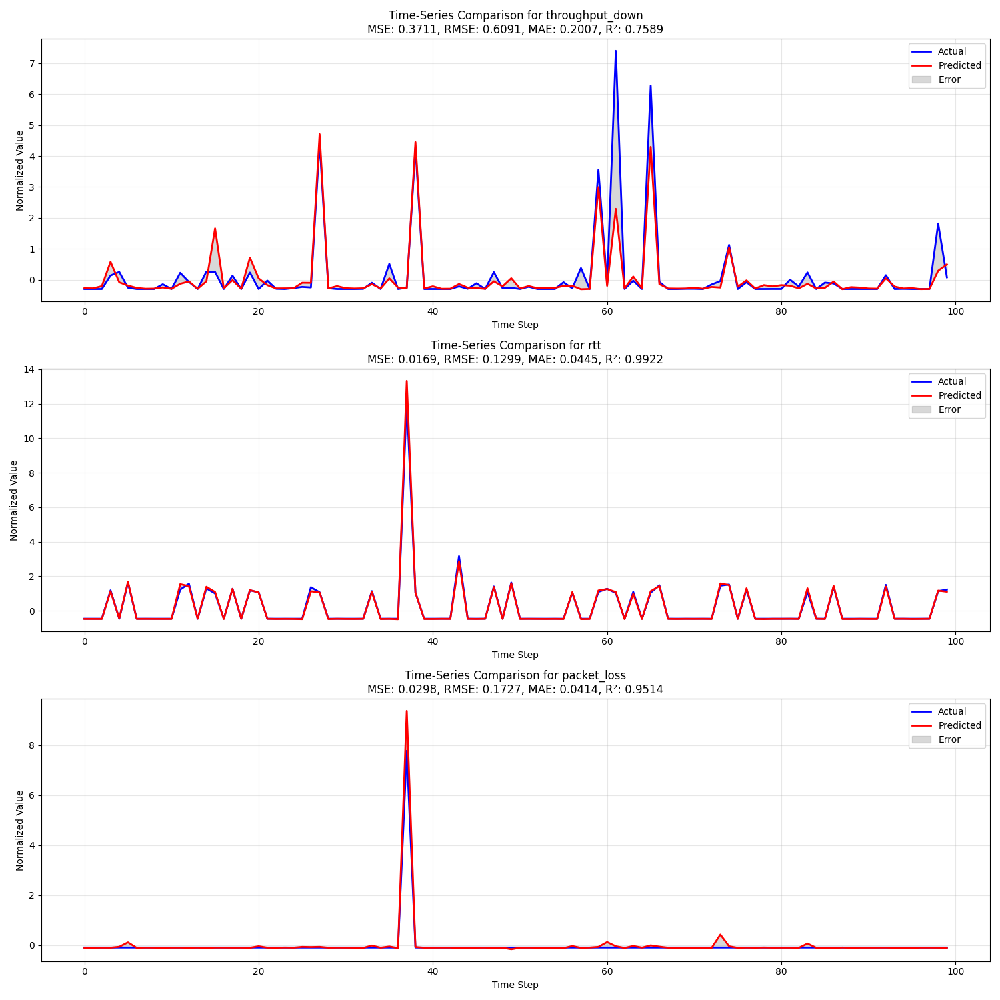
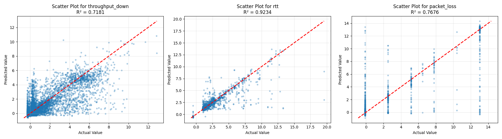

# AI QoS Predictor for Mobile Video Streaming: A Comprehensive Guide

This document provides a detailed explanation of the AI QoS Predictor system, designed for readers with no prior experience in artificial intelligence or machine learning. It breaks down technical terms and explains what's happening at each step of the process.

## Table of Contents

1. [Introduction: The Problem We're Solving](#introduction-the-problem-were-solving)
2. [Key Terms and Concepts](#key-terms-and-concepts)
3. [How the System Works](#how-the-system-works)
4. [The Data: What We're Learning From](#the-data-what-were-learning-from)
5. [The AI Model: How Predictions Are Made](#the-ai-model-how-predictions-are-made)
6. [Visualizations: Understanding the Results](#visualizations-understanding-the-results)
7. [Practical Applications](#practical-applications)
8. [Step-by-Step Guide to Using the System](#step-by-step-guide-to-using-the-system)
9. [Frequently Asked Questions](#frequently-asked-questions)

## Introduction: The Problem We're Solving

When you watch videos on your phone while moving (in a car, train, or walking), the quality of your video often changes. Sometimes it looks clear, other times it gets blurry, and occasionally it might freeze completely. This happens because the network connection (your internet) changes as you move.

Traditional video players wait until the connection gets bad before they react - by then, it's too late and your video experience suffers. Our system tries to predict network problems before they happen, so the video player can take action early and maintain a smooth viewing experience.

Think of it like driving a car:
- **Traditional approach**: You only slow down after you see an obstacle in the road (reactive)
- **Our approach**: You slow down because you can see there's an obstacle ahead (proactive)

## Key Terms and Concepts

### Basic Terms

- **QoS (Quality of Service)**: Measurements of how good a network connection is, including speed, delay, and reliability.

- **Network Metrics**: Specific measurements of network performance:
  - **Throughput**: How much data can be transferred per second (like the width of a pipe)
  - **RTT (Round-Trip Time)**: How long it takes for a signal to go from your device to the server and back (like the delay when talking to someone far away)
  - **Packet Loss**: The percentage of data that gets lost during transmission (like letters getting lost in the mail)
  - **Signal Quality**: How strong and clear the cellular signal is (like radio reception)

- **Video Streaming Terms**:
  - **Buffering**: When the video player loads extra video ahead of time to prevent interruptions
  - **Adaptive Bitrate (ABR)**: Technology that changes video quality based on your connection
  - **Resolution**: The clarity of the video (480p, 720p, 1080p, etc.)
  - **Stall**: When the video freezes because it ran out of buffered content

### AI and Machine Learning Terms

- **Artificial Intelligence (AI)**: Computer systems that can perform tasks that normally require human intelligence.

- **Machine Learning**: A type of AI where computers learn patterns from data without being explicitly programmed with rules.

- **Deep Learning**: A subset of machine learning using neural networks with many layers, capable of learning complex patterns.

- **LSTM (Long Short-Term Memory)**: A type of neural network designed to remember patterns over time, making it good for predicting time-based data like network conditions.

- **Training**: The process of teaching the AI model by showing it examples of past data and the outcomes.

- **Prediction**: Using the trained model to estimate future outcomes based on current data.

- **Features**: The input variables used by the model (in our case, network measurements).

- **Targets**: The output variables the model tries to predict (future network conditions).

- **Accuracy Metrics**:
  - **MSE (Mean Squared Error)**: Measures the average squared difference between predictions and actual values
  - **RMSE (Root Mean Squared Error)**: The square root of MSE, giving a value in the same units as the original data
  - **MAE (Mean Absolute Error)**: The average absolute difference between predictions and actual values
  - **R² (R-squared)**: A score from 0 to 1 indicating how well the model explains the variation in the data (higher is better)

## How the System Works

Our system works in four main stages:

### 1. Data Collection and Processing

First, we collect network measurements from real-world scenarios, like a phone in a moving car. These measurements include:
- Download speed (throughput)
- Delay (RTT)
- Packet loss
- Signal strength

We clean this data (remove errors, handle missing values) and organize it into a format the AI can understand.

### 2. Feature Extraction and Preparation

Next, we transform the data into "sequences" - series of measurements over time. For example, we might use 10 seconds of network measurements to predict what will happen 3 seconds in the future.

We also "normalize" the data (scale all values to similar ranges) so the AI can process it effectively.

### 3. Model Training

This is where the learning happens:

1. We show the AI model thousands of examples: "When the network looked like THIS, it later became THAT"
2. The model adjusts its internal parameters to recognize patterns
3. We test the model on data it hasn't seen before to make sure it's learning general patterns, not just memorizing examples
4. We save the trained model for future use

Think of it like teaching someone to predict weather by showing them thousands of examples of how certain cloud patterns led to specific weather conditions.

### 4. Making Predictions

Once trained, the model can predict future network conditions:

1. The system monitors current network metrics in real-time
2. It feeds the last 10 seconds of measurements into the trained model
3. The model predicts what the network will look like 3 seconds in the future
4. A video player can use these predictions to adjust quality before problems occur

## The Data: What We're Learning From

Our primary dataset is the **5G KPI Dataset** (also known as "Beyond Throughput"), which contains real network measurements from phones in both stationary positions and moving vehicles.

### What's in the Data?

- **Network Measurements**: Throughput, RTT, packet loss, jitter (variation in delay)
- **Signal Quality**: SINR (signal-to-interference ratio), RSRP (signal power), RSRQ (signal quality)
- **Context Information**: GPS location, speed, cell tower ID
- **Time Information**: Timestamps for each measurement

### How We Use the Data

1. **Sequences**: We organize the data into overlapping windows (e.g., 10-second sequences)
2. **Labeling**: Each sequence is paired with the network conditions that occurred 3 seconds later
3. **Train/Validation/Test Split**: We divide the data into three parts:
   - Training data (60%): Used to teach the model
   - Validation data (20%): Used to fine-tune the model
   - Test data (20%): Used to evaluate the final model's performance

## The AI Model: How Predictions Are Made

We use an **LSTM (Long Short-Term Memory)** neural network, which is specially designed to learn patterns in time-series data.

### Model Architecture

Our model consists of:

1. **Input Layer**: Takes in sequences of network measurements (10 time steps with 8 features each)
2. **First LSTM Layer**: 64 units that process the sequence and remember important patterns
3. **Dropout Layer**: Randomly ignores some information to prevent over-reliance on specific patterns
4. **Second LSTM Layer**: 64 units that further process the information
5. **Another Dropout Layer**: Additional regularization to improve generalization
6. **Output Layer**: Produces predictions for future throughput, RTT, and packet loss

### How LSTM Works (Simplified)

LSTM networks have a special ability to "remember" important information and "forget" irrelevant details. This makes them excellent for learning from sequences:

1. They can detect patterns like "when throughput starts dropping gradually, RTT usually increases sharply 3 seconds later"
2. They can remember longer-term patterns, like "network conditions often degrade when entering this area"
3. They can ignore random fluctuations that don't predict future conditions

Think of it like an experienced driver who knows that when they see certain signs or landmarks, they should prepare for a change in road conditions ahead.

## Visualizations: Understanding the Results

Our system generates several visualizations to help understand how well the predictions match reality:

### 1. Time-Series Comparison



This plot shows:
- Blue line: Actual network conditions over time
- Red line: What our model predicted
- Gray area: The difference between prediction and reality

A good model will have the red line closely following the blue line, with minimal gray area.

### 2. Scatter Plots



Each point represents one prediction:
- X-axis: The actual value that occurred
- Y-axis: What our model predicted
- Diagonal line: Perfect prediction (if all points were on this line, the model would be perfect)

Points clustered tightly around the diagonal line indicate accurate predictions.

### 3. Error Distribution


These histograms show how far off our predictions typically are:
- X-axis: Prediction error (actual value minus predicted value)
- Y-axis: How frequently that error occurs
- Center line at zero: No error

A good model has a tall, narrow peak centered at zero, meaning most predictions have small errors.

### 4. Feature Importance


This bar chart shows which network measurements are most useful for making predictions:
- Taller bars: More important features
- Shorter bars: Less important features

This helps us understand which network metrics are the best indicators of future conditions.

## Practical Applications

### Video Streaming Improvements

Our prediction system can be integrated with video players to:

1. **Preemptive Quality Adjustment**: Lower video quality before network problems occur, preventing buffering
2. **Smart Buffering**: Buffer more content when the system predicts network degradation
3. **Route Planning**: In connected vehicles, suggest routes with better predicted network coverage

### Example Scenario

Imagine watching a video while riding in a car:

1. The car approaches an area with poor coverage (like a tunnel)
2. Traditional player: Continues at high quality until signal drops, then buffers and quality drops sharply
3. Our system: Detects patterns indicating approaching poor coverage, gradually reduces quality and increases buffer before entering the tunnel, maintaining smooth playback

## Step-by-Step Guide to Using the System

### Installation

1. Clone the repository:
   ```bash
   git clone https://github.com/yourusername/ai_qos_predictor.git
   cd ai_qos_predictor
   ```

2. Run the setup script:
   ```bash
   chmod +x setup.sh
   ./setup.sh
   ```

### Basic Usage

1. **Process the data**:
   ```bash
   ./main.py process-data --dataset 5g_kpi
   ```
   This prepares the network measurement data for training.

2. **Train the model**:
   ```bash
   ./main.py train --model lstm --dataset 5g_kpi
   ```
   This teaches the AI to recognize patterns in network behavior.

3. **Generate visualizations**:
   ```bash
   ./main.py visualize --model lstm
   ```
   This creates graphs comparing predictions with actual values.

4. **Run real-time prediction**:
   ```bash
   ./main.py predict --model lstm --interface eth0
   ```
   This monitors your network and predicts future conditions.

### Understanding the Output

When running predictions, you'll see output like:

```
Current network conditions:
- Throughput: 5.2 Mbps
- RTT: 45 ms
- Packet Loss: 0.2%

Predicted conditions in 3 seconds:
- Throughput: 4.8 Mbps (↓)
- RTT: 52 ms (↑)
- Packet Loss: 0.5% (↑)

Recommendation: Reduce video quality to 720p
```

This tells you:
1. Current network measurements
2. What the AI expects to happen in 3 seconds
3. A suggested action based on the prediction

## Frequently Asked Questions

### General Questions

**Q: How accurate are the predictions?**

A: Our model achieves the following accuracy on test data:
- Throughput: R² = 0.72 (explains 72% of variation)
- RTT: R² = 0.92 (explains 92% of variation)
- Packet Loss: R² = 0.77 (explains 77% of variation)

RTT is the most accurately predicted metric, while throughput is the most challenging.

**Q: How far into the future can it predict?**

A: By default, we predict 3 seconds ahead, which provides a good balance between accuracy and usefulness. Predictions further into the future become less accurate due to the unpredictable nature of mobile networks.

**Q: Does this work for all types of networks?**

A: The model is trained primarily on 5G and 4G cellular data, but the principles apply to any network. For best results, you would want to train on data from the specific type of network you're using.

### Technical Questions

**Q: What does R² mean in simple terms?**

A: R² (R-squared) is a score from 0 to 1 that tells you how well the model's predictions match the actual values:
- R² = 1.0: Perfect predictions (100% accurate)
- R² = 0.5: The model explains half of the variation in the data
- R² = 0.0: The model is no better than just guessing the average value

**Q: Why use LSTM instead of other models?**

A: LSTM networks are specially designed to learn from sequences and remember important patterns over time. Since network conditions change over time and future conditions depend on past trends, LSTM is a natural fit for this problem.

**Q: How much data is needed for training?**

A: More data generally leads to better results. Our model was trained on over 100,000 sequences, representing many hours of network measurements in various conditions. For a basic model, you might get reasonable results with a few hours of diverse network data.

---

This README aims to make AI concepts accessible to readers with no prior experience. If you have any questions or need further clarification, please feel free to reach out.