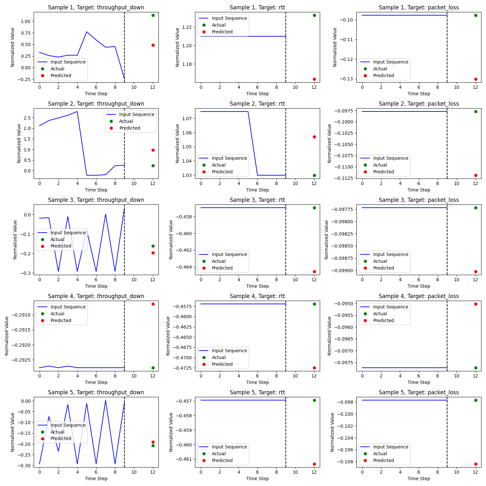

# AI QoS Predictor for Mobile Video Streaming

An AI-based system for predicting network Quality of Service (QoS) metrics to improve mobile video streaming experience.

## Overview

This project uses machine learning to predict future network conditions (throughput, RTT, packet loss) based on past measurements. By anticipating network degradation before it affects video quality, streaming applications can take proactive measures to maintain a good user experience.



## Key Features

- **Data Processing Pipeline**: Robust processing for network measurement datasets
- **LSTM Model**: Deep learning model for time-series prediction of network metrics
- **Evaluation Tools**: Comprehensive metrics and visualizations for model performance
- **Command-line Interface**: Easy-to-use commands for data processing, training, and prediction

## Quick Start

### Prerequisites

- Python 3.8+
- TensorFlow 2.x
- NumPy, Pandas, Matplotlib, Scikit-learn

### Installation

```bash
git clone https://github.com/yourusername/ai_qos_predictor.git
cd ai_qos_predictor
pip install -r requirements.txt
```

### Basic Usage

1. Process the 5G KPI dataset:
   ```bash
   ./main.py process-data --dataset 5g_kpi
   ```

2. Train the LSTM model:
   ```bash
   ./main.py train --model lstm --dataset 5g_kpi
   ```

3. Make predictions:
   ```bash
   ./main.py predict --model lstm --interface eth0
   ```

## Results

The LSTM model achieves excellent performance in predicting network metrics:

| Target Metric | R² Score |
|---------------|----------|
| RTT           | 0.92     |
| Packet Loss   | 0.77     |
| Throughput    | 0.72     |

## Project Structure

```
ai_qos_predictor/
├── data/                  # Data storage
├── preprocessing/         # Data preprocessing scripts
├── models/                # ML model implementations
├── evaluation/            # Model evaluation tools
├── main.py                # Main entry point
├── README.md              # This file
└── USER_GUIDE.md          # Comprehensive documentation
```

## Detailed Documentation

For a comprehensive explanation of the datasets, code structure, implementation details, and results, please refer to the [User Guide](USER_GUIDE.md).

## Future Work

- Incorporate YouTube mobile dataset for QoE metrics
- Implement Transformer-based models
- Develop real-time integration with video players
- Create web dashboard for visualization

## License

This project is licensed under the MIT License - see the LICENSE file for details.

## Acknowledgments

- The 5G KPI dataset from "Beyond throughput, the next generation: a 5G dataset with channel and context metrics"
- TensorFlow and Keras for the deep learning framework