# Dynamic Quality Testing System

This system allows you to stream video between two computers with dynamic quality testing. The system automatically varies video quality parameters and measures their impact on performance under different network conditions.

## Table of Contents

1. [System Overview](#system-overview)
2. [Key Features](#key-features)
3. [System Components](#system-components)
4. [Setup Instructions](#setup-instructions)
5. [Running the System](#running-the-system)
6. [Dynamic Quality Testing](#dynamic-quality-testing)
7. [System Architecture](#system-architecture)
8. [Data Flow](#data-flow)
9. [Process Flows](#process-flows)
10. [Quality Metrics](#quality-metrics)
11. [Network Simulation](#network-simulation)
12. [Troubleshooting](#troubleshooting)

## System Overview

The Dynamic Quality Testing system is designed to evaluate video streaming performance under various network conditions and quality settings. It consists of a sender, a receiver, and testing/analysis components.

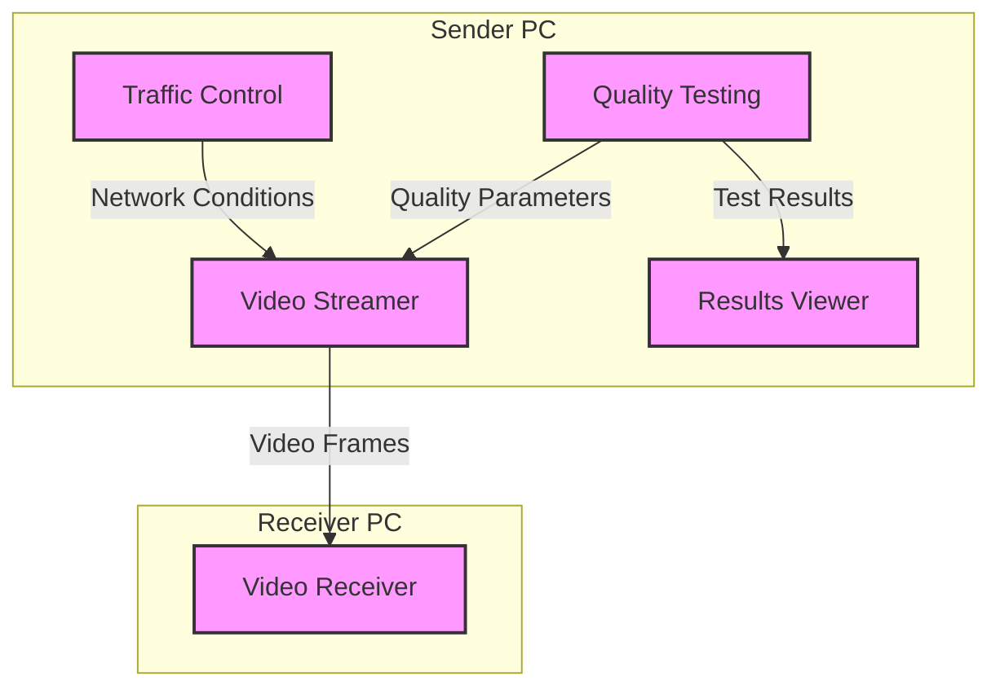

### Component Explanation

- **Video Streamer (VS)**: The core component on the sender PC that reads video frames from a file, applies quality settings (resolution scaling, JPEG quality), and sends them to the receiver. Implemented in `video_streamer.py`.

- **Video Receiver (VR)**: The core component on the receiver PC that receives video frames from the streamer, decodes them, and displays them in a web browser. Implemented in `receive_video.py`.

- **Traffic Control (TC)**: A component that simulates different network conditions by applying bandwidth limitations, delay, and packet loss to the network interface. Implemented in `dynamic_tc_control.sh` using Linux's `tc` command.

- **Quality Testing (QT)**: A component that systematically tests different combinations of quality parameters and network conditions, measuring performance metrics for each combination. Implemented in `run_quality_tests.py` and `quick_test.py`.

- **Results Viewer (RV)**: A component that provides a web interface for viewing and comparing test results. Implemented in `view_results.py`.

## Key Features

- **Automatic Quality Testing**: Systematically tests different quality settings
- **Network Condition Simulation**: Applies various bandwidth, delay, and packet loss settings
- **Performance Measurement**: Records metrics for each quality/network combination
- **Comparative Analysis**: Helps identify optimal quality settings for different network conditions
- **Results Visualization**: Interactive web interface for viewing and comparing test results

## System Components

1. **Video Streamer** (`video_streamer.py`): Reads a video file and streams it to a receiver with dynamic quality adjustment
2. **Video Receiver** (`receive_video.py`): Receives video frames and displays them in a browser
3. **Traffic Control** (`dynamic_tc_control.sh`): Tool for simulating different network conditions
4. **Quality Testing** (`run_quality_tests.py`): Automated testing of different quality settings
5. **Quick Testing** (`quick_test.py`): Streamlined testing with fewer combinations
6. **Results Viewer** (`view_results.py`): Web interface for viewing test results

## Setup Instructions

### Preparing Both PCs

1. Copy the `dynamic_quality_testing` folder to both the sender and receiver PCs
2. Make sure both PCs have the required Python packages installed:
   ```bash
   pip install flask opencv-python numpy requests matplotlib
   ```
3. Ensure both PCs have the `tc` command available (part of the `iproute2` package)

### Sender PC Setup

1. Run the sender setup script:
   ```bash
   ./dynamic_quality_testing/sender_setup.sh
   ```
   This will prompt you for the receiver's IP address and configure the system accordingly.

### Receiver PC Setup

1. Run the receiver setup script:
   ```bash
   ./dynamic_quality_testing/receiver_setup.sh
   ```

## Running the System

### On the Receiver PC

1. Start the video receiver:
   ```bash
   python3 dynamic_quality_testing/receive_video.py
   ```
2. The receiver will listen for frames on port 8081

### On the Sender PC

1. Start the video streamer:
   ```bash
   python3 dynamic_quality_testing/video_streamer.py
   ```
2. The streamer will read the video file and send frames to the receiver

### Viewing the Video

1. On the receiver PC, open a web browser and go to:
   ```
   http://localhost:8081/rx_video_feed
   ```
2. On the sender PC, you can view the local stream at:
   ```
   http://localhost:5000/tx_video_feed
   ```

## Dynamic Quality Testing

The system includes functionality to automatically test different quality settings:

1. **Resolution Scaling**: Tests different scaling factors (50%, 75%, 90%, 100%)
2. **JPEG Quality**: Tests different compression levels (60%, 75%, 85%, 95%)
3. **Frame Rate**: Tests different FPS settings (10, 15, 20, 30)

### Running Automated Tests

There are two options for running automated tests:

#### 1. Quick Test (Recommended for First-Time Users)

For a quick test with a reduced set of parameters:

```bash
python3 dynamic_quality_testing/quick_test.py
```

This script will:
1. Run a small subset of tests (8 combinations instead of 64)
2. Test only the minimum and maximum values for each parameter
3. Complete in about 5-10 minutes
4. Generate detailed reports with the results (JSON, text, HTML)
5. Generate graphs comparing controlled parameters vs. measured metrics

#### 2. Full Test

For a comprehensive test of all parameter combinations:

```bash
python3 dynamic_quality_testing/run_quality_tests.py
```

This script will:
1. Systematically vary quality parameters
2. Apply different network conditions using traffic control
3. Measure performance metrics for each combination
4. Generate detailed reports with the results (JSON, text, HTML)
5. Generate graphs comparing controlled parameters vs. measured metrics
6. Save all results in the `test_results` directory

The full test takes significantly longer to complete (30-60 minutes).

### Test Matrix

The testing system uses the following parameters:

| Parameter | Values Tested |
|-----------|--------------|
| Resolution Scale | 50%, 75%, 90%, 100% |
| JPEG Quality | 60%, 75%, 85%, 95% |
| Frame Rate | 10, 15, 20, 30 FPS |
| Network Condition | Poor (2mbit, 150ms, 3% loss) |
|                   | Fair (4mbit, 80ms, 1% loss) |
|                   | Good (6mbit, 40ms, 0.5% loss) |
|                   | Excellent (10mbit, 20ms, 0% loss) |

### Why We Test Multiple Parameters

We test different combinations of these parameters because:

1. **Finding Optimal Settings**: The main goal is to discover which video quality settings work best under each network condition.

2. **Quality-Bandwidth Tradeoffs**: Each parameter affects both quality and bandwidth requirements:
   - Higher resolution = Better detail but more bandwidth
   - Higher JPEG quality = Fewer artifacts but more bandwidth
   - Higher frame rate = Smoother motion but more bandwidth

3. **Adaptive Streaming Strategy**: By understanding how each parameter performs under different network conditions, we can create intelligent adaptation strategies.

#### Practical Example

When network conditions degrade from Excellent to Poor:
- The system could automatically reduce resolution from 100% to 50%
- Lower JPEG quality from 95% to 60%
- Reduce frame rate from 30 FPS to 15 FPS

These adjustments would maintain a functional video stream at lower quality rather than experiencing freezing or complete failure.

The test matrix helps us determine exactly which combinations of settings provide the best user experience under each network condition, allowing for smart, dynamic quality adaptation.

### Testing Strategy

Instead of testing all possible combinations (which would be 64 tests), the system uses a more efficient approach:

1. For each network condition (starting with the best):
   - Test all resolution scales at fixed quality (85%) and FPS (20)
   - Test all quality levels at fixed resolution (75%) and FPS (20)
   - Test all frame rates at fixed resolution (75%) and quality (85%)

This approach provides comprehensive coverage while reducing the total number of tests to 16 per network condition.

### Controlled Parameters vs. Measured Metrics

The system works by:

1. **Controlling Network Parameters** using Linux Traffic Control (tc):
   - **Bandwidth Limitation**: Restricts the maximum data rate (2mbit, 4mbit, 6mbit, 10mbit)
   - **Delay**: Adds artificial latency (150ms, 80ms, 40ms, 20ms)
   - **Packet Loss**: Randomly drops packets (3%, 1%, 0.5%, 0%)

2. **Measuring Performance Metrics** to evaluate how the system performs under those controlled conditions:
   - **Bandwidth Usage**: How much network bandwidth is actually consumed
   - **Frame Delivery Time**: How long it takes to deliver each frame
   - **Frame Drop Rate**: Percentage of frames that fail to deliver
   - **Visual Quality Score**: Estimated quality based on resolution and compression
   - **Smoothness Score**: Estimated smoothness based on frame rate and delivery time

This approach allows us to see how different quality settings perform under various network conditions. For example, we can determine which resolution and quality settings provide acceptable performance when the network has high delay or limited bandwidth.

### Viewing Test Results

After running the tests, you can view the results using the included viewer:

```bash
python3 dynamic_quality_testing/view_results.py
```

This will:
1. Start a local web server on port 8000
2. Open your browser to display the test results
3. Show a list of all test runs with timestamps
4. Allow you to view detailed results for each test run

Each test result includes:
- Network analysis graphs showing the relationship between controlled parameters and measured metrics
- Detailed tables with all measured metrics
- Comparison of performance across different network conditions

The results are saved in the `test_results` directory, making it easy to compare different test runs over time.

#### Network Analysis Graphs

The system automatically generates four types of graphs to help you visualize the relationship between controlled network parameters and measured metrics:

1. **Bandwidth Graphs** (`bandwidth_graphs.png`): Shows how controlled bandwidth affects measured bandwidth usage, and how resolution, quality, and FPS impact bandwidth requirements. Uses line plots with markers to clearly visualize trends.
   - The blue line shows the actual measured bandwidth
   - The red dashed line shows the ideal 1:1 relationship (where measured bandwidth equals controlled bandwidth)

2. **Delay Graphs** (`delay_graphs.png`): Shows how controlled delay affects measured frame delivery time, and how different quality settings perform under various delay conditions. Uses line plots with markers to show the relationship between parameters.
   - The blue line shows the actual measured frame delivery time
   - The red dashed line shows the ideal 1:1 relationship (where measured frame delivery time equals controlled delay)

3. **Loss Graphs** (`loss_graphs.png`): Shows how controlled packet loss affects measured frame drop rate, and how different quality settings can mitigate packet loss. Uses line plots with markers to highlight trends.
   - The blue line shows the actual measured frame drop rate
   - The red dashed line shows the ideal 1:1 relationship (where measured frame drop rate equals controlled packet loss)

4. **Combined Graph** (`combined_graph.png`): Two 3D surface plots showing:
   - Bandwidth vs Delay vs Frame Delivery Time
   - Bandwidth vs Packet Loss vs Frame Drop Rate
   
   These surface plots provide a comprehensive view of how multiple network parameters interact simultaneously.

5. **Time Series Graphs** (`time_series_graphs.png`): Four graphs showing how metrics change over time:
   - Bandwidth Usage Over Time
   - Frame Delivery Time Over Time
   - Frame Drop Rate Over Time
   - Quality Scores Over Time (Visual Quality and Smoothness)
   
   These time series graphs help you understand how performance metrics evolve during testing and identify any patterns or anomalies.

### Real-Time Monitoring

The system also includes a real-time monitoring feature that allows you to see how metrics change as you adjust network conditions:

```bash
python3 dynamic_quality_testing/live_monitor.py
```

This will:
1. Start a web server on port 8090 (or the next available port)
2. Open your browser to display real-time graphs
3. Automatically update the graphs every few seconds

**Note:** For full real-time monitoring functionality, you need to have the `jq` command installed:
```bash
sudo apt install jq
```
This is used to parse JSON responses from the video streamer and receiver.

As you change network conditions using the `dynamic_tc_control.sh` script, the graphs will update in real-time, showing you the immediate impact of your changes on video quality and performance metrics.

The live monitoring page includes:
- Bandwidth usage over time
- Frame delivery time over time
- Frame drop rate over time
- Visual quality and smoothness scores over time

This is particularly useful for:
- Demonstrating the impact of network conditions on video quality
- Fine-tuning quality parameters for specific network conditions
- Educational purposes to understand the relationship between network conditions and video performance

For demonstration purposes, you can generate sample live data:
```bash
python3 dynamic_quality_testing/generate_sample_live_data.py
```

This will create 30 sample data points with varying network conditions and quality parameters, allowing you to see how the live monitoring graphs work without having to manually change network conditions.

### All-in-One Live Quality Monitoring

For the most comprehensive experience, use the all-in-one script that combines all components:

```bash
python3 dynamic_quality_testing/run_live_quality_monitoring.py
```

This script:
1. Starts the video streamer (if not already running)
2. Starts the video receiver (if not already running)
3. Offers a choice between terminal-based or browser-based monitoring
4. Provides an interactive menu to change network conditions
5. Automatically updates the live data in real-time
6. Includes options to generate sample data and reset network conditions

This is the recommended way to use the system, as it handles all the components and their interactions automatically.

### Terminal-Based Live Monitoring

For the best real-time visualization experience, the system now includes a terminal-based monitoring option:

```bash
python3 dynamic_quality_testing/terminal_live_monitor.py
```

This provides:
- ASCII-based graphs that update in real-time directly in your terminal
- No browser caching issues or refresh delays
- Immediate visual feedback when network conditions change
- Compact display of all key metrics

The terminal-based monitoring is especially useful when you need to see the immediate impact of network changes without any delay.

## How to Use the System - Step by Step Guide

### Basic Setup and Testing

1. **Clone the repository** (if you haven't already):
   ```bash
   git clone <repository-url>
   cd git_mesurement_tc
   ```

2. **Install dependencies**:
   ```bash
   sudo apt install iproute2 jq  # For tc and JSON parsing
   pip install matplotlib numpy   # For graph generation
   ```

3. **Run the all-in-one script**:
   ```bash
   python3 dynamic_quality_testing/run_live_quality_monitoring.py
   ```
   This will:
   - Start the video streamer and receiver
   - Ask you to choose between terminal-based or browser-based monitoring
   - Provide a menu to control network conditions

4. **Change network conditions**:
   - Select options 1-4 to apply predefined network conditions
   - Select option 5 to apply custom network conditions
   - Select option 6 to reset network conditions
   - Select option 7 to view current network conditions
   - Select option 8 to generate sample data
   - Select option 9 to exit

5. **Observe the effects**:
   - Watch the terminal-based graphs update in real-time
   - Notice how different network conditions affect the metrics
   - See how bandwidth, delay, and loss impact video quality

### Understanding the Graphs

The system provides several types of graphs to help you understand the relationship between network conditions and video quality:

#### Terminal-Based ASCII Graphs

The terminal-based monitoring shows five ASCII graphs:

1. **Bandwidth Usage (Mbps)**:
   - Shows the actual bandwidth used by the video stream
   - Higher values mean more data is being transmitted
   - Should decrease when network conditions worsen

2. **Frame Delivery Time (ms)**:
   - Shows how long it takes for frames to be delivered
   - Higher values mean more delay in the video
   - Should increase when network delay increases

3. **Frame Drop Rate (%)**:
   - Shows the percentage of frames that are dropped
   - Higher values mean more frames are being lost
   - Should increase when network loss increases

4. **Visual Quality Score**:
   - Shows the estimated visual quality of the video
   - Higher values mean better visual quality
   - Should decrease when network conditions worsen

5. **Smoothness Score**:
   - Shows how smooth the video playback is
   - Higher values mean smoother playback
   - Should decrease when network conditions worsen

Each graph shows the most recent data points (up to 20), with the newest points on the right. The height of each bar represents the value of the metric at that point in time.

#### Browser-Based Graphs

The browser-based monitoring shows four graphs:

1. **Bandwidth Usage Over Time**:
   - Blue line shows how bandwidth usage changes over time
   - Should decrease when network conditions worsen

2. **Frame Delivery Time Over Time**:
   - Red line shows how frame delivery time changes over time
   - Should increase when network delay increases

3. **Frame Drop Rate Over Time**:
   - Orange line shows how frame drop rate changes over time
   - Should increase when network loss increases

4. **Quality Scores Over Time**:
   - Green line shows visual quality score over time
   - Purple line shows smoothness score over time
   - Both should decrease when network conditions worsen

#### Static Analysis Graphs

The static analysis graphs (generated after testing) show:

1. **Bandwidth Graphs**:
   - Blue line shows actual measured bandwidth
   - Red dashed line shows ideal 1:1 relationship
   - The closer the blue line is to the red line, the better

2. **Delay Graphs**:
   - Blue line shows actual measured frame delivery time
   - Red dashed line shows ideal 1:1 relationship
   - The closer the blue line is to the red line, the better

3. **Loss Graphs**:
   - Blue line shows actual measured frame drop rate
   - Red dashed line shows ideal 1:1 relationship
   - The closer the blue line is to the red line, the better

4. **Combined Graphs**:
   - 3D surface plots showing the relationship between multiple parameters
   - Colors represent the value of the metric (blue = low, red = high)

### Example Workflow

1. Start the system:
   ```bash
   python3 dynamic_quality_testing/run_live_quality_monitoring.py
   ```

2. Choose terminal-based monitoring (option 1)

3. Apply "Excellent" network condition (option 1)
   - Observe high bandwidth, low delay, low loss
   - Observe high quality scores

4. Apply "Poor" network condition (option 4)
   - Observe decreased bandwidth
   - Observe increased delay and loss
   - Observe decreased quality scores

5. Reset network conditions (option 6)

6. Try custom network conditions (option 5)
   - Experiment with different values
   - Observe the effects on the metrics

7. Generate sample data for demonstration (option 8)

8. Exit the system (option 9)

These graphs are embedded directly in the HTML report for each test run, so you can view them by clicking on any test result in the viewer.

### Generating Graphs

To visualize the relationship between controlled network parameters (bandwidth, delay, packet loss) and measured metrics, you can use the included graph generator:

```bash
python3 dynamic_quality_testing/generate_graphs.py
```

### Comparing Controlled vs Measured Metrics

To generate detailed comparison graphs between controlled and measured metrics:

```bash
python3 dynamic_quality_testing/compare_controlled_vs_measured.py
```

This script:
1. Takes the test results data
2. For each network condition (Excellent, Good, Fair, Poor):
   - Shows the command executed (tc command)
   - Generates separate graphs for controlled and measured metrics:
     - Bandwidth (Mbps)
     - Delay/Frame Delivery Time (ms)
     - Packet Loss/Frame Drop Rate (%)

The generated report is saved in `test_results/comparison_graphs/comparison_report.html`. Open this file in a browser to view:
- Side-by-side comparisons of controlled vs measured metrics
- Mean values for each metric
- Clear visualization of how controlled parameters affect measured performance

This is particularly useful for understanding:
- How accurately the tc commands control network conditions
- How the video streaming system responds to different network conditions
- The relationship between controlled parameters and measured metrics

This script will:
1. Read all test results from the JSON files in the `test_results` directory
2. If no results are found, it will create sample results for demonstration
3. Generate the following graphs:
   - **Bandwidth Graphs**: Compare controlled bandwidth with measured bandwidth usage
   - **Delay Graphs**: Compare controlled delay with measured frame delivery time
   - **Loss Graphs**: Compare controlled packet loss with measured frame drop rate
   - **Combined Graph**: 3D visualization showing the effect of all controlled parameters

The graphs are saved as PNG files in the `test_results` directory:
- `bandwidth_graphs.png`
- `delay_graphs.png`
- `loss_graphs.png`
- `combined_graph.png`

These graphs help you visualize how the controlled network conditions affect the actual performance metrics, making it easier to understand the relationship between them. The sample results demonstrate the expected relationships between controlled parameters and measured metrics, even if you haven't run any tests yet.

## Applying Network Conditions

You can manually apply different network conditions using the included traffic control script:

```bash
sudo bash dynamic_quality_testing/dynamic_tc_control.sh
```

This interactive script allows you to:
1. Set custom network conditions (bandwidth, delay, packet loss)
2. Monitor the current network statistics
3. Reset network conditions to normal

## System Architecture

The system consists of several key components that work together to provide a comprehensive testing framework.

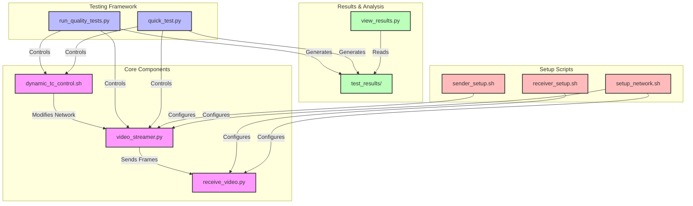

### Component Details

#### Core Components
- **video_streamer.py (VS)**: The main sender application that reads video frames from a file, applies quality settings, and streams them to the receiver. It provides endpoints for controlling quality parameters and retrieving metrics.

- **receive_video.py (VR)**: The main receiver application that receives video frames from the streamer, decodes them, and displays them in a web browser. It also provides endpoints for retrieving metrics.

- **dynamic_tc_control.sh (TC)**: A Bash script that uses Linux Traffic Control (tc) to simulate different network conditions by applying bandwidth limitations, delay, and packet loss.

#### Testing Framework
- **run_quality_tests.py (RQT)**: A comprehensive testing script that systematically tests all combinations of quality parameters and network conditions, measuring performance metrics for each combination.

- **quick_test.py (QT)**: A streamlined testing script that tests a reduced set of combinations to quickly generate results for analysis.

#### Results & Analysis
- **view_results.py (RV)**: A web-based results viewer that displays test results in an interactive format, allowing users to compare different test runs.

- **test_results/ (TR)**: A directory where test results are stored, including JSON data files, HTML reports, and plot images.

#### Setup Scripts
- **sender_setup.sh (SS)**: A script for configuring the sender PC, setting the receiver's IP address and installing dependencies.

- **receiver_setup.sh (RS)**: A script for configuring the receiver PC and installing dependencies.

- **setup_network.sh (SN)**: A script for configuring both PCs for network communication.

## Data Flow

This diagram illustrates how data flows through the system during testing.

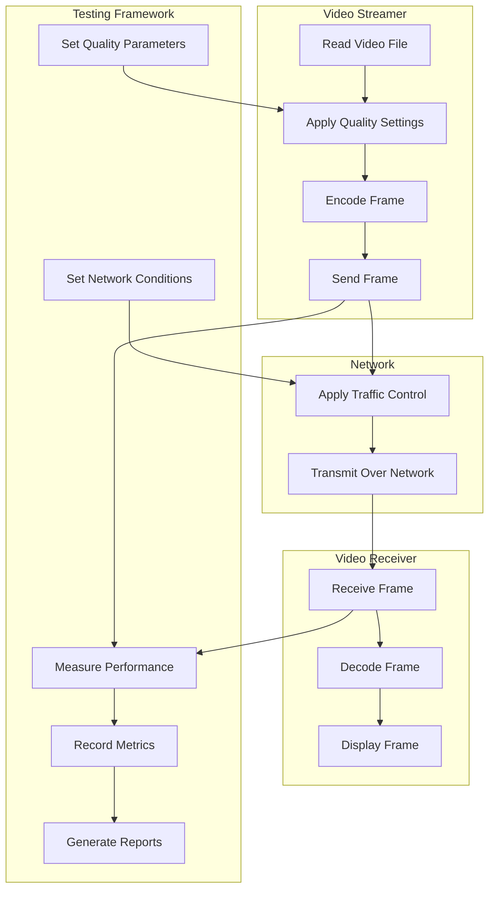

### Data Flow Explanation

#### Video Streamer Process
1. **Read Video File**: The video streamer reads frames from the source video file.
2. **Apply Quality Settings**: Quality parameters are applied to the frame:
   - Resolution scaling (50%, 75%, 90%, or 100%)
   - JPEG quality (60%, 75%, 85%, or 95%)
   - Frame rate control (10, 15, 20, or 30 FPS)
3. **Encode Frame**: The frame is encoded as a JPEG image with the specified quality.
4. **Send Frame**: The encoded frame is sent to the receiver over HTTP.

#### Network Process
5. **Apply Traffic Control**: Linux Traffic Control (tc) applies the specified network conditions:
   - Bandwidth limitation (2mbit, 4mbit, 6mbit, or 10mbit)
   - Delay (150ms, 80ms, 40ms, or 20ms)
   - Packet loss (3%, 1%, 0.5%, or 0%)
6. **Transmit Over Network**: The frame is transmitted over the network with the applied conditions.

#### Video Receiver Process
7. **Receive Frame**: The receiver receives the encoded frame.
8. **Decode Frame**: The frame is decoded from JPEG back to a raw image.
9. **Display Frame**: The frame is displayed in a web browser using MJPEG streaming.

#### Testing Framework Process
10. **Set Quality Parameters**: The testing framework sets quality parameters on the video streamer.
11. **Set Network Conditions**: The testing framework sets network conditions using Traffic Control.
12. **Measure Performance**: Performance metrics are measured at both the sender and receiver.
13. **Record Metrics**: Metrics are recorded for analysis.
14. **Generate Reports**: Reports are generated with the test results.

## Process Flows

### Video Streaming Process

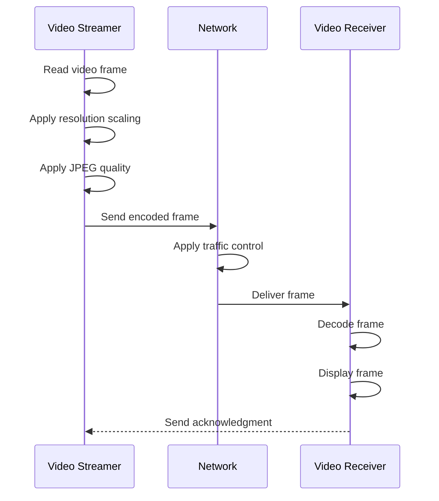

#### Video Streaming Process Explanation

This sequence diagram shows the step-by-step process of streaming a single video frame from the sender to the receiver:

1. **Read video frame**: The video streamer reads a frame from the video file using OpenCV.
2. **Apply resolution scaling**: The frame is resized according to the resolution scale parameter (e.g., 50%, 75%, 90%, 100%).
3. **Apply JPEG quality**: The frame is encoded as a JPEG with the specified quality parameter (e.g., 60%, 75%, 85%, 95%).
4. **Send encoded frame**: The encoded frame is sent to the receiver as a base64-encoded string in a JSON payload via HTTP POST.
5. **Apply traffic control**: The network conditions (bandwidth, delay, packet loss) are applied to the frame as it travels through the network.
6. **Deliver frame**: The frame arrives at the receiver after being affected by the network conditions.
7. **Decode frame**: The receiver decodes the base64 string back to a JPEG and then to a raw image.
8. **Display frame**: The frame is displayed in the web browser as part of an MJPEG stream.
9. **Send acknowledgment**: The receiver sends a success response back to the sender.

This process repeats for each frame in the video, with the frame rate controlled by the sender based on the FPS parameter.

### Testing Process

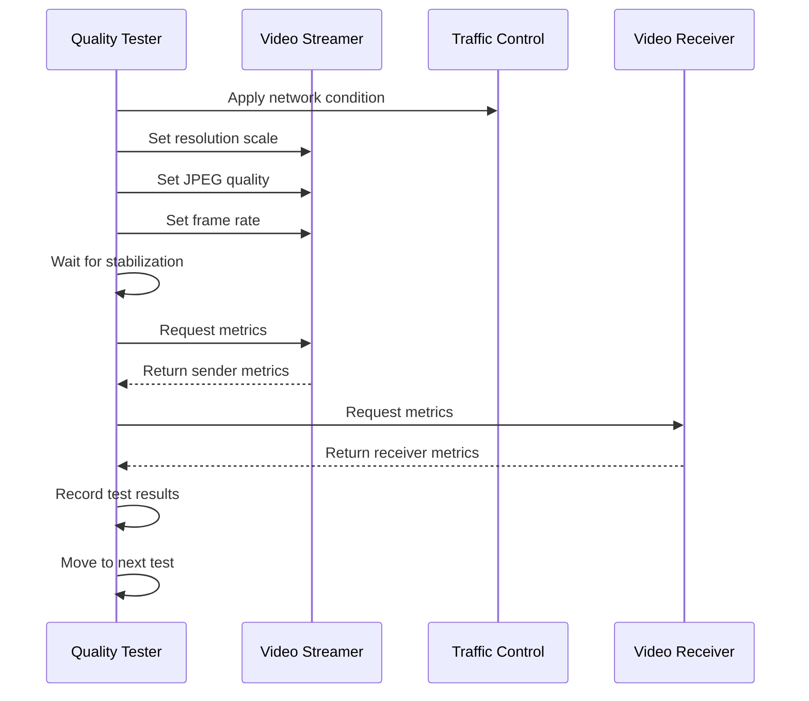

#### Testing Process Explanation

This sequence diagram shows the testing process for a single combination of quality parameters and network conditions:

1. **Apply network condition**: The Quality Tester (run_quality_tests.py or quick_test.py) uses the Traffic Control script to apply specific network conditions.
2. **Set resolution scale**: The Quality Tester calls the Video Streamer's API endpoint to set the resolution scale.
3. **Set JPEG quality**: The Quality Tester calls the Video Streamer's API endpoint to set the JPEG quality.
4. **Set frame rate**: The Quality Tester calls the Video Streamer's API endpoint to set the target frame rate.
5. **Wait for stabilization**: The Quality Tester waits for 15 seconds to allow the system to stabilize with the new settings.
6. **Request metrics from sender**: The Quality Tester calls the Video Streamer's API endpoint to get performance metrics.
7. **Return sender metrics**: The Video Streamer returns its metrics to the Quality Tester.
8. **Request metrics from receiver**: The Quality Tester calls the Video Receiver's API endpoint to get performance metrics.
9. **Return receiver metrics**: The Video Receiver returns its metrics to the Quality Tester.
10. **Record test results**: The Quality Tester records all metrics along with the test parameters.
11. **Move to next test**: The Quality Tester proceeds to the next combination of parameters and network conditions.

### Setup Process

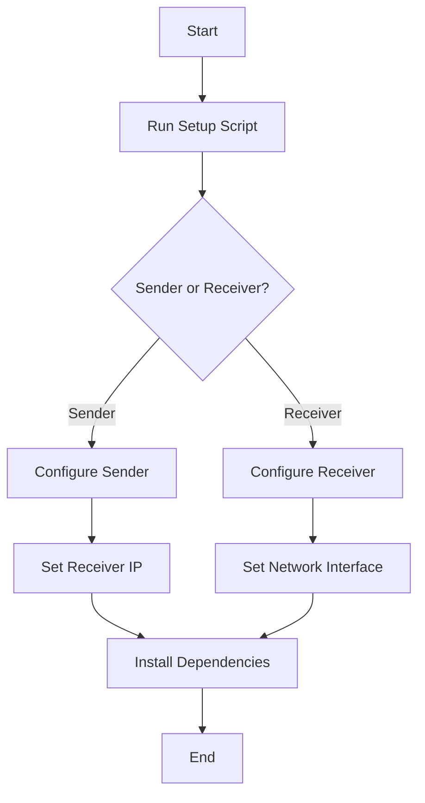

#### Setup Process Explanation

This flow diagram shows the setup process for the system:

1. **Start**: The user begins the setup process.
2. **Run Setup Script**: The user runs either `sender_setup.sh` or `receiver_setup.sh` depending on which PC they are setting up.
3. **Sender or Receiver?**: The process branches based on which setup script is run.
4. **Configure Sender/Receiver**: The script detects the network interface and IP address, and for the sender, prompts for the receiver's IP address.
5. **Set Receiver IP/Network Interface**: The script updates the configuration files with the correct settings.
6. **Install Dependencies**: The script installs all required dependencies.
7. **End**: The setup process is complete, and the system is ready to use.

### Testing Process Flow

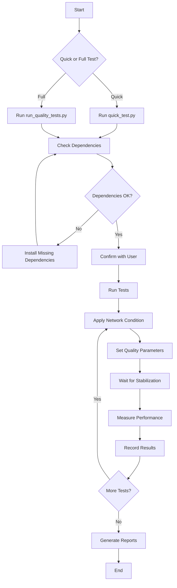

#### Testing Process Flow Explanation

This flow diagram shows the testing process:

1. **Start**: The user begins the testing process.
2. **Quick or Full Test?**: The user decides whether to run a quick test or a full test.
3. **Run quick_test.py/run_quality_tests.py**: The appropriate testing script is executed.
4. **Check Dependencies**: The script checks if all required dependencies are installed and if the video streamer and receiver are running.
5. **Dependencies OK?**: If any dependencies are missing, the user is prompted to install them.
6. **Confirm with User**: The script explains what it will do and asks for confirmation before proceeding.
7. **Run Tests**: The testing process begins.
8. **Apply Network Condition**: For each test, the script applies the appropriate network condition.
9. **Set Quality Parameters**: The script sets the quality parameters on the video streamer.
10. **Wait for Stabilization**: The script waits for 15 seconds to allow the system to stabilize.
11. **Measure Performance**: The script measures performance metrics from both the sender and receiver.
12. **Record Results**: The script records the test results.
13. **More Tests?**: If there are more combinations to test, the process repeats from step 8.
14. **Generate Reports**: Once all tests are complete, the script generates reports.
15. **End**: The testing process is complete, and the results are ready to view.

### Results Viewing Process

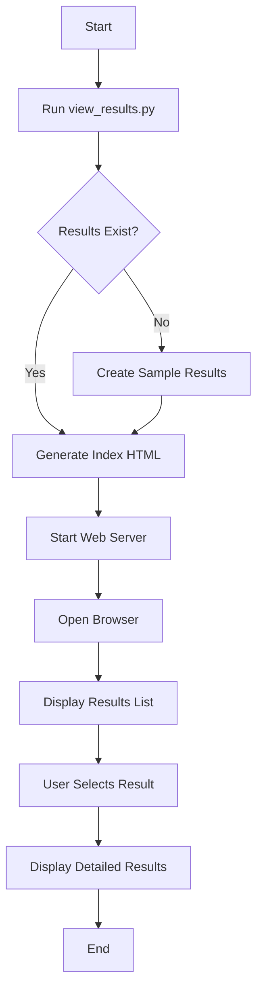

#### Results Viewing Process Explanation

This flow diagram shows the process of viewing test results:

1. **Start**: The user begins the results viewing process.
2. **Run view_results.py**: The user runs the view_results.py script.
3. **Results Exist?**: The script checks if there are any test results in the test_results directory.
4. **Create Sample Results**: If no results exist, the script creates sample results to demonstrate how the viewer works.
5. **Generate Index HTML**: The script generates an index.html file that lists all available test results.
6. **Start Web Server**: The script starts a simple HTTP server on port 8000 to serve the results.
7. **Open Browser**: The script automatically opens the default web browser to display the results.
8. **Display Results List**: The browser shows a list of all available test results, sorted by date.
9. **User Selects Result**: The user clicks on a result to view its details.
10. **Display Detailed Results**: The browser shows the detailed results for the selected test.
11. **End**: The user has viewed the results and can close the browser when done.

## Quality Metrics

The system measures several key metrics to evaluate how video streaming performs under different controlled network conditions (bandwidth, delay, packet loss):

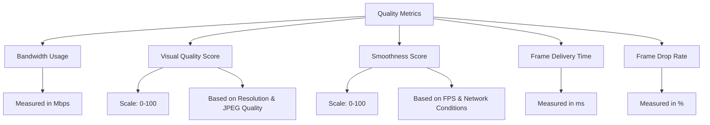

### Quality Metrics Explanation

1. **Bandwidth Usage**:
   - Measures how much network bandwidth is consumed by the video stream
   - Measured in Megabits per second (Mbps)
   - Higher values indicate more data being transmitted
   - Affected by resolution, JPEG quality, and frame rate
   - Example: A 720p video at 95% quality and 30 FPS might use 8.5 Mbps
   - **Calculation**: If not directly measured, it's estimated using the formula:
     ```
     base_bandwidth (5 Mbps) × resolution_factor × quality_factor × fps_factor
     ```
     Where:
     - Resolution factor: 0.5 → 0.25, 0.75 → 0.5625, 0.9 → 0.81, 1.0 → 1.0
     - Quality factor: 60 → 0.4, 75 → 0.6, 85 → 0.8, 95 → 1.0
     - FPS factor: 10 → 0.33, 15 → 0.5, 20 → 0.67, 30 → 1.0

2. **Visual Quality Score**:
   - Estimates the visual quality of the video
   - Scale: 0-100, where higher values indicate better quality
   - Based on resolution scale (60% weight) and JPEG quality (40% weight)
   - Example: 100% resolution at 95% JPEG quality gives a score of 95
   - **Calculation**: The formula is:
     ```
     (resolution_score × 0.6) + (quality_score × 0.4)
     ```
     Where:
     - Resolution score: 0.5 → 50, 0.75 → 75, 0.9 → 90, 1.0 → 100
     - Quality score: 60 → 60, 75 → 75, 85 → 85, 95 → 95

3. **Smoothness Score**:
   - Estimates how smooth the video playback is
   - Scale: 0-100, where higher values indicate smoother playback
   - Based on frame rate (70% weight) and network conditions (30% weight)
   - Example: 30 FPS under excellent network conditions gives a score of 98.5
   - **Calculation**: The formula is:
     ```
     (fps_score × 0.7) + (network_score × 0.3)
     ```
     Where:
     - FPS score: 10 → 30, 15 → 50, 20 → 70, 30 → 100
     - Network score: Poor → 30, Fair → 60, Good → 80, Excellent → 100

4. **Frame Delivery Time**:
   - Measures how long it takes to deliver each frame from sender to receiver
   - Measured in milliseconds (ms)
   - Lower values indicate faster delivery and better responsiveness
   - Example: Under excellent conditions, delivery might take 20ms; under poor conditions, it might take 200ms
   - **Calculation**: Directly measured by timing how long it takes for a frame to be sent from the sender and received by the receiver

5. **Frame Drop Rate**:
   - Percentage of frames that fail to deliver
   - Measured as a percentage (%)
   - Lower values indicate fewer dropped frames and better reliability
   - Example: Under excellent conditions, drop rate might be 0%; under poor conditions, it might be 5%
   - **Calculation**: (Number of failed frames / Total frames sent) × 100

### Visual Quality Score Calculation

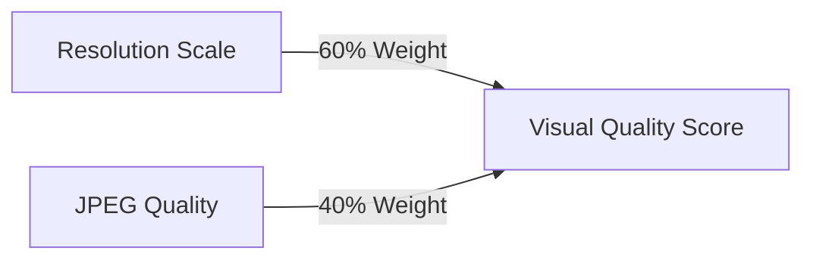

#### Visual Quality Score Calculation Explanation

This diagram shows how the Visual Quality Score is calculated:

- **Resolution Scale**: The scaling factor applied to the original video resolution
  - Values: 50%, 75%, 90%, 100%
  - Weight: 60% of the final score
  - Higher resolution means more detail and better visual quality
  - Example: 100% resolution contributes 60 points to the score

- **JPEG Quality**: The quality setting used when encoding frames as JPEG images
  - Values: 60%, 75%, 85%, 95%
  - Weight: 40% of the final score
  - Higher JPEG quality means less compression artifacts and better visual quality
  - Example: 95% JPEG quality contributes 38 points to the score

- **Visual Quality Score**: The weighted sum of Resolution Scale and JPEG Quality
  - Formula: (Resolution Scale × 0.6) + (JPEG Quality × 0.4)
  - Scale: 0-100, where higher values indicate better visual quality
  - Example: 100% resolution and 95% JPEG quality gives a score of (100 × 0.6) + (95 × 0.4) = 60 + 38 = 98

### Smoothness Score Calculation

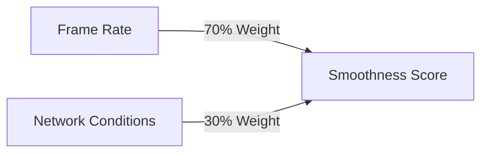

#### Smoothness Score Calculation Explanation

This diagram shows how the Smoothness Score is calculated:

- **Frame Rate**: The target frame rate for the video
  - Values: 10, 15, 20, 30 FPS
  - Weight: 70% of the final score
  - Higher frame rate means smoother motion
  - Example: 30 FPS contributes 70 points to the score (30 FPS is considered full score)

- **Network Conditions**: The network condition being simulated
  - Values: Poor, Fair, Good, Excellent
  - Weight: 30% of the final score
  - Better network conditions mean more consistent frame delivery
  - Example: Excellent network conditions contribute 30 points to the score

- **Smoothness Score**: The weighted sum of Frame Rate and Network Conditions
  - Formula: (Frame Rate Score × 0.7) + (Network Condition Score × 0.3)
  - Scale: 0-100, where higher values indicate smoother playback
  - Example: 30 FPS under excellent network conditions gives a score of (100 × 0.7) + (100 × 0.3) = 70 + 30 = 100

## Network Simulation

The system uses Linux Traffic Control (tc) to simulate different network conditions. These are the controlled parameters that we adjust to test how the video streaming performs:

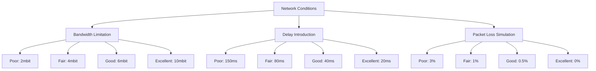

### Network Simulation Explanation

This diagram shows how different network conditions are simulated using Linux Traffic Control (tc):

1. **Bandwidth Limitation**:
   - Restricts the maximum data transfer rate
   - Implemented using the `rate` parameter in tc
   - Values:
     - Poor: 2mbit (2 megabits per second)
     - Fair: 4mbit (4 megabits per second)
     - Good: 6mbit (6 megabits per second)
     - Excellent: 10mbit (10 megabits per second)
   - Lower bandwidth means less data can be transmitted per second, potentially requiring lower resolution or quality

2. **Delay Introduction**:
   - Adds artificial latency to packet transmission
   - Implemented using the `delay` parameter in tc
   - Values:
     - Poor: 150ms (150 milliseconds)
     - Fair: 80ms (80 milliseconds)
     - Good: 40ms (40 milliseconds)
     - Excellent: 20ms (20 milliseconds)
   - Higher delay means longer wait times between sending a frame and receiving it, affecting responsiveness

3. **Packet Loss Simulation**:
   - Randomly drops a percentage of packets
   - Implemented using the `loss` parameter in tc
   - Values:
     - Poor: 3% (3 percent of packets lost)
     - Fair: 1% (1 percent of packets lost)
     - Good: 0.5% (0.5 percent of packets lost)
     - Excellent: 0% (no packet loss)
   - Higher packet loss means more frames may fail to deliver, requiring retransmission or causing dropped frames

These network conditions are applied using the following tc command:
```bash
tc qdisc add dev $INTERFACE root netem rate $RATE delay $DELAY loss $LOSS
```

Where:
- $INTERFACE is the network interface (e.g., wlp0s20f3)
- $RATE is the bandwidth limitation (e.g., 2mbit)
- $DELAY is the added delay (e.g., 150ms)
- $LOSS is the packet loss percentage (e.g., 3%)

> **Important Note**: Make sure the INTERFACE in dynamic_tc_control.sh is set to your actual network interface (not "lo"). Using the loopback interface (lo) will not affect the actual network traffic between the sender and receiver PCs, which means the delay, bandwidth limitation, and packet loss settings will have no effect on the video streaming.

## Troubleshooting

- If the video doesn't appear, check that both applications are running and that the IP addresses are configured correctly
- If traffic control doesn't seem to have an effect:
  - Check that the INTERFACE in dynamic_tc_control.sh is set to your actual network interface (not "lo")
  - Verify that the tc command is working by running `tc qdisc show dev <your-interface>`
  - Try more extreme settings (higher delay, lower bandwidth, higher packet loss)
- Make sure the network interface in run_quality_tests.py matches the one in dynamic_tc_control.sh
- Check the terminal output for any error messages
- If you're not seeing any delay effect, make sure you're testing between two different physical machines, as delay won't be noticeable on the same machine