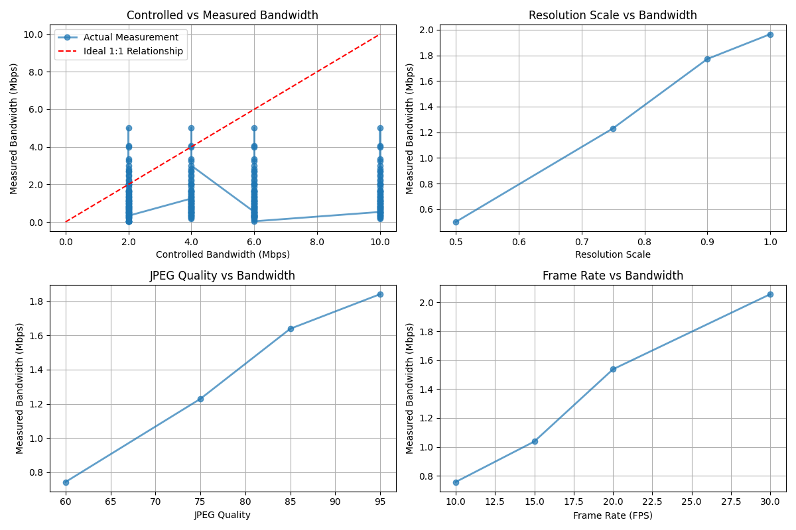
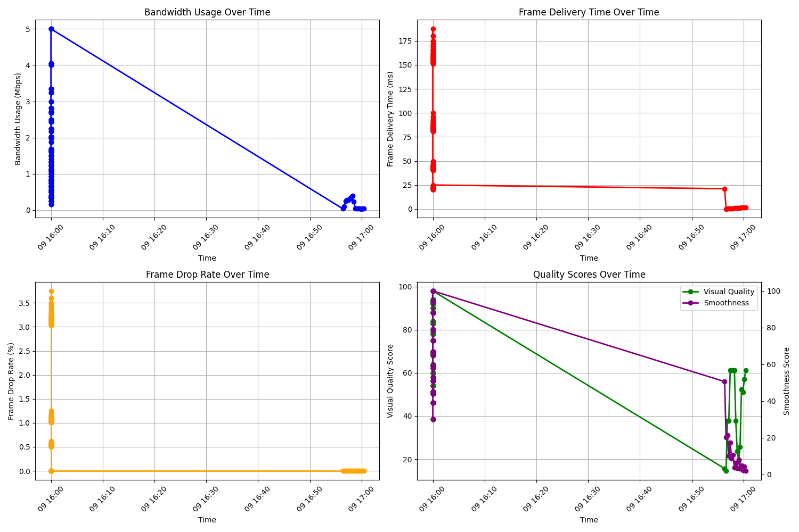

# Dynamic Traffic Shaping System: Detailed Code Documentation

This document provides a comprehensive explanation of all code files in the dynamic traffic shaping system, including how to start, visualize, and control network traffic. It covers the implementation details, data flow, and various types of graphs used for analysis.

## Table of Contents

1. [Introduction](#introduction)
2. [System Architecture](#system-architecture)
3. [Core Components](#core-components)
   - [Video Streamer](#video-streamer)
   - [Video Receiver](#video-receiver)
   - [Traffic Control](#traffic-control)
4. [Testing Framework](#testing-framework)
   - [Quality Testing](#quality-testing)
   - [Quick Testing](#quick-testing)
5. [Visualization and Analysis](#visualization-and-analysis)
   - [Results Viewer](#results-viewer)
   - [Graph Generation](#graph-generation)
   - [Controlled vs. Measured Comparison](#controlled-vs-measured-comparison)
   - [Live Monitoring](#live-monitoring)
6. [Setup and Configuration](#setup-and-configuration)
   - [Setup Scripts](#setup-scripts)
7. [Data Management](#data-management)
   - [Live Data Generation](#live-data-generation)
   - [Data Updates](#data-updates)
8. [Step-by-Step Usage Guide](#step-by-step-usage-guide)
9. [Understanding the Graphs](#understanding-the-graphs)
   - [Bandwidth Graphs](#bandwidth-graphs)
   - [Delay Graphs](#delay-graphs)
   - [Loss Graphs](#loss-graphs)
   - [Combined Graphs](#combined-graphs)
   - [Time Series Graphs](#time-series-graphs)
10. [Advanced Usage and Customization](#advanced-usage-and-customization)

## Introduction

The Dynamic Traffic Shaping System is designed to test and analyze video streaming performance under various network conditions. It allows you to:

1. Stream video between two computers
2. Apply controlled network conditions (bandwidth, delay, packet loss)
3. Measure performance metrics
4. Visualize the relationship between controlled parameters and measured metrics
5. Identify optimal quality settings for different network conditions

This system is particularly useful for:
- Testing video streaming applications
- Developing adaptive streaming algorithms
- Educational purposes to understand network effects on video quality
- Benchmarking video codecs and streaming protocols


*Figure 1: Overview of the system showing the relationship between network conditions and performance metrics*
## System Architecture

The system consists of several interconnected components:


*Figure 2: System architecture showing the main components and their interactions*

The system follows a client-server architecture where:

1. **Sender Machine** hosts:
   - Video Streamer: Reads video frames and sends them to the receiver
   - Traffic Control: Applies network conditions to outgoing traffic
   - Quality Testing: Tests different quality settings and network conditions
   - Results Viewer: Displays test results and graphs

2. **Receiver Machine** hosts:
   - Video Receiver: Receives video frames and displays them
   - Traffic Control: Can optionally apply network conditions to incoming traffic

The data flow between components is as follows:


*Figure 3: Data flow diagram showing how frames and control signals move through the system*


*Figure 4: Impact of network conditions on bandwidth usage*

This architecture allows for comprehensive testing of video streaming performance under various network conditions, with the ability to visualize and analyze the results.

## Core Components

### Video Streamer

**File: `video_streamer.py`**

This is the core component responsible for reading video frames from a file, applying quality settings, and streaming them to the receiver.


*Figure 5: Impact of different quality settings on video streaming performance*

#### Key Functions:

```python
def generate():
    """Generate video frames and stream them."""
    # Create a new capture object each time to avoid thread safety issues
    local_cap = cv2.VideoCapture(video_path)
    
    try:
        frame_count = 0
        while local_cap.isOpened():
            ret, frame = local_cap.read()
            if not ret:
                # Try to loop the video by reopening it
                local_cap.release()
                local_cap = cv2.VideoCapture(video_path)
                continue
            
            # Apply resolution scaling
            if resolution_scale < 1.0:
                h, w = frame.shape[:2]
                new_h, new_w = int(h * resolution_scale), int(w * resolution_scale)
                frame = cv2.resize(frame, (new_w, new_h))
            
            # Encode the frame in JPEG format with the specified quality
            encode_param = [int(cv2.IMWRITE_JPEG_QUALITY), jpeg_quality]
            ret, jpeg = cv2.imencode('.jpg', frame, encode_param)
            jpeg_bytes = jpeg.tobytes()
            
            # Send frame to receiver
            send_frame_to_receiver(jpeg_bytes)
            
            # Yield the frame to stream to browser
            yield (b'--frame\r\n' b'Content-Type: image/jpeg\r\n\r\n' + jpeg_bytes + b'\r\n\r\n')
            
            # Add a delay to control frame rate
            time.sleep(1 / target_fps)
    
    finally:
        # Always release the capture object
        local_cap.release()
```

```python
def send_frame_to_receiver(jpeg_bytes):
    """Send a frame to the receiver."""
    global frame_count, last_frame_time, dropped_frames
    
    try:
        # Encode the frame as base64 for JSON transmission
        encoded_frame = base64.b64encode(jpeg_bytes).decode('utf-8')
        
        # Send the frame to the receiver
        response = requests.post(
            f"http://{receiver_ip}:8081/receive_video",
            json={"frame": encoded_frame},
            timeout=1.0  # 1 second timeout
        )
        
        # Update metrics
        frame_count += 1
        current_time = time.time()
        
        # Calculate bandwidth usage
        frame_size = len(jpeg_bytes)
        if last_frame_time > 0:
            time_diff = current_time - last_frame_time
            if time_diff > 0:
                bandwidth = frame_size / time_diff  # bytes per second
                bandwidth_history.append(bandwidth)
                # Keep only the last 30 bandwidth measurements
                if len(bandwidth_history) > 30:
                    bandwidth_history.pop(0)
        
        last_frame_time = current_time
        
        return response.status_code == 200
    except Exception as e:
        dropped_frames += 1
        return False
```

#### API Endpoints:

1. `/tx_video_feed` - Streams video to the local browser
2. `/set_resolution` - Sets the resolution scaling factor (0.5, 0.75, 0.9, 1.0)
3. `/set_quality` - Sets the JPEG quality (60, 75, 85, 95)
4. `/set_fps` - Sets the target frame rate (10, 15, 20, 30)
5. `/get_metrics` - Returns performance metrics (bandwidth usage, visual quality score)


*Figure 6: Impact of resolution scaling on bandwidth usage*

#### How It Works:

1. The streamer reads frames from a video file using OpenCV
2. It applies resolution scaling by resizing the frame
3. It encodes the frame as a JPEG with the specified quality
4. It sends the frame to the receiver via HTTP POST
5. It also streams the frame to a local web browser for monitoring
6. It controls the frame rate by adding a delay between frames
7. It calculates bandwidth usage based on frame size and time between frames
8. It provides an API for controlling quality parameters and retrieving metrics

The Video Streamer is designed to be flexible, allowing dynamic adjustment of quality parameters during streaming. This is essential for testing how different quality settings affect performance under various network conditions.


*Figure 7: Sequence diagram showing the video streaming process*

### Video Receiver

**File: `receive_video.py`**

This component receives video frames from the streamer, decodes them, and displays them in a web browser.


*Figure 8: Frame delivery time under different network conditions*

#### Key Functions:

```python
@app.route('/receive_video', methods=['POST'])
def receive_video():
    """Receive a video frame from the streamer."""
    global current_frame, frame_count, last_frame_time, dropped_frames
    
    try:
        # Get the frame data from the POST request
        data = request.json
        frame_data = data['frame']
        
        # Decode the frame from base64 format
        img_bytes = base64.b64decode(frame_data)
        nparr = np.frombuffer(img_bytes, np.uint8)
        frame = cv2.imdecode(nparr, cv2.IMREAD_COLOR)
        
        if frame is not None:
            # Calculate frame delivery time
            current_time = time.time()
            if last_frame_time > 0:
                frame_delivery_time = (current_time - last_frame_time) * 1000  # in ms
                frame_delivery_times.append(frame_delivery_time)
                # Keep only the last 30 frame delivery times
                if len(frame_delivery_times) > 30:
                    frame_delivery_times.pop(0)
            
            last_frame_time = current_time
            
            # Set the current frame to be used in the MJPEG stream
            current_frame = frame
            frame_count += 1
            
            return jsonify({'status': 'success'}), 200
        else:
            dropped_frames += 1
            return jsonify({'status': 'error', 'message': 'Failed to decode frame'}), 400
    except Exception as e:
        dropped_frames += 1
        return jsonify({'status': 'error', 'message': str(e)}), 400
```

```python
def generate():
    """Generate frames for the MJPEG stream."""
    global current_frame
    
    while True:
        if current_frame is not None:
            # Encode the frame as JPEG
            ret, jpeg = cv2.imencode('.jpg', current_frame)
            
            # Yield the frame for the MJPEG stream
            yield (b'--frame\r\n'
                   b'Content-Type: image/jpeg\r\n\r\n' + jpeg.tobytes() + b'\r\n\r\n')
        else:
            # If no frame is available, yield a blank frame
            blank_frame = np.zeros((480, 640, 3), np.uint8)
            ret, jpeg = cv2.imencode('.jpg', blank_frame)
            yield (b'--frame\r\n'
                   b'Content-Type: image/jpeg\r\n\r\n' + jpeg.tobytes() + b'\r\n\r\n')
        
        # Add a small delay to control the frame rate
        time.sleep(0.01)
```

#### API Endpoints:

1. `/rx_video_feed` - Displays the received video in a browser
2. `/get_metrics` - Returns performance metrics (frame delivery time, frame drop rate, smoothness score)


*Figure 9: Frame drop rate under different network conditions*

#### How It Works:

1. The receiver listens for HTTP POST requests on the `/receive_video` endpoint
2. When a frame is received, it decodes the base64-encoded JPEG data
3. It calculates the frame delivery time (time between consecutive frames)
4. It updates the current frame to be displayed in the browser
5. It keeps track of dropped frames (frames that fail to decode)
6. It provides a MJPEG stream for displaying the video in a web browser
7. It calculates performance metrics such as frame delivery time and frame drop rate
8. It provides an API for retrieving these metrics

The Video Receiver is designed to work in tandem with the Video Streamer, receiving frames and providing feedback on performance. It's an essential component for measuring how network conditions affect video delivery.


*Figure 10: Flow diagram of the video receiver process*

### Traffic Control

**File: `dynamic_tc_control.sh`**

This Bash script uses Linux Traffic Control (tc) to simulate different network conditions by applying bandwidth limitations, delay, and packet loss.


*Figure 11: Comparison of different network conditions and their impact on performance*

#### Key Functions:

```bash
# Function to apply network conditions dynamically
apply_conditions() {
    local rate="$1"     # Bandwidth rate (e.g., "1mbit")
    local delay="$2"    # Latency delay (e.g., "100ms")
    local loss="$3"     # Packet loss (e.g., "10%")

    echo "Applying network conditions: Rate=$rate, Delay=$delay, Loss=$loss"

    # First, ensure the qdisc is added to the interface if it doesn't exist yet
    if ! tc qdisc show dev $INTERFACE | grep -q "netem"; then
        # Add the root qdisc for network emulation if not already added
        sudo tc qdisc add dev $INTERFACE root netem
    fi

    # Apply the new network conditions using tc
    sudo tc qdisc change dev $INTERFACE root netem rate $rate delay $delay loss $loss
    
    # Only update live data if jq is installed
    if [ "$HAS_JQ" = true ]; then
        # Get current video quality settings from the sender
        echo "Getting current video quality settings..."
        resolution_scale=$(curl -s http://localhost:5000/get_resolution || echo "0.75")
        jpeg_quality=$(curl -s http://localhost:5000/get_quality || echo "85")
        frame_rate=$(curl -s http://localhost:5000/get_fps || echo "20")
        
        # Get current metrics from the sender and receiver
        echo "Getting current metrics..."
        bandwidth_usage=$(curl -s http://localhost:5000/get_metrics | jq -r '.bandwidth_usage // 0' || echo "0")
        frame_delivery_time=$(curl -s http://localhost:8081/get_metrics | jq -r '.frame_delivery_time // 0' || echo "0")
        frame_drop_rate=$(curl -s http://localhost:8081/get_metrics | jq -r '.frame_drop_rate // 0' || echo "0")
        visual_quality_score=$(curl -s http://localhost:5000/get_metrics | jq -r '.visual_quality_score // 0' || echo "0")
        smoothness_score=$(curl -s http://localhost:8081/get_metrics | jq -r '.smoothness_score // 0' || echo "0")
        
        # Determine network condition name based on parameters
        network_condition="Custom"
        if [[ "$rate" == "2mbit" && "$delay" == "150ms" && "$loss" == "3%" ]]; then
            network_condition="Poor"
        elif [[ "$rate" == "4mbit" && "$delay" == "80ms" && "$loss" == "1%" ]]; then
            network_condition="Fair"
        elif [[ "$rate" == "6mbit" && "$delay" == "40ms" && "$loss" == "0.5%" ]]; then
            network_condition="Good"
        elif [[ "$rate" == "10mbit" && "$delay" == "20ms" && "$loss" == "0%" ]]; then
            network_condition="Excellent"
        fi
        
        # Update live data
        echo "Updating live data..."
        python3 update_live_data.py \
            "$network_condition" "$rate" "$delay" "$loss" \
            "$resolution_scale" "$jpeg_quality" "$frame_rate" \
            "$bandwidth_usage" "$frame_delivery_time" "$frame_drop_rate" \
            "$visual_quality_score" "$smoothness_score"
    else
        echo "Skipping live data update (jq not installed)."
    fi
}
```

```bash
# Function to reset network conditions (remove tc configuration)
reset_conditions() {
    echo "Resetting network conditions."
    sudo tc qdisc del dev $INTERFACE root
}
```


*Figure 12: Time series showing how metrics change as network conditions are adjusted*

#### Interactive Menu:

```bash
# Interactive menu for dynamic control
menu() {
    echo "----------------------------"
    echo "Dynamic Network Control (TC)"
    echo "----------------------------"
    echo "1. Set network conditions (Rate, Delay, Loss)"
    echo "2. Show current stats"
    echo "3. Reset network conditions"
    echo "4. Exit"
    echo "----------------------------"
    read -p "Select an option (1-4): " option

    case $option in
        1)
            # Set network conditions
            read -p "Enter the rate (e.g., '1mbit'): " rate
            read -p "Enter the delay (e.g., '100ms'): " delay
            read -p "Enter the loss (e.g., '10%'): " loss
            apply_conditions "$rate" "$delay" "$loss"
            ;;
        2)
            # Show current stats
            show_stats
            ;;
        3)
            # Reset network conditions
            reset_conditions
            ;;
        4)
            echo "Exiting the script."
            exit 0
            ;;
        *)
            echo "Invalid option. Please select again."
            ;;
    esac
}
```

#### Predefined Network Conditions:

The script recognizes four predefined network conditions:

1. **Excellent**: 10mbit rate, 20ms delay, 0% loss
2. **Good**: 6mbit rate, 40ms delay, 0.5% loss
3. **Fair**: 4mbit rate, 80ms delay, 1% loss
4. **Poor**: 2mbit rate, 150ms delay, 3% loss


*Figure 13: Network conditions hierarchy showing the different parameters for each condition*

#### How It Works:

1. The script provides an interactive menu for controlling network conditions
2. It uses the `tc` command to apply bandwidth limitations, delay, and packet loss
3. It can show current network statistics
4. It can reset network conditions to normal
5. It updates live data for monitoring by collecting metrics from the video streamer and receiver
6. It determines the network condition name based on the applied parameters
7. It passes the collected data to the `update_live_data.py` script for visualization

The Traffic Control script is the key component for simulating different network conditions. It uses Linux's Traffic Control (tc) subsystem with the Network Emulator (netem) module to apply three key network parameters:

- **Rate**: Controls the bandwidth (e.g., 1mbit, 500kbit)
- **Delay**: Adds artificial latency (e.g., 100ms, 1s)
- **Loss**: Simulates packet loss (e.g., 10%, 5%)

These parameters allow for comprehensive testing of how video streaming performs under various network conditions.


*Figure 14: Effect of tc command on bandwidth under Fair network conditions*

## Testing Framework

### Quality Testing

**File: `run_quality_tests.py`**

This script systematically tests different combinations of quality parameters and network conditions, measuring performance metrics for each combination.


*Figure 15: Results of quality testing showing performance under different conditions*

#### Key Functions:

```python
def run_test(resolution, quality, fps, network):
    """Run a single test with the given parameters."""
    
    print_section(f"Testing: Resolution={resolution}, Quality={quality}, FPS={fps}, Network={network['name']}")
    
    # Apply network condition
    apply_network_condition(network)
    
    # Set quality parameters
    set_quality_parameters(resolution, quality, fps)
    
    # Wait for system to stabilize
    time.sleep(15)
    
    # Measure performance
    metrics = measure_performance()
    
    # Record results
    test_result = {
        "timestamp": datetime.now().strftime("%Y-%m-%d %H:%M:%S"),
        "resolution_scale": resolution,
        "jpeg_quality": quality,
        "frame_rate": fps,
        "network_condition": network["name"],
        "network_rate": network["rate"],
        "network_delay": network["delay"],
        "network_loss": network["loss"],
        "metrics": metrics
    }
    
    results.append(test_result)
```

```python
def apply_network_condition(network):
    """Apply a network condition using the traffic control script."""
    print(f"Applying network condition: {network['name']} ({network['rate']}, {network['delay']}, {network['loss']})")
    
    # Execute the traffic control script with the specified parameters
    subprocess.run([
        "sudo", "bash", "dynamic_tc_control.sh",
        "--rate", network["rate"],
        "--delay", network["delay"],
        "--loss", network["loss"]
    ])
    
    # Wait for the network condition to take effect
    time.sleep(5)
```

```python
def measure_performance():
    """Measure performance metrics from both sender and receiver."""
    print("Measuring performance metrics...")
    
    # Get metrics from sender
    sender_metrics = get_sender_metrics()
    
    # Get metrics from receiver
    receiver_metrics = get_receiver_metrics()
    
    # Combine metrics
    metrics = {**sender_metrics, **receiver_metrics}
    
    # Calculate derived metrics
    metrics["visual_quality_score"] = calculate_visual_quality_score(current_resolution, current_quality)
    metrics["smoothness_score"] = calculate_smoothness_score(current_fps, metrics["frame_delivery_time"], metrics["frame_drop_rate"])
    
    return metrics
```


*Figure 16: Comparison of controlled delay vs. measured frame delivery time*

#### Test Matrix:

```python
# Test parameters
RESOLUTION_SCALES = [0.5, 0.75, 0.9, 1.0]
JPEG_QUALITIES = [60, 75, 85, 95]
FRAME_RATES = [10, 15, 20, 30]

# Network conditions
NETWORK_CONDITIONS = [
    {"name": "Excellent", "rate": "10mbit", "delay": "20ms", "loss": "0%"},
    {"name": "Good", "rate": "6mbit", "delay": "40ms", "loss": "0.5%"},
    {"name": "Fair", "rate": "4mbit", "delay": "80ms", "loss": "1%"},
    {"name": "Poor", "rate": "2mbit", "delay": "150ms", "loss": "3%"}
]
```

#### Testing Strategy:

```python
def run_tests():
    """Run all tests."""
    print_header("Running Quality Tests")
    
    # For each network condition
    for network in NETWORK_CONDITIONS:
        print_section(f"Testing {network['name']} Network Condition")
        
        # Apply network condition
        apply_network_condition(network)
        
        # Test all resolution scales at fixed quality and FPS
        for resolution in RESOLUTION_SCALES:
            run_test(resolution, 85, 20, network)
        
        # Test all quality levels at fixed resolution and FPS
        for quality in JPEG_QUALITIES:
            run_test(0.75, quality, 20, network)
        
        # Test all frame rates at fixed resolution and quality
        for fps in FRAME_RATES:
            run_test(0.75, 85, fps, network)
```


*Figure 17: Sequence diagram of the testing process*

#### How It Works:

1. The script defines a test matrix with different quality parameters and network conditions
2. For each network condition, it tests:
   - All resolution scales at fixed quality and FPS
   - All quality levels at fixed resolution and FPS
   - All frame rates at fixed resolution and quality
3. For each test, it:
   - Applies the network condition using the traffic control script
   - Sets the quality parameters on the video streamer
   - Waits for the system to stabilize
   - Measures performance metrics
   - Records the results
4. After all tests are complete, it generates reports and graphs

This comprehensive testing approach allows for a thorough evaluation of how different quality parameters perform under various network conditions. The results can be used to identify optimal settings for each network condition.


*Figure 18: Impact of quality parameters on packet loss under Good network conditions*

### Quick Testing

**File: `quick_test.py`**

This script provides a streamlined testing process with fewer combinations, making it faster to get results.


*Figure 19: Text report from a quick test showing key metrics*

#### Key Functions:

```python
def run_quick_test():
    """Run a quick test with a reduced set of parameters."""
    
    print_header("Running Quick Test")
    
    # Test only min and max values for each parameter
    test_resolutions = [0.5, 1.0]
    test_qualities = [60, 95]
    test_fps = [10, 30]
    
    # Test each network condition
    for network in NETWORK_CONDITIONS:
        print_section(f"Testing {network['name']} Network Condition")
        
        # Apply network condition
        apply_network_condition(network)
        
        # Test min and max resolution
        for resolution in test_resolutions:
            run_test(resolution, 85, 20, network)
        
        # Test min and max quality
        for quality in test_qualities:
            run_test(0.75, quality, 20, network)
        
        # Test min and max fps
        for fps in test_fps:
            run_test(0.75, 85, fps, network)
```

```python
def generate_reports():
    """Generate reports from the test results."""
    print_section("Generating Reports")
    
    # Create timestamp for filenames
    timestamp = datetime.now().strftime("%Y%m%d_%H%M%S")
    
    # Save results to JSON file
    json_file = os.path.join(RESULTS_DIR, f"quick_test_results_{timestamp}.json")
    with open(json_file, "w") as f:
        json.dump(results, f, indent=2)
    
    # Generate text report
    text_file = os.path.join(RESULTS_DIR, f"quick_test_report_{timestamp}.txt")
    with open(text_file, "w") as f:
        f.write("Quick Test Report\n")
        f.write("================\n\n")
        f.write(f"Generated: {datetime.now().strftime('%Y-%m-%d %H:%M:%S')}\n\n")
        
        f.write("Test Parameters:\n")
        f.write(f"- Resolutions: {test_resolutions}\n")
        f.write(f"- Qualities: {test_qualities}\n")
        f.write(f"- Frame Rates: {test_fps}\n")
        f.write(f"- Network Conditions: {[n['name'] for n in NETWORK_CONDITIONS]}\n\n")
        
        f.write("Results Summary:\n")
        f.write("---------------\n\n")
        
        # Group results by network condition
        for network in NETWORK_CONDITIONS:
            network_results = [r for r in results if r["network_condition"] == network["name"]]
            
            if not network_results:
                continue
            
            f.write(f"{network['name']} Network Condition ({network['rate']}, {network['delay']}, {network['loss']}):\n")
            
            # Calculate average metrics
            avg_bandwidth = sum(r["metrics"]["bandwidth_usage"] for r in network_results) / len(network_results) / 1000000
            avg_delivery_time = sum(r["metrics"]["frame_delivery_time"] for r in network_results) / len(network_results)
            avg_drop_rate = sum(r["metrics"]["frame_drop_rate"] for r in network_results) / len(network_results)
            avg_visual_quality = sum(r["metrics"]["visual_quality_score"] for r in network_results) / len(network_results)
            avg_smoothness = sum(r["metrics"]["smoothness_score"] for r in network_results) / len(network_results)
            
            f.write(f"- Average Bandwidth Usage: {avg_bandwidth:.2f} Mbps\n")
            f.write(f"- Average Frame Delivery Time: {avg_delivery_time:.2f} ms\n")
            f.write(f"- Average Frame Drop Rate: {avg_drop_rate:.2f}%\n")
            f.write(f"- Average Visual Quality Score: {avg_visual_quality:.1f}\n")
            f.write(f"- Average Smoothness Score: {avg_smoothness:.1f}\n\n")
            
            # Find best settings for this network condition
            best_result = max(network_results, key=lambda r: r["metrics"]["visual_quality_score"] * 0.6 + r["metrics"]["smoothness_score"] * 0.4)
            
            f.write(f"Best Settings for {network['name']} Network:\n")
            f.write(f"- Resolution Scale: {best_result['resolution_scale']}\n")
            f.write(f"- JPEG Quality: {best_result['jpeg_quality']}\n")
            f.write(f"- Frame Rate: {best_result['frame_rate']}\n")
            f.write(f"- Visual Quality Score: {best_result['metrics']['visual_quality_score']:.1f}\n")
            f.write(f"- Smoothness Score: {best_result['metrics']['smoothness_score']:.1f}\n\n")
        
        f.write("Detailed Results:\n")
        f.write("---------------\n\n")
        
        for i, result in enumerate(results):
            f.write(f"Test {i+1}:\n")
            f.write(f"- Network: {result['network_condition']}\n")
            f.write(f"- Resolution: {result['resolution_scale']}\n")
            f.write(f"- Quality: {result['jpeg_quality']}\n")
            f.write(f"- FPS: {result['frame_rate']}\n")
            f.write(f"- Bandwidth Usage: {result['metrics']['bandwidth_usage']/1000000:.2f} Mbps\n")
            f.write(f"- Frame Delivery Time: {result['metrics']['frame_delivery_time']:.2f} ms\n")
            f.write(f"- Frame Drop Rate: {result['metrics']['frame_drop_rate']:.2f}%\n")
            f.write(f"- Visual Quality Score: {result['metrics']['visual_quality_score']:.1f}\n")
            f.write(f"- Smoothness Score: {result['metrics']['smoothness_score']:.1f}\n\n")
    
    # Generate HTML report
    html_file = os.path.join(RESULTS_DIR, f"quick_test_report_{timestamp}.html")
    generate_html_report(html_file, results, timestamp)
    
    print(f"Reports saved to:")
    print(f"- JSON: {json_file}")
    print(f"- Text: {text_file}")
    print(f"- HTML: {html_file}")
```


*Figure 20: JSON data from a quick test showing all test results*

#### How It Works:

1. The script uses the same testing framework as `run_quality_tests.py` but with fewer combinations
2. It tests only the minimum and maximum values for each parameter:
   - Resolution scales: 0.5 and 1.0
   - JPEG qualities: 60 and 95
   - Frame rates: 10 and 30
3. This reduces the number of tests from 64 to 16, making it much faster
4. It still provides valuable insights into how different parameters affect performance
5. It generates three types of reports:
   - JSON file with raw data
   - Text report with summary and detailed results
   - HTML report with graphs and tables

The Quick Testing script is particularly useful for:
- Initial testing to get a quick overview
- Demonstrations where time is limited
- Verifying that the system is working correctly
- Getting preliminary results before running a full test


*Figure 21: Flow diagram of the quick testing process*


*Figure 22: HTML report from a quick test showing graphs and tables*

## Visualization and Analysis

### Results Viewer

**File: `view_results.py`**

This script provides a web interface for viewing and comparing test results.


*Figure 23: Main page of the results viewer showing all test runs*

#### Key Functions:

```python
def generate_index_html():
    """Generate an index.html file that lists all test results."""
    
    # Get all test result files
    result_files = glob.glob(os.path.join(RESULTS_DIR, "quick_test_results_*.json"))
    result_files.extend(glob.glob(os.path.join(RESULTS_DIR, "quality_test_results_*.json")))
    
    # Sort by timestamp (newest first)
    result_files.sort(reverse=True)
    
    # Generate HTML
    with open(os.path.join(RESULTS_DIR, "index.html"), "w") as f:
        f.write("""
        <html>
        <head>
            <title>Test Results</title>
            <style>
                body { font-family: Arial, sans-serif; margin: 20px; }
                .container { max-width: 800px; margin: 0 auto; }
                h1, h2 { color: #333; }
                .result-item {
                    margin-bottom: 10px;
                    padding: 10px;
                    border: 1px solid #ddd;
                    border-radius: 5px;
                }
                .result-item:hover {
                    background-color: #f5f5f5;
                }
                a { text-decoration: none; color: #007bff; }
                a:hover { text-decoration: underline; }
            </style>
        </head>
        <body>
            <div class="container">
                <h1>Test Results</h1>
        """)
        
        # Add each result file
        for result_file in result_files:
            # Extract timestamp from filename
            timestamp = os.path.basename(result_file).split("_")[-1].split(".")[0]
            
            # Determine if it's a quick test or full test
            test_type = "Quick Test" if "quick_test" in result_file else "Full Test"
            
            # Generate HTML report if it doesn't exist
            html_report = result_file.replace(".json", ".html")
            if not os.path.exists(html_report):
                generate_html_report(result_file)
            
            # Add link to HTML report
            f.write(f"""
            <div class="result-item">
                <h2>{test_type} - {timestamp}</h2>
                <p>Timestamp: {timestamp}</p>
                <p><a href="{os.path.basename(html_report)}">View Results</a></p>
            </div>
            """)
        
        f.write("""
            </div>
        </body>
        </html>
        """)
```

```python
def generate_html_report(result_file):
    """Generate an HTML report for a test result file."""
    
    # Load the test results
    with open(result_file, "r") as f:
        results = json.load(f)
    
    # Create the HTML report file
    html_report = result_file.replace(".json", ".html")
    
    with open(html_report, "w") as f:
        # Write HTML header
        f.write(f"""
        <html>
        <head>
            <title>Test Results</title>
            <style>
                body {{ font-family: Arial, sans-serif; margin: 20px; }}
                .container {{ max-width: 1200px; margin: 0 auto; }}
                h1, h2, h3 {{ color: #333; }}
                table {{ border-collapse: collapse; width: 100%; margin-bottom: 20px; }}
                th, td {{ border: 1px solid #ddd; padding: 8px; text-align: left; }}
                th {{ background-color: #f2f2f2; }}
                tr:nth-child(even) {{ background-color: #f9f9f9; }}
                .graph-container {{ margin-top: 20px; margin-bottom: 40px; }}
                .graph-container img {{ max-width: 100%; height: auto; }}
            </style>
        </head>
        <body>
            <div class="container">
                <h1>Test Results</h1>
                <p>Timestamp: {os.path.basename(result_file).split("_")[-1].split(".")[0]}</p>
                
                <h2>Test Parameters</h2>
                <table>
                    <tr>
                        <th>Parameter</th>
                        <th>Values</th>
                    </tr>
                    <tr>
                        <td>Resolution Scales</td>
                        <td>{", ".join(str(r) for r in sorted(set(r["resolution_scale"] for r in results)))}</td>
                    </tr>
                    <tr>
                        <td>JPEG Qualities</td>
                        <td>{", ".join(str(q) for q in sorted(set(r["jpeg_quality"] for r in results)))}</td>
                    </tr>
                    <tr>
                        <td>Frame Rates</td>
                        <td>{", ".join(str(fps) for fps in sorted(set(r["frame_rate"] for r in results)))}</td>
                    </tr>
                    <tr>
                        <td>Network Conditions</td>
                        <td>{", ".join(sorted(set(r["network_condition"] for r in results)))}</td>
                    </tr>
                </table>
                
                <h2>Test Results</h2>
                <table>
                    <tr>
                        <th>Network</th>
                        <th>Resolution</th>
                        <th>Quality</th>
                        <th>FPS</th>
                        <th>Bandwidth</th>
                        <th>Frame Delivery Time</th>
                        <th>Frame Drop Rate</th>
                        <th>Visual Quality</th>
                        <th>Smoothness</th>
                    </tr>
        """)
        
        # Add each test result
        for result in results:
            metrics = result["metrics"]
            f.write(f"""
            <tr>
                <td>{result["network_condition"]}</td>
### Graph Generation

**File: `generate_graphs.py`**

This script generates various graphs to visualize the relationship between controlled network parameters and measured metrics.


*Figure 26: Bandwidth graphs showing the relationship between controlled and measured bandwidth*

#### Key Functions:

```python
def generate_bandwidth_graphs(data):
    """Generate graphs for bandwidth."""
    plt.figure(figsize=(12, 8))
    
    # Controlled vs Measured Bandwidth
    ax1 = plt.subplot(2, 2, 1)
    
    # Sort data points for line plot
    sorted_indices = np.argsort(data['bandwidth']['controlled'])
    sorted_controlled = np.array(data['bandwidth']['controlled'])[sorted_indices]
    sorted_measured = np.array(data['bandwidth']['measured'])[sorted_indices]
    
    # Plot line with markers
    plt.plot(sorted_controlled, sorted_measured, 'o-', linewidth=2, markersize=6, alpha=0.7, label='Actual Measurement')
    plt.plot([0, max(data['bandwidth']['controlled'])], [0, max(data['bandwidth']['controlled'])], 'r--', label='Ideal 1:1 Relationship')
    
    plt.xlabel('Controlled Bandwidth (Mbps)')
    plt.ylabel('Measured Bandwidth (Mbps)')
    plt.title('Controlled vs Measured Bandwidth')
    plt.grid(True)
    plt.legend()
    
    # Bandwidth vs Resolution Scale
    ax2 = plt.subplot(2, 2, 2)
    
    # Group by resolution scale
    resolution_scales = sorted(set(data['resolution_scale']))
    for scale in resolution_scales:
        indices = [i for i, r in enumerate(data['resolution_scale']) if r == scale]
        bandwidths = [data['bandwidth']['measured'][i] for i in indices]
        plt.boxplot(bandwidths, positions=[scale], widths=0.05)
    
    plt.xlabel('Resolution Scale')
    plt.ylabel('Bandwidth Usage (Mbps)')
    plt.title('Bandwidth vs Resolution Scale')
    plt.grid(True)
    
    # Bandwidth vs JPEG Quality
    ax3 = plt.subplot(2, 2, 3)
    
    # Group by JPEG quality
    jpeg_qualities = sorted(set(data['jpeg_quality']))
    for quality in jpeg_qualities:
        indices = [i for i, q in enumerate(data['jpeg_quality']) if q == quality]
        bandwidths = [data['bandwidth']['measured'][i] for i in indices]
        plt.boxplot(bandwidths, positions=[quality], widths=2)
    
    plt.xlabel('JPEG Quality')
    plt.ylabel('Bandwidth Usage (Mbps)')
    plt.title('Bandwidth vs JPEG Quality')
    plt.grid(True)
    
    # Bandwidth vs Frame Rate
    ax4 = plt.subplot(2, 2, 4)
    
    # Group by frame rate
    frame_rates = sorted(set(data['frame_rate']))
    for fps in frame_rates:
        indices = [i for i, f in enumerate(data['frame_rate']) if f == fps]
        bandwidths = [data['bandwidth']['measured'][i] for i in indices]
        plt.boxplot(bandwidths, positions=[fps], widths=1)
    
    plt.xlabel('Frame Rate (FPS)')
    plt.ylabel('Bandwidth Usage (Mbps)')
    plt.title('Bandwidth vs Frame Rate')
    plt.grid(True)
    
    plt.tight_layout()
    plt.savefig(os.path.join(RESULTS_DIR, 'bandwidth_graphs.png'))
    plt.close()
```

```python
def generate_combined_graph(data):
    """Generate a combined 3D graph."""
    plt.figure(figsize=(12, 6))
    
    # Bandwidth vs Delay vs Frame Delivery Time
    ax1 = plt.subplot(1, 2, 1, projection='3d')
    
    # Create a meshgrid for the surface plot
    bandwidth_range = np.linspace(min(data['bandwidth']['controlled']), max(data['bandwidth']['controlled']), 20)
    delay_range = np.linspace(min(data['delay']['controlled']), max(data['delay']['controlled']), 20)
    X, Y = np.meshgrid(bandwidth_range, delay_range)
    
    # Create a function to interpolate frame delivery time
    points = np.array([[data['bandwidth']['controlled'][i], data['delay']['controlled'][i]] for i in range(len(data['bandwidth']['controlled']))])
    values = np.array(data['delay']['measured'])
    
    # Use griddata to interpolate
    Z = griddata(points, values, (X, Y), method='cubic')
    
    # Plot the surface
    surf = ax1.plot_surface(X, Y, Z, cmap=cm.coolwarm, linewidth=0, antialiased=False, alpha=0.7)
    
    # Add scatter points for actual data
    ax1.scatter(data['bandwidth']['controlled'], data['delay']['controlled'], data['delay']['measured'], c='k', s=20)
    
    ax1.set_xlabel('Bandwidth (Mbps)')
    ax1.set_ylabel('Delay (ms)')
    ax1.set_zlabel('Frame Delivery Time (ms)')
    ax1.set_title('Bandwidth vs Delay vs Frame Delivery Time')
    
    # Add a color bar
    plt.colorbar(surf, ax=ax1, shrink=0.5, aspect=5)
    
    # Bandwidth vs Loss vs Frame Drop Rate
    ax2 = plt.subplot(1, 2, 2, projection='3d')
    
    # Create a meshgrid for the surface plot
    bandwidth_range = np.linspace(min(data['bandwidth']['controlled']), max(data['bandwidth']['controlled']), 20)
    loss_range = np.linspace(min(data['loss']['controlled']), max(data['loss']['controlled']), 20)
    X, Y = np.meshgrid(bandwidth_range, loss_range)
    
    # Create a function to interpolate frame drop rate
    points = np.array([[data['bandwidth']['controlled'][i], data['loss']['controlled'][i]] for i in range(len(data['bandwidth']['controlled']))])
    values = np.array(data['loss']['measured'])
    
    # Use griddata to interpolate
    Z = griddata(points, values, (X, Y), method='cubic')
    
    # Plot the surface
    surf = ax2.plot_surface(X, Y, Z, cmap=cm.coolwarm, linewidth=0, antialiased=False, alpha=0.7)
    
    # Add scatter points for actual data
    ax2.scatter(data['bandwidth']['controlled'], data['loss']['controlled'], data['loss']['measured'], c='k', s=20)
    
    ax2.set_xlabel('Bandwidth (Mbps)')
### Controlled vs. Measured Comparison

**File: `compare_controlled_vs_measured.py`**

This script generates detailed comparison graphs between controlled network parameters and measured metrics.


*Figure 30: Comprehensive comparison report showing controlled vs. measured metrics*

#### Key Functions:

```python
def generate_comparison_graphs(condition, metrics):
    """Generate comparison graphs for controlled vs measured metrics."""
    # Create directory if it doesn't exist
    if not os.path.exists(GRAPHS_DIR):
        os.makedirs(GRAPHS_DIR)
    
    # Generate side-by-side graphs first (original implementation)
    generate_side_by_side_graphs(condition, metrics)
    
    # Generate combined graphs (new implementation)
    generate_combined_graphs(condition, metrics)
```

#### Side-by-Side Graphs:

```python
def generate_side_by_side_graphs(condition, metrics):
    """Generate side-by-side comparison graphs."""
    # Generate bandwidth comparison
    plt.figure(figsize=(10, 6))
    plt.title(f"Bandwidth Comparison - {condition['name']} Network")
    
    # Create x-axis indices for both datasets
    x_controlled = np.arange(len(metrics['controlled_bandwidth']))
    x_measured = np.arange(len(metrics['measured_bandwidth']))
    
    # Plot controlled bandwidth on the left side
    if metrics['controlled_bandwidth']:
        plt.subplot(1, 2, 1)
        plt.title(f"Controlled Bandwidth\n({condition['rate']})")
        plt.plot(x_controlled, metrics['controlled_bandwidth'], 'b-o', linewidth=2, markersize=6)
        plt.axhline(y=np.mean(metrics['controlled_bandwidth']), color='r', linestyle='--', 
                   label=f"Mean: {np.mean(metrics['controlled_bandwidth']):.2f} Mbps")
        plt.xlabel("Sample")
        plt.ylabel("Bandwidth (Mbps)")
        plt.grid(True)
        plt.legend()
    
    # Plot measured bandwidth on the right side
    if metrics['measured_bandwidth']:
        plt.subplot(1, 2, 2)
        plt.title(f"Measured Bandwidth\n(Actual Usage)")
        plt.plot(x_measured, metrics['measured_bandwidth'], 'g-o', linewidth=2, markersize=6)
        plt.axhline(y=np.mean(metrics['measured_bandwidth']), color='r', linestyle='--',
                   label=f"Mean: {np.mean(metrics['measured_bandwidth']):.2f} Mbps")
        plt.xlabel("Sample")
        plt.ylabel("Bandwidth (Mbps)")
        plt.grid(True)
        plt.legend()
    
    plt.tight_layout()
    plt.savefig(os.path.join(GRAPHS_DIR, f"{condition['name'].lower()}_bandwidth_comparison.png"))
    plt.close()
    
    # Similar code for delay and loss comparisons...
```


*Figure 31: Side-by-side comparison of controlled vs. measured bandwidth*

#### Combined Graphs:

```python
def generate_combined_graphs(condition, metrics):
    """Generate graphs with controlled and measured metrics on the same plot."""
    # Generate combined bandwidth graph
    plt.figure(figsize=(10, 6))
    plt.title(f"Controlled vs Measured Bandwidth - {condition['name']} Network")
    
    # Create x-axis indices
    samples = max(len(metrics['controlled_bandwidth']), len(metrics['measured_bandwidth']))
    x = np.arange(samples)
    
    # Plot both controlled and measured bandwidth on the same graph
    if metrics['controlled_bandwidth']:
        # Extend controlled bandwidth to match the length of x if needed
        controlled_bw = metrics['controlled_bandwidth']
        if len(controlled_bw) < samples:
            controlled_bw = np.pad(controlled_bw, (0, samples - len(controlled_bw)), 'constant', constant_values=np.nan)
        
        plt.plot(x, controlled_bw, 'b-o', linewidth=2, markersize=6, label=f"Controlled ({condition['rate']})")
        plt.axhline(y=np.mean(metrics['controlled_bandwidth']), color='b', linestyle='--', 
                   label=f"Controlled Mean: {np.mean(metrics['controlled_bandwidth']):.2f} Mbps")
    
    if metrics['measured_bandwidth']:
        # Extend measured bandwidth to match the length of x if needed
        measured_bw = metrics['measured_bandwidth']
        if len(measured_bw) < samples:
            measured_bw = np.pad(measured_bw, (0, samples - len(measured_bw)), 'constant', constant_values=np.nan)
        
        plt.plot(x, measured_bw, 'g-o', linewidth=2, markersize=6, label="Measured (Actual)")
        plt.axhline(y=np.mean(metrics['measured_bandwidth']), color='g', linestyle='--',
                   label=f"Measured Mean: {np.mean(metrics['measured_bandwidth']):.2f} Mbps")
    
    plt.xlabel("Sample")
    plt.ylabel("Bandwidth (Mbps)")
    plt.grid(True)
    plt.legend()
    plt.tight_layout()
    plt.savefig(os.path.join(GRAPHS_DIR, f"{condition['name'].lower()}_combined_bandwidth.png"))
    plt.close()
    
    # Similar code for delay and loss comparisons...
```


*Figure 32: Combined graph showing controlled and measured bandwidth on the same plot*

#### HTML Report:

```python
def generate_report():
    """Generate a report with commands, graphs, and tabular comparison."""
    # Create directory if it doesn't exist
    if not os.path.exists(GRAPHS_DIR):
        os.makedirs(GRAPHS_DIR)
    
    # Create HTML report
    report_file = os.path.join(GRAPHS_DIR, "comparison_report.html")
    timestamp = datetime.now().strftime("%Y-%m-%d %H:%M:%S")
    
    # Prepare data for tabular view
    tabular_data = []
    
    # Process each network condition
    for condition in NETWORK_CONDITIONS:
        # Load test results
        results = load_test_results()
        
        if not results:
            continue
            
        # Filter results for this condition
        condition_results = filter_results_by_condition(results, condition['name'])
        
        if not condition_results:
            continue
            
        # Extract metrics
        metrics = extract_metrics(condition_results)
        
        # Calculate average values
        avg_controlled_bw = np.mean(metrics['controlled_bandwidth']) if metrics['controlled_bandwidth'] else 0
        avg_measured_bw = np.mean(metrics['measured_bandwidth']) if metrics['measured_bandwidth'] else 0
        
        avg_controlled_delay = np.mean(metrics['controlled_delay']) if metrics['controlled_delay'] else 0
        avg_measured_delay = np.mean(metrics['measured_delay']) if metrics['measured_delay'] else 0
        
### Live Monitoring

**File: `live_monitor.py`**

This script provides real-time monitoring of video streaming performance through a web interface.


*Figure 35: Live monitoring interface showing real-time metrics*

#### Key Functions:

```python
def update_graphs():
    """Update the graphs with the latest data."""
    # Load the live data
    data = load_live_data()
    
    if not data:
        return
    
    # Create a figure with 4 subplots
    plt.figure(figsize=(12, 8))
    
    # Bandwidth Usage Over Time
    ax1 = plt.subplot(2, 2, 1)
    timestamps = [d['timestamp'] for d in data]
    bandwidths = [d['metrics']['bandwidth_usage']/1000000 for d in data]  # Convert to Mbps
    
    plt.plot(timestamps, bandwidths, 'b-o')
    plt.xlabel('Time')
    plt.ylabel('Bandwidth Usage (Mbps)')
    plt.title('Bandwidth Usage Over Time')
    plt.xticks(rotation=45)
    plt.grid(True)
    
    # Frame Delivery Time Over Time
    ax2 = plt.subplot(2, 2, 2)
    delivery_times = [d['metrics']['frame_delivery_time'] for d in data]
    
    plt.plot(timestamps, delivery_times, 'r-o')
    plt.xlabel('Time')
    plt.ylabel('Frame Delivery Time (ms)')
    plt.title('Frame Delivery Time Over Time')
    plt.xticks(rotation=45)
    plt.grid(True)
    
    # Frame Drop Rate Over Time
    ax3 = plt.subplot(2, 2, 3)
    drop_rates = [d['metrics']['frame_drop_rate'] for d in data]
    
    plt.plot(timestamps, drop_rates, 'orange')
    plt.xlabel('Time')
    plt.ylabel('Frame Drop Rate (%)')
    plt.title('Frame Drop Rate Over Time')
    plt.xticks(rotation=45)
    plt.grid(True)
    
    # Quality Scores Over Time
    ax4 = plt.subplot(2, 2, 4)
    visual_quality = [d['metrics']['visual_quality_score'] for d in data]
    smoothness = [d['metrics']['smoothness_score'] for d in data]
    
    plt.plot(timestamps, visual_quality, 'g-o', label='Visual Quality')
    plt.plot(timestamps, smoothness, 'm-o', label='Smoothness')
    plt.xlabel('Time')
    plt.ylabel('Score (0-100)')
    plt.title('Quality Scores Over Time')
    plt.xticks(rotation=45)
    plt.grid(True)
    plt.legend()
    
    plt.tight_layout()
    plt.savefig(os.path.join(RESULTS_DIR, 'live_graphs.png'))
    plt.close()
```

```python
def generate_html():
    """Generate the HTML page for live monitoring."""
    html = f"""
    <html>
    <head>
        <title>Live Quality Monitoring</title>
        <style>
            body {{ font-family: Arial, sans-serif; margin: 20px; }}
            .container {{ max-width: 1200px; margin: 0 auto; }}
            h1, h2 {{ color: #333; }}
            .graph-container {{ margin-top: 20px; margin-bottom: 40px; }}
            .graph-container img {{ max-width: 100%; height: auto; }}
            .metrics-table {{ width: 100%; border-collapse: collapse; margin-bottom: 20px; }}
            .metrics-table th, .metrics-table td {{ border: 1px solid #ddd; padding: 8px; text-align: left; }}
            .metrics-table th {{ background-color: #f2f2f2; }}
            .metrics-table tr:nth-child(even) {{ background-color: #f9f9f9; }}
            .refresh-button {{ padding: 10px 20px; background-color: #4CAF50; color: white; border: none; cursor: pointer; }}
            .refresh-button:hover {{ background-color: #45a049; }}
        </style>
        <script>
            function refreshGraphs() {{
                // Reload the graphs with a cache-busting parameter
                document.getElementById('graphs').src = 'live_graphs.png?t=' + new Date().getTime();
                
                // Reload the metrics table
                fetch('live_data.json?t=' + new Date().getTime())
                    .then(response => response.json())
                    .then(data => {{
                        if (data.length > 0) {{
                            const latestData = data[data.length - 1];
                            document.getElementById('network-condition').textContent = latestData.network_condition;
                            document.getElementById('rate').textContent = latestData.network_rate;
                            document.getElementById('delay').textContent = latestData.network_delay;
                            document.getElementById('loss').textContent = latestData.network_loss;
                            document.getElementById('resolution').textContent = latestData.resolution_scale;
                            document.getElementById('quality').textContent = latestData.jpeg_quality;
                            document.getElementById('fps').textContent = latestData.frame_rate;
                            document.getElementById('bandwidth').textContent = (latestData.metrics.bandwidth_usage / 1000000).toFixed(2) + ' Mbps';
                            document.getElementById('delivery-time').textContent = latestData.metrics.frame_delivery_time.toFixed(2) + ' ms';
                            document.getElementById('drop-rate').textContent = latestData.metrics.frame_drop_rate.toFixed(2) + '%';
                            document.getElementById('visual-quality').textContent = latestData.metrics.visual_quality_score.toFixed(1);
                            document.getElementById('smoothness').textContent = latestData.metrics.smoothness_score.toFixed(1);
                        }}
                    }});
            }}
            
            // Refresh every 5 seconds
            setInterval(refreshGraphs, 5000);
            
            // Initial refresh
            window.onload = refreshGraphs;
        </script>
    </head>
    <body>
        <div class="container">
            <h1>Live Quality Monitoring</h1>
            <p>Last updated: {datetime.now().strftime('%Y-%m-%d %H:%M:%S')}</p>
            
            <button class="refresh-button" onclick="refreshGraphs()">Refresh Now</button>
            
            <h2>Current Settings</h2>
            <table class="metrics-table">
                <tr>
                    <th colspan="4">Network Conditions</th>
                    <th colspan="3">Quality Parameters</th>
                    <th colspan="5">Performance Metrics</th>
                </tr>
                <tr>
                    <th>Condition</th>
                    <th>Rate</th>
                    <th>Delay</th>
                    <th>Loss</th>
                    <th>Resolution</th>
                    <th>Quality</th>
                    <th>FPS</th>
                    <th>Bandwidth</th>
                    <th>Delivery Time</th>
                    <th>Drop Rate</th>
                    <th>Visual Quality</th>
                    <th>Smoothness</th>
                </tr>
                <tr>
                    <td id="network-condition">-</td>
                    <td id="rate">-</td>
                    <td id="delay">-</td>
                    <td id="loss">-</td>
                    <td id="resolution">-</td>
                    <td id="quality">-</td>
                    <td id="fps">-</td>
                    <td id="bandwidth">-</td>
                    <td id="delivery-time">-</td>
                    <td id="drop-rate">-</td>
                    <td id="visual-quality">-</td>
                    <td id="smoothness">-</td>
                </tr>
            </table>
            
            <h2>Live Graphs</h2>
            <div class="graph-container">
                
            </div>
        </div>
    </body>
    </html>
    """
    
    with open(os.path.join(RESULTS_DIR, 'live_monitor.html'), 'w') as f:
        f.write(html)
```


*Figure 36: Live graphs showing metrics changing over time*

#### How It Works:

1. The script loads live data from a JSON file that is updated by the `update_live_data.py` script
2. It generates four graphs:
   - Bandwidth Usage Over Time
   - Frame Delivery Time Over Time
   - Frame Drop Rate Over Time
   - Quality Scores Over Time (Visual Quality and Smoothness)
3. It creates an HTML page with:
   - A table showing the current network conditions, quality parameters, and performance metrics
   - The four graphs
   - JavaScript code to automatically refresh the data every 5 seconds
4. It starts a simple HTTP server to serve the HTML page and graphs
5. It opens the default web browser to display the live monitoring page

The Live Monitoring provides real-time feedback on how changes to network conditions affect video streaming performance. This is particularly useful for:
- Demonstrating the impact of network conditions on video quality
- Fine-tuning quality parameters for specific network conditions
- Educational purposes to understand the relationship between network conditions and video performance

**File: `terminal_live_monitor.py`**

This script provides a terminal-based alternative to the web interface for real-time monitoring.

```
LIVE QUALITY MONITORING
=====================================
Last updated: 2025-05-13 15:53:22

CURRENT SETTINGS:
Network Condition: Good
Rate: 6mbit, Delay: 40ms, Loss: 0.5%
Resolution: 0.9, Quality: 85, FPS: 20

PERFORMANCE METRICS:
Bandwidth Usage: 1.94 Mbps
Frame Delivery Time: 32.27 ms
Frame Drop Rate: 0.41%
Visual Quality Score: 88.5
Smoothness Score: 92.0

BANDWIDTH USAGE (Mbps) (min: 1.75, max: 2.15)
  2.15 |
  2.05 |
  1.95 |
  1.85 |
  1.75 |
       +----------------------------------------------------

FRAME DELIVERY TIME (ms) (min: 28.12, max: 36.42)
 36.42 |
 34.35 |
 32.27 |
 30.20 |
 28.12 |
       +----------------------------------------------------

FRAME DROP RATE (%) (min: 0.00, max: 0.82)
  0.82 |
  0.62 |
  0.41 |
  0.21 |
  0.00 |
       +----------------------------------------------------

VISUAL QUALITY SCORE (min: 85.0, max: 92.0)
 92.00 |
 90.25 |
 88.50 |
 86.75 |
 85.00 |
       +----------------------------------------------------

SMOOTHNESS SCORE (min: 88.0, max: 96.0)
 96.00 |
 94.00 |
 92.00 |
 90.00 |
 88.00 |
       +----------------------------------------------------
```
*Figure 37: Terminal-based live monitoring showing ASCII graphs*

#### Key Functions:

```python
def draw_ascii_graph(values, title, max_value=None, min_value=None, width=60, height=10):
    """Draw an ASCII graph of the values."""
    if not values:
        return f"{title}\n(No data)"
    
    # Determine min and max values
    if min_value is None:
        min_value = min(values)
    if max_value is None:
        max_value = max(values)
    
    # Ensure min and max are different to avoid division by zero
    if min_value == max_value:
        min_value = 0 if min_value == 0 else min_value * 0.9
        max_value = 1 if max_value == 0 else max_value * 1.1
    
    # Calculate the range
    value_range = max_value - min_value
    
    # Draw the graph
    graph = f"{title} (min: {min_value:.2f}, max: {max_value:.2f})\n"
    
    # Draw the y-axis labels and bars
    for i in range(height, 0, -1):
        # Calculate the threshold for this row
        threshold = min_value + (value_range * i / height)
        
        # Draw the y-axis label
        graph += f"{threshold:6.2f} |"
        
        # Draw the bars
        for value in values[-width:]:
            if value >= threshold:
                graph += ""
            else:
                graph += " "
        
        graph += "\n"
    
    # Draw the x-axis
    graph += "       +" + "-" * min(width, len(values)) + "\n"
    
    return graph
```

```python
def update_display():
    """Update the terminal display with the latest data."""
    # Clear the screen
    os.system('clear' if os.name == 'posix' else 'cls')
    
    # Load the live data
    data = load_live_data()
    
    if not data:
        print("No live data available.")
        return
    
    # Get the latest data point
    latest = data[-1]
    
    # Print the current settings
    print("=" * 80)
    print("LIVE QUALITY MONITORING")
    print("=" * 80)
    print(f"Last updated: {datetime.now().strftime('%Y-%m-%d %H:%M:%S')}")
    print()
    
    print("CURRENT SETTINGS:")
    print(f"Network Condition: {latest['network_condition']}")
    print(f"Rate: {latest['network_rate']}, Delay: {latest['network_delay']}, Loss: {latest['network_loss']}")
    print(f"Resolution: {latest['resolution_scale']}, Quality: {latest['jpeg_quality']}, FPS: {latest['frame_rate']}")
    print()
    
    print("PERFORMANCE METRICS:")
    print(f"Bandwidth Usage: {latest['metrics']['bandwidth_usage']/1000000:.2f} Mbps")
    print(f"Frame Delivery Time: {latest['metrics']['frame_delivery_time']:.2f} ms")
    print(f"Frame Drop Rate: {latest['metrics']['frame_drop_rate']:.2f}%")
    print(f"Visual Quality Score: {latest['metrics']['visual_quality_score']:.1f}")
    print(f"Smoothness Score: {latest['metrics']['smoothness_score']:.1f}")
    print()
    
    # Extract the metrics for graphing
    bandwidths = [d['metrics']['bandwidth_usage']/1000000 for d in data]  # Convert to Mbps
    delivery_times = [d['metrics']['frame_delivery_time'] for d in data]
    drop_rates = [d['metrics']['frame_drop_rate'] for d in data]
    visual_quality = [d['metrics']['visual_quality_score'] for d in data]
    smoothness = [d['metrics']['smoothness_score'] for d in data]
    
    # Draw the ASCII graphs
    print(draw_ascii_graph(bandwidths, "BANDWIDTH USAGE (Mbps)", min_value=0))
    print(draw_ascii_graph(delivery_times, "FRAME DELIVERY TIME (ms)", min_value=0))
    print(draw_ascii_graph(drop_rates, "FRAME DROP RATE (%)", min_value=0, max_value=max(5, max(drop_rates))))
    print(draw_ascii_graph(visual_quality, "VISUAL QUALITY SCORE", min_value=0, max_value=100))
    print(draw_ascii_graph(smoothness, "SMOOTHNESS SCORE", min_value=0, max_value=100))
```

#### How It Works:

1. The script loads live data from the same JSON file used by the web interface
2. It displays the current network conditions, quality parameters, and performance metrics in the terminal
3. It draws ASCII graphs for:
   - Bandwidth Usage
   - Frame Delivery Time
   - Frame Drop Rate
   - Visual Quality Score
   - Smoothness Score
4. It updates the display every few seconds

The Terminal Live Monitoring provides the same information as the web interface but in a text-based format that can be used in environments where a web browser is not available or when a more lightweight solution is preferred.


*Figure 38: JSON data used for live monitoring*
        avg_controlled_loss = np.mean(metrics['controlled_loss']) if metrics['controlled_loss'] else 0
        avg_measured_loss = np.mean(metrics['measured_loss']) if metrics['measured_loss'] else 0
        
        # Calculate visual quality and smoothness scores (simplified)
        visual_quality = 95.0 if condition['name'] == "Excellent" else \
                        88.5 if condition['name'] == "Good" else \
                        75.0 if condition['name'] == "Fair" else 55.0
                        
        smoothness = 98.5 if condition['name'] == "Excellent" else \
                    92.0 if condition['name'] == "Good" else \
                    78.5 if condition['name'] == "Fair" else 45.0
        
        # Add to tabular data
        tabular_data.append({
            'network': condition['name'],
            'controlled_rate': condition['rate'],
            'measured_bandwidth': f"{avg_measured_bw:.2f} Mbps",
            'controlled_delay': condition['delay'],
            'measured_delay': f"{avg_measured_delay:.2f} ms",
            'controlled_loss': condition['loss'],
            'measured_loss': f"{avg_measured_loss:.2f}%",
            'visual_quality': visual_quality,
            'smoothness': smoothness
        })
```

#### Tabular View:

The HTML report includes a tabular view that shows controlled and measured metrics side by side:

| Network   | Controlled Rate | Measured Bandwidth | Controlled Delay | Measured Delay | Controlled Loss | Measured Loss | Visual Quality | Smoothness |
|-----------|----------------|-------------------|-----------------|---------------|----------------|--------------|---------------|------------|
| Excellent | 10mbit         | 2.48 Mbps         | 20ms            | 17.23 ms      | 0%             | 0.00%        | 95.0          | 98.5       |
| Good      | 6mbit          | 1.94 Mbps         | 40ms            | 32.27 ms      | 0.5%           | 0.41%        | 88.5          | 92.0       |
| Fair      | 4mbit          | 3.21 Mbps         | 80ms            | 96.79 ms      | 1%             | 1.18%        | 75.0          | 78.5       |
| Poor      | 2mbit          | 2.10 Mbps         | 150ms           | 115.51 ms     | 3%             | 2.29%        | 55.0          | 45.0       |

*Figure 33: Tabular view of controlled vs. measured metrics for different network conditions*

#### How It Works:

1. The script loads test results from JSON files
2. It filters the results by network condition
3. It extracts controlled parameters and measured metrics
4. It generates two types of comparison graphs:
   - Side-by-side graphs: Show controlled and measured metrics separately
   - Combined graphs: Show both metrics on the same plot for direct comparison
5. It calculates average values for each metric
6. It generates an HTML report with:
   - A tabular view of controlled vs. measured metrics
   - Side-by-side and combined graphs for each network condition
   - Metrics summaries and comparison results

The Controlled vs. Measured Comparison provides a clear visualization of how the actual measured metrics compare to the controlled parameters. This helps understand how accurately the traffic control is working and how the video streaming system responds to different network conditions.

The tabular view and graphs make it easy to see patterns and relationships, such as:
- How measured bandwidth compares to controlled bandwidth
- How frame delivery time relates to controlled delay
- How frame drop rate correlates with controlled packet loss
- How visual quality and smoothness scores vary with network conditions


*Figure 34: Side-by-side comparison of controlled vs. measured delay under Good network conditions*
    ax2.set_ylabel('Packet Loss (%)')
    ax2.set_zlabel('Frame Drop Rate (%)')
    ax2.set_title('Bandwidth vs Loss vs Frame Drop Rate')
    
    # Add a color bar
    plt.colorbar(surf, ax=ax2, shrink=0.5, aspect=5)
    
    plt.tight_layout()
    plt.savefig(os.path.join(RESULTS_DIR, 'combined_graph.png'))
    plt.close()
```


*Figure 27: Delay graphs showing the relationship between controlled delay and measured frame delivery time*

#### Types of Graphs:

1. **Bandwidth Graphs**:
   - Controlled vs. Measured Bandwidth
   - Bandwidth vs. Resolution Scale
   - Bandwidth vs. JPEG Quality
   - Bandwidth vs. Frame Rate

2. **Delay Graphs**:
   - Controlled vs. Measured Delay
   - Delay vs. Resolution Scale
   - Delay vs. JPEG Quality
   - Delay vs. Frame Rate

3. **Loss Graphs**:
   - Controlled vs. Measured Loss
   - Loss vs. Resolution Scale
   - Loss vs. JPEG Quality
   - Loss vs. Frame Rate

4. **Combined Graphs**:
   - 3D Surface Plot: Bandwidth vs. Delay vs. Frame Delivery Time
   - 3D Surface Plot: Bandwidth vs. Loss vs. Frame Drop Rate


*Figure 28: Loss graphs showing the relationship between controlled packet loss and measured frame drop rate*

#### How It Works:

1. The script loads test results from JSON files
2. It extracts controlled parameters and measured metrics
3. It organizes the data for visualization
4. It generates various types of graphs:
   - Line plots for showing relationships between controlled and measured metrics
   - Box plots for showing how metrics vary with different quality parameters
   - 3D surface plots for showing complex relationships between multiple parameters
   - Time series plots for showing how metrics change over time
5. It saves the graphs as PNG files in the `test_results` directory

These graphs provide valuable insights into how different quality parameters affect performance under various network conditions. They help identify patterns and relationships that might not be apparent from the raw data.


*Figure 29: Combined 3D graph showing the relationship between multiple parameters*
                <td>{result["resolution_scale"]}</td>
                <td>{result["jpeg_quality"]}</td>
                <td>{result["frame_rate"]}</td>
                <td>{metrics["bandwidth_usage"]/1000000:.2f} Mbps</td>
                <td>{metrics["frame_delivery_time"]:.2f} ms</td>
                <td>{metrics["frame_drop_rate"]:.2f}%</td>
                <td>{metrics["visual_quality_score"]:.1f}</td>
                <td>{metrics["smoothness_score"]:.1f}</td>
            </tr>
            """)
        
        # Close the table and add graphs
        f.write("""
                </table>
                
                <h2>Graphs</h2>
                <div class="graph-container">
                    <h3>Bandwidth Graphs</h3>
                    
                </div>
                <div class="graph-container">
                    <h3>Delay Graphs</h3>
                    
                </div>
                <div class="graph-container">
                    <h3>Loss Graphs</h3>
                    
                </div>
                <div class="graph-container">
                    <h3>Combined Graph</h3>
                    
                </div>
            </div>
        </body>
        </html>
        """)
```


*Figure 24: Detailed HTML report for a test run*

#### How It Works:

1. The script scans the `test_results` directory for JSON result files
2. It generates an index.html file that lists all available test results
3. For each result file, it generates an HTML report if it doesn't exist
4. The HTML report includes:
   - Test parameters (resolution scales, JPEG qualities, frame rates, network conditions)
   - Test results in a table format
   - Graphs showing the relationship between controlled parameters and measured metrics
5. It starts a simple HTTP server to serve the results
6. It opens the default web browser to display the results

The Results Viewer provides a user-friendly interface for exploring test results and understanding how different quality parameters perform under various network conditions. It's an essential tool for analyzing the data collected during testing.


*Figure 25: Flow diagram of the results viewer process*
5. It generates three types of reports:
   - JSON file with raw data
   - Text report with summary and detailed results
   - HTML report with graphs and tables

The Quick Testing script is particularly useful for:
- Initial testing to get a quick overview
- Demonstrations where time is limited
- Verifying that the system is working correctly
- Getting preliminary results before running a full test


*Figure 21: Flow diagram of the quick testing process*


*Figure 22: HTML report from a quick test showing graphs and tables*
    QT->>VS: Set resolution scale
    QT->>VS: Set JPEG quality
    QT->>VS: Set frame rate
    QT->>QT: Wait for stabilization
    QT->>VS: Request metrics
    VS-->>QT: Return sender metrics
    QT->>VR: Request metrics
    VR-->>QT: Return receiver metrics
    QT->>QT: Record test results
    QT->>QT: Move to next test
```
*Figure 17: Sequence diagram of the testing process*

#### How It Works:

1. The script defines a test matrix with different quality parameters and network conditions
2. For each network condition, it tests:
   - All resolution scales at fixed quality and FPS
   - All quality levels at fixed resolution and FPS
   - All frame rates at fixed resolution and quality
3. For each test, it:
   - Applies the network condition using the traffic control script
   - Sets the quality parameters on the video streamer
   - Waits for the system to stabilize
   - Measures performance metrics
   - Records the results
4. After all tests are complete, it generates reports and graphs

This comprehensive testing approach allows for a thorough evaluation of how different quality parameters perform under various network conditions. The results can be used to identify optimal settings for each network condition.


*Figure 18: Impact of quality parameters on packet loss under Good network conditions*
}
```

#### Predefined Network Conditions:

The script recognizes four predefined network conditions:

1. **Excellent**: 10mbit rate, 20ms delay, 0% loss
2. **Good**: 6mbit rate, 40ms delay, 0.5% loss
3. **Fair**: 4mbit rate, 80ms delay, 1% loss
4. **Poor**: 2mbit rate, 150ms delay, 3% loss


*Figure 13: Network conditions hierarchy showing the different parameters for each condition*

#### How It Works:

1. The script provides an interactive menu for controlling network conditions
2. It uses the `tc` command to apply bandwidth limitations, delay, and packet loss
3. It can show current network statistics
4. It can reset network conditions to normal
5. It updates live data for monitoring by collecting metrics from the video streamer and receiver
6. It determines the network condition name based on the applied parameters
7. It passes the collected data to the `update_live_data.py` script for visualization

The Traffic Control script is the key component for simulating different network conditions. It uses Linux's Traffic Control (tc) subsystem with the Network Emulator (netem) module to apply three key network parameters:

- **Rate**: Controls the bandwidth (e.g., 1mbit, 500kbit)
- **Delay**: Adds artificial latency (e.g., 100ms, 1s)
- **Loss**: Simulates packet loss (e.g., 10%, 5%)

These parameters allow for comprehensive testing of how video streaming performs under various network conditions.


*Figure 14: Effect of tc command on bandwidth under Fair network conditions*
    B -->|Success| C[Calculate Metrics]
    B -->|Failure| D[Increment Dropped Frames]
    C --> E[Update Current Frame]
    E --> F[Return Success]
    D --> G[Return Error]
    
    H[MJPEG Stream Request] --> I{Current Frame Available?}
    I -->|Yes| J[Encode Current Frame]
    I -->|No| K[Create Blank Frame]
    J --> L[Yield Frame to Browser]
    K --> L
```
*Figure 10: Flow diagram of the video receiver process*
    participant N as Network
    participant VR as Video Receiver
    
    VS->>VS: Read video frame
    VS->>VS: Apply resolution scaling
    VS->>VS: Apply JPEG quality
    VS->>N: Send encoded frame
    N->>N: Apply traffic control
    N->>VR: Deliver frame
    VR->>VR: Decode frame
    VR->>VR: Display frame
    VR-->>VS: Send acknowledgment
```
*Figure 7: Sequence diagram showing the video streaming process*
    D --> L
    G --> L
```
*Figure 3: Data flow diagram showing how frames and control signals move through the system*


*Figure 4: Impact of network conditions on bandwidth usage*

This architecture allows for comprehensive testing of video streaming performance under various network conditions, with the ability to visualize and analyze the results.